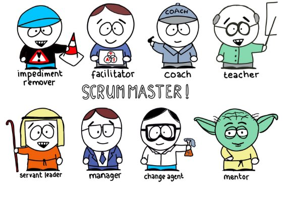
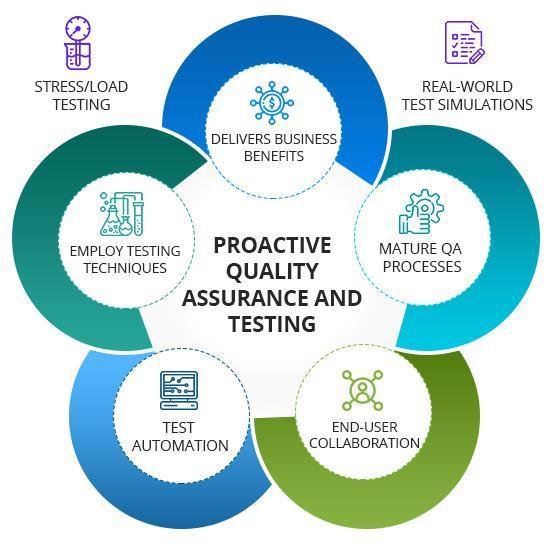

What is a Product Team?

An ideal product team consists of people whose skills complement each others’ and who, combined, have all the skills necessary to create the product.

For software product, a Product Team may consist of the following members:

- Product Manager or Product Owner
- Scrum Master or Agile Coach
- Software Engineers
- Quality Assurance Engineers
- UX Designers
- Business stakeholders

Though product teams are fluid, each of these members has different responsibilities. As a product manager, it is important to understand what those duties are; so that you can interact with them accordingly.

Getting to Know Your Team: Product Manager/Owner

Recap

|**Product Manager**|**Product Owner**|
| - | - |
|Researches and owns the market|Works closely to stay aligned with the Product Manager|
|Represents the voice of the customer||
|Focuses on what and why we should build it?|Focuses on how the product is built|
||
Tips to Collaborate

As a product manager, the way you interact with a product owner is typically daily or multiple times a week. As you are focused on strategic objectives, you bring the following to the table:

- What to build next?
- How to measure the success of what is being built?

As the product owner, the role tends to bring the following:

- What is being built currently?
- Is it up to quality?
- Are we in line to deliver? If not, what are the major issues?

Getting to Know Your Team: Scrum Master

The scrum master (also referred to as an agile coach) is someone who really ensures that the team focuses on delivering on time. The scrum master is often referred to as an agile project manager because he/she is focused on making sure that the development team is delivering on time.

Though the primary responsibility of a scrum master is to ensure that the team able to self-organize, they really add a lot of intangible value to the team by playing several different roles as the team needs it:

- **Impediment Remover:** focuses on clearing obstacles for the team to minimize dependencies on others outside the team
- **Facilitator:** runs the team meetings and ensures transparent communication within the team and with stakeholders
- **Coach:** helps each individual by assisting in their career growth
- **Teacher:** identifies where the team is lacking and teaches concepts or coordinates workshops
- **Servant Leader:** is someone that is in the trenches with the team
- **Manager:** in some cases will play the role of a manager by providing learning objectives to each team member
- **Change Agent:** leads the change in processes to improve the capabilities of the team
- **Mentor:** acts as someone that the team can confide in and seek advice about careers or provide other guidance

Software Engineer/Developer

A software engineer (also known as a developer) is the major workhorse of the team. The members of this role typically write the code to build the features.

Types of Software Engineers/Developers

There are several types of software engineers, but for the sake of simplicity, we will focus on four:

- **Front-End Engineer -** focuses on building the front-end components typically dealing with visual design elements such as HTML, CSS, Javascript
- **Back-End Engineer -** focuses on building the back-end components typically dealing with, but not limited to platform capabilities, APIs, databases, query languages such as SQL
- **Full Stack Engineer -** strong on both the front-end and back-end - is typically able to build an entire feature end-to-end without a lot of help
- **Technical Lead -** typically has several years of experience either as a front-end, back-end, or full-stack engineer. Oversees the development process and ensures quality code is being built by other software engineers in the team.

Tips to Collaborate

- **Work Together.** Don't go to Engineers with a solution. Instead, present the problem and work with them to find a solution.
- **Be Curious.** Engineers love product managers that make an effort to understand the technical aspect. Even if you aren't technical, being curious about what engineers do will develop rapport.
- **Coffee.** If you're co-located, treat your engineer to a coffee and learn more about their work.

Getting to Know Your Team: Product/UX Designer

Recap

A product designer is also another ally of a product manager. In this discipline, the designer focuses on the user-facing elements of the product management role such as:

Tips to Collaborate

- **User Interviews.** Go to interviews with your product designer. Let them lead the interviews and be a fly on the wall.
- **Wireframes to Prototypes.** Always be communicating your ideas using back of napkin drawings or
- **Whiteboard!** Brainstorm on a whiteboard with your product designer. Work through user flows and personas. Do anything you can to understand the user, even if it is just a tiny bit more.
- **Development.** Make sure to always include your product designer when talking to the development team. This is where the most crucial innovation happens when the user requirements are matched with technical feasibility.

Quality Assurance Engineer

Quality Assurance Engineers (also branded as QA) focus on the product's quality. Some key questions they consider and try to answer:

- **Quality.** Is the feature or solution built to the specification or acceptance criteria defined?
- **Bug Control.** Are there any side effects that were introduced by this specific feature or solution?
- **End to End.** Are there any holistic issues that were created due to the introduction of this specific feature or solution?
- **Automation.** Is the system being tested on a nightly/weekly basis so that all existing test cases are being covered?
- **Test Coverage.** Are all of the features that we have covered with tests?

**Tips to Collaborate**

- **Acceptance Criteria.** Setting clear expectations for each task or feature will be essential for a good relationship with your QA Engineers and pivotal in producing a good product.
- **Include QA from the start.** Having the QA team’s input early in development is helpful. In many companies representatives from product management, design, development, and QA create the test plan together at the beginning. This way, the team knows what QA is looking for, and they can make sure it aligns with the purpose and is easy to execute.
- **Help the QA and development team prioritize what gets automated.** As a product manager, you work closely with the customers and are responsible for speaking up for them. Your knowledge helps you explain to the team what is valuable to the users and what isn’t. This is an important part of your role as a PM. By providing the team with this knowledge, you can guide them towards what should be tested and what needs to be prioritized. Common and consistent problems should be the focus for automation.

A Word About Test-Automation and Test-Driven Development

In many environments, the Software Engineers take ownership of Quality and employ automated testing techniques in their code: unit testing, integration testing, end-to-end acceptance testing. In these environments, there may not be a separate Quality Assurance Engineer role. Or, the Quality Assurance Engineer role may be focused on those aspects of testing that cannot be easily automated: security penetration testing, exploratory testing.

A Balanced Team

Now that we understand all of the individuals that make up a product team, let us see what a balanced team looks like.

**Number:** A balanced team typically has between 3 and 9 individuals including the product manager, product owner, and the scrum master. Smaller than 3 and the team may lack sufficient skill to get significant work done and they’ll rely heavily on people outside the team; larger than 9 the team may struggle to achieve cohesion, and may splinter into sub-teams.

**Composition:** There is no hard and fast rule on how teams should be broken apart, but it does tend to depend on the needs of the product. If the product needs more help around testing, there will be more QA Engineers. If the product has a lot of design work, it helps to have an extra product designer.

**Odd-Numbered:** There is no hard and fast rule about this, but most teams prefer being odd-numbered. Most agile teams are autonomous, meaning that they will make most decisions amongst themselves, it's important to have a way to break ties. That's why an odd number of members are suggested and preferred.

Team Composition

Here are some realistic ways teams tend to come together.

5-Person Team

5-Person teams are rare and they don't actually end up looking like the ideal situation that is shown above. They end up looking something like this:

In this scenario, the Product Manager or Product Owner plays both the Scrum Master role as well as the Product Designer role, so that the team can gain an extra 2 software developers. This team is typically seen in startups or early-stage products who are trying to understand if they even have a product.

7-Person Team

7-Person teams look a lot more balanced with a healthy share of individuals playing the roles that they need to be playing to move the product forward.

9-Person Team

Though this team is starting to look pretty big now, 9-Person teams do well and are common in the industry. As mentioned before, the QA Engineer addition can be interchangeable with a Software Engineer, if needed.

11-Person Teams are rare and typically add on an additional product designer and a software engineer.

Key Takeaways

- Cohesion is important so teams can make decisions effectively and so everyone in the team can easily know the progress of the product. Smaller teams tend to achieve and maintain cohesion more easily than large teams.
- Front End Heavy vs API Products. In API products, a product designer isn't typically needed, whereas front-end heavy products need more product designers.
- What Works for You. Remember, always be flexible to find what works for you and your team. Talk to your team - they know what they need, especially if you have a Scrum Master.
