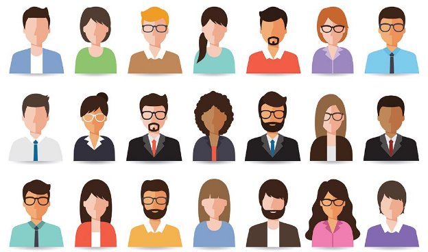
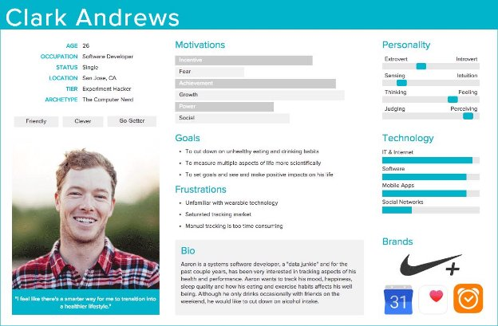
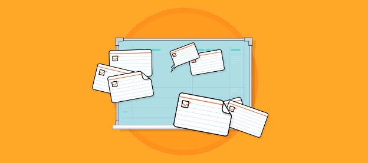

Personas

What is a persona?

A **persona** is a fictionalized profile of a product's typical user or customer. Personas help product managers understand key traits, behavior, expectations, wants, and needs for specific types of users. Another way to think of them is that personas are a practical tool to help prioritize content and functionality.

Personas are not intended to capture all of the functionality of the product or service. Rather, they serve as an understanding of a product or service's most important priorities. Ultimately, personas help you prioritize what’s important and are a very useful tool for describing to your entire product team who the product or service is for, how they will use it, and why they will care. In other words, know who you want to delight!

What is included in a persona?

- Personal information, including name and photo
- Education level
- Technology literacy
- Background
- Current job situation
- Goals
- Frustrations

You may see other things added to a persona. Don’t be tempted to add additional categories if you don’t have a use for them. Remember, the point of a persona is to characterize a group of users or customers in an easy-to-read visual format. What do you and your team need to know about this group of people to design a product for them? That’s what you should focus on in your persona. We’ll talk about five categories that will help you make sure you have the essentials in the next lesson.

Who creates personas?

The team!

The act of creating a persona, the discussion and discovery necessary, help your team members develop empathy for end users.

Empathy is motivational and helps us truly want to solve real-world problems for users.

What's in it for Product Managers?

Personas let your team understand customers. Seeing your customers as real people instead of a nameless mass helps you better understand them. Like we usually say - you believe it when you see it. Ultimately, creating personas gives you, a Product Manager, a unique opportunity to see your product or service from the standpoint of your customers.

Let's look at an example before we go into more detail: Your mobile device. You may buy one for your own and use it, in this scenario you are the customer as well as a user. But if you buy a mobile device for your dad or your mom? You are still the customer, but not the user.

It seems very obvious, right? Well, it really is. The trick is being aware of both when deciding how to design and market your product or service. Why? Because as we learned from our example above that customers and users, and thus, their personas, often have different goals, use cases, and expectations.

How And Why Do Personas Work?

Personas are effective because they leverage and stimulate several natural human abilities:

- **Narrative practice:** This is the ability to create, share, and hear stories.
- **Long-term memory:** This is the ability to acquire and maintain memories of the past (wisdom) from our own life experiences, which can be brought to bear on problems that other people face.
- **Concrete thinking:** It’s easier for people to remember examples of things rather than broad, overarching concepts.
- **Theory of mind:** This is the ability to predict another person’s behavior by understanding their mental state.
- **Empathy:** sympathizing with and understanding from another person’s perspective
- **Experience-taking:** This is the ability to have the “emotions, thoughts, beliefs and internal responses” of a fictional character when reading or watching a story.

Personas, goals, and scenarios tap into our humanity because they allow us to understand users/customers’ emotions and traits in our research findings. When hundreds of users/customers are represented by a persona, imagining what they would do is a lot easier than pouring over abstract data. This high-resolution connection to the end users replaces the need for low-resolution, expensive documentation.

Creating a Persona

When we create a persona, we want to make sure that we’re addressing five major categories that capture the essence of a group of users.

1. Problem
1. Pain Points
1. Demographics
1. Psychographics
5. Goals
1. **Problem**

Every persona has a problem- something that your product or service is hoping to solve. Always express the persona's main problem clearly and effectively. Problems have many symptoms and sub-problems, so it’s easy to get caught up in things that aren’t the main problem. As the Product Manager, it’s your job to investigate the root cause because that’s what will eventually lead to customer satisfaction. If your research has revealed that the problem you previously used for your persona isn’t the best fit anymore, here’s your chance to update it.

2. **Pain Points**

Learning the pain points of your customer experience helps you empathize better, which in turn guides the design of the product and helps you sell better. The symptoms and negative emotions tied to the problem you solve are what your customers really want to eliminate from their life and business. Use new data to add additional pain points or prioritize the ones you already have.

These can also be listed in a persona as “frustrations”.

3. **Demographics**

Demographics describe tangible characteristics about your users/customers such as age, gender, marital status, location, etc. Did your surveys reveal that the average age of your target customer is 30 instead of 20, as you previously thought? Demographics are the hardest piece to research, especially when you don’t have many users/customers.

4. **Psychographics**

Psychographics describe the intangible characteristics of a person, such as personality, opinions, values, emotions, interests, attitudes, and lifestyle. Psychographics shed light on how to provide the best experience for your user/customers. Once you discover how your ideal user/customers think, the effects are wide-reaching. It can impact the decisions you make about everything from the colors of your website to the way you collect payments. This is a particularly useful category of data for teams across the company, so it’s important that you be able to communicate it well.

5. **Goals**

Discovering your users/customers’ common goals will help you assist them better. Understanding their main goal along with any sub-goals teaches you how to provide the best solution based on what they’re trying to achieve. If you find that no user/customers have the same goals, it’s an indication that you haven’t dug deep enough or your niche is still too general.

Now that you know the key elements of a solid user/customer persona, you can leverage and group the information accordingly If you find yourself lost in the amount of data, keep this in mind:

- The problems and pain points your user/customers experiences helps you **understand**.
- Demographics and psychographics help you **relate**.
- Identifying common goals helps you **assist**.

If you can understand, relate to, and assist your user/customers better, you’ll become one of the best (if not, the best!) Product Managers within your organization.

To paint a clear picture, we want to make sure we have well-rounded data about our user. We do that by checking the five elements. This also helps us sort the data we have into categories so that we can display and communicate it clearly.

Designing a Persona

When you create a persona, you also need to design the layout of the information. There are many great persona templates out there. In this course, we use Xtensio, a user-friendly and free option.

Using Personas

Personas are often used as an input for other tools. Instead of trying to describe a population every time we want to talk about a group of users, we can reference a persona instead. The persona is usually paired with a scenario and a goal. You’ll see this in User Journey Maps, Value Proposition Canvases, Empathy Maps, and others.

Here is an illustrative example that explains how personas are used:

https://www.interaction-design.org/literature/article/personas-why-and-how-you-should-use-them

This is also an important reason why you should keep your personas updated. As you interview users and learn more about them, you’ll want to reflect those changes in your persona. A persona should not be stagnant- it should change with the population. This is how you ensure that your product will change with the needs of its users.

Final Note on Personas

Product management is all about choices. Making decisions about what opportunities are worth chasing, which problems are worth solving, what features will provide the most value, what the best time-to-market trade-offs are, and which customers are most important. While you as a Product Manager will never make all the right choices, you have to make most of them right for your product to succeed. One of the best tools that will help you do that is Personas. Personas are created with information gathered from the user, customer, and stakeholder interviews. When we learn more about their goals, behavior, expectations, wants, and needs, it helps you as a Product Manager decide what feature or functionality you should focus on.

**User Stories**

“A user story is an informal, general explanation of a software feature written from the perspective of the end user. Its purpose is to articulate how a software feature will provide value to the customer.”

This is a common definition of user stories as given by Atlassian. However, user stories are not about features. It describes an end goal - what a user can *do*, not a component of the system.

Simply put, User Stories or “Stories” are a way to describe the outcome from an end user’s perspective. They allow development teams to work together to build a solution towards that end goal.

You will also see the term ‘Epic’ used to mean either:

- A very large story.
- Or a collection of multiple, smaller stories.

**Why User Stories?**

It is important to remember that we are breaking a really big problem down to the atomic pieces that will help us build the product.

Now, specifically for user stories, there are three major reasons.

- User at the forefront. With user stories, the user’s end goal is at the forefront of the development team’s mind. Any solution they build, they have to think about the user. This is one of the most important enablers of user stories.
- Working together. User stories force collaboration. You have to work together to bring users to their end goal, often through product features or integrations.
- Small wins add up to big things. User stories drive momentum by creating awesome small wins and allow for iteration. As the product evolves, user stories end up becoming the building blocks that it evolves on.

User Stories are written in such a way to break down large scopes of work into slices of functionality that can be implemented in just a few days. For example:

1. Users might be required to log in to use your system. A Product Manager might write a story like this for the team:
- As a subscriber, I can login to the system to see my account information, billing history, change my username and password, and even delete my account.
2. The team might indicate that’s a LOT of work. There are multiple screens and features, and will take many weeks to implement. It’s a very large story – an “Epic”, they might say.
3. So, a Product Manager would work with the team and stakeholders to split that story into smaller slices that can each be implemented separately:
- As a subscriber, I can login with my username and password.
- As a subscriber, I can change my username.
- As a subscriber, I can reset my password.
- As a subscriber, I am informed with a polite error message when I enter an invalid password or username.
- As a subscriber, I can review my account information.
- As a subscriber, I can review my billing history.
- As a subscriber, I can delete my account.

You can see how all the stories in #3 relate to (and can replace) the broad story in #1. However, now, the team can work on and deliver each smaller story incrementally. And each smaller story can be implemented, fully tested, and deployed separately. And you as a Product Manager can make choices about which items you’d like to test and deliver first into the hands of end users.

**Components of a User Story**

User stories can be broken down into three major components: card, conversation, and confirmation.

Card

Arguably the most important part of the user story, the Card effectively describes the user's needs from their perspective. It is typically written in the following format:

As {**Persona**}

I can {perform **Action**}

So that I can {gain **Benefit**}

These three components allow you to describe the 3 W’s:

- **Who** is this for?
- **What** is their need?
- **Why** do they need it?

Here is an example that we will use through this lesson. Let us say we are building a way for customers to apply for a loan. A potential user story could look like this:

As **Sam** (this is our persona for a small business owner) I can **apply for a loan**

So that I can **gain funds to continue to run my business**

Conversation

One of the key aspects of the user story is the conversation that happens within the development team in order to build the proper solution for the end users. This is what drives collaboration between team members. As the work is discussed, it is helpful to capture some of these details within the user story itself, so that the team will remember them when they start working on the task.

In our loan example, here are some sample conversational items that the development team could have said:

- Need a list of fields that we need to take in from customer
- Need a finalized wireframe of what we are going to build for the loan process
- Define data architecture for this

These conversations and comments become the tasks needed to accomplish the functionality from the development side.

Confirmation

Also known as the Acceptance Criteria, the Confirmation component allows you to create a clear understanding of what success looks like for this specific user story. In other words, when do you know when the user story has been completed? The answer is, when the user story passes the confirmation or the acceptance criteria.

A user story can have several confirmations. It is typically written in the [gherkin syntax](https://medium.com/@nic/writing-user-stories-with-gherkin-dda63461b1d2). Given-When-Then.

Given {**scenario**}

When I {**perform action**}

Then I expect {**certain behavior**}

This allows you to describe the behavior of the platform/product/end result in a systematic way. Let us see how this applies to our small business owner and how the confirmation is like for that user story.

- Given that I visit the website

When I am on the home page

Then I expect to have a way to apply for a loan

- Given that I start the loan process

When I am applying for the loan

Then I expect to provide all the details required for the loan

- Given that I am applying for a loan

When I have completed the loan process

Then I expect to see if I have been approved/declined for the loan

These are three different confirmations or acceptance criteria that would indicate that the user story has been completed successfully.

Putting it all together

If we put it all together in a user story, it would look something like this.

