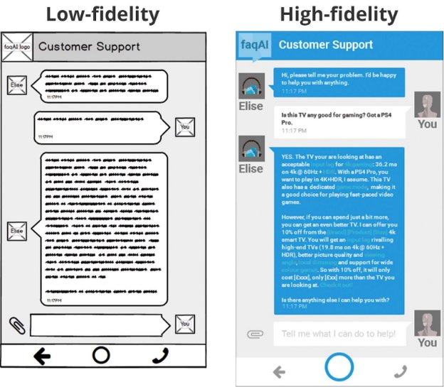
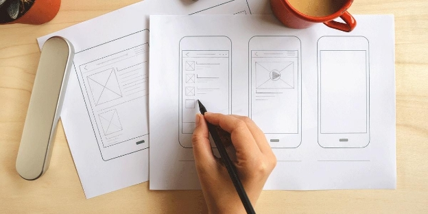
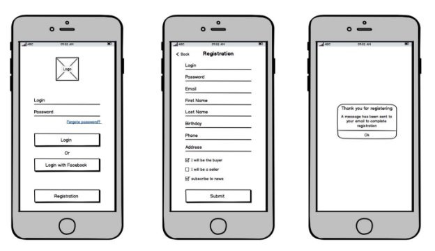
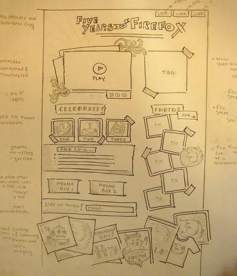
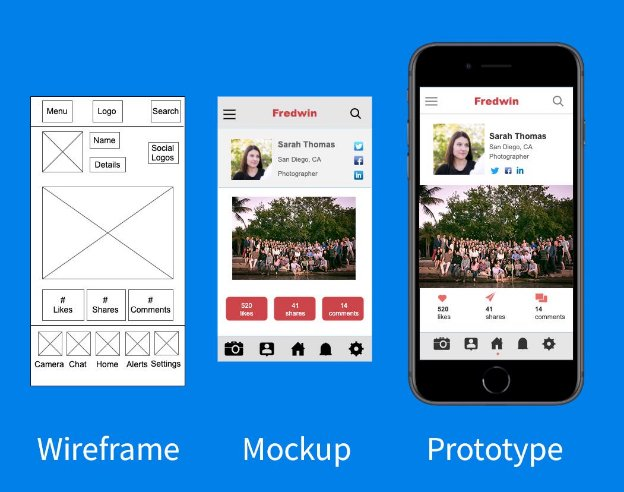
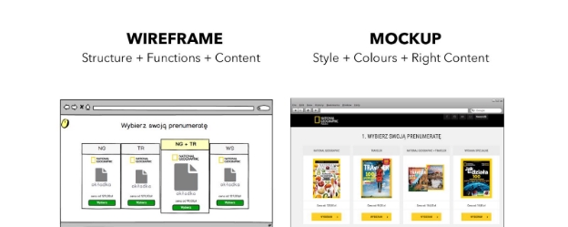
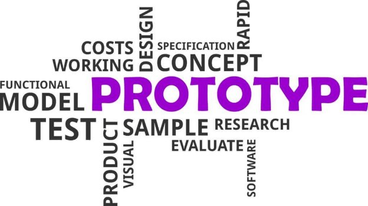

What is a Wireframe?

- Wireframes are oftentimes defined as a “page schematic” or “screen blueprint.” This definition is not too far from building schematics or architectural blueprints in the fields of architecture and construction.
- Simply put, a wireframe is an inexpensive and visual representation of a solution to the user problem. It draws a powerful vision to what the product could look like and ultimately can bear a striking resemblance to the end product.
- Wireframes are used by product managers to have design discussions about a potential solution to a problem.
- The common misconception is that only UX Designers put together wireframes. However, wireframes are one of the most potent tools that a product manager has in his toolbelt to start powerful discussions. You may have heard a notable Chinese proverb “A picture is worth a thousand words.” This could not have been truer when it comes to wireframes.
- Wireframes allow you not only to convey how a product could look, feel and function, but also allow you to collaborate with others on your team to come up with the best solution for the customer problem.

Types of Wireframes

There are two types of wireframes:

- Low Fidelity Wireframes typically lack color and all the bells and whistles. This is done so that the team can focus on the flow of the product and not get caught up in the details.
- High Fidelity Wireframes are also known as mockups, which we will cover in the following lesson. These wireframes are much more involved and can be much closer to what the end product is.

Most product teams start with low fidelity wireframes and work towards high fidelity wireframes or mockups as they finalize how they want to build the product.

Why Wireframe?

As we discussed before, wireframes are a fast and lightweight technique to

- visualize a customer’s journey through their product
- present their perspective of what the product should look and function like
- drive collaboration between team members to come up with a great solution for the problem at hand
- have a tool that helps drive design discussions

As you have seen already, wireframes almost always look bland, colorless and lack personality. That is definitely intentional, since we want to keep people out of the details and focus on the customer’s flow through the product.

The goal of wireframes is to identify:

- Did we identify the elements that are required for a customer to complete their job?
- Did we identify the proper interactions that are required for a customer to complete their job?

Wireframe Examples

Let’s take a look at a few examples to understand wireframes better.

Basic Mobile Login Example

In this example, there are three basic wireframes

- The first wireframe depicts a login screen that contains
- An Image placeholder for the logo
- Two Text Input Fields that allow for a user to enter in login and password
- A Forgot Password link that allows users to reset passwords in case they forgot it
- Three Buttons that will allow the user to, respectively:
- Login, if the user provided a login and password
- Login with Facebook, which allows the user to go to another page and login using their Facebook credentials
- Registration, which allows the user to register for a new account
- The second wireframe depicts the Registration flow
- There are several Text Fields that allow the user to provide required information
- Three Checkbox fields that allow the user to specify
- they will be a buyer
- they will be a seller
- subscribe to the newsletter
- Finally the third wireframe closes the registration loop providing an Alert that thanks the user and directs them to their email to complete registration

Desktop - One Page Content Website

- The great thing about this wireframe is all of the great annotations on the
- Great usage of **Link** placeholders at the top
- The “5 years of Firefox” logo image is great, but unnecessary as they could have used an **Image** placeholder
- Great use of the Video Player placeholder
- Great use of the TBD (To Be Decided) section - which later turns into a Facebook and Twitter feed
- Under the Celebrate and Photos section, several Image placeholders are used
- Great use of Textarea placeholders towards the end of the website
- The actual [end product](https://website-archive.mozilla.org/5years/) strikes a very close resemblance to this wireframe

What is a Mockup?

A mockup is nothing but a high fidelity wireframe - a visual way of representing your product. It expands on a low fidelity wireframe by adding additional elements:

- Color Schemes
- Visual Style
- Typography - fonts

Mockups are a good way to get an idea of what the end product could look like.

The goal of a mockup is to give you a way to make decisions about a product’s color palette, visual appeal and typography.

As you can see above, the key differences between wireframes and mockups are:

- color has been added
- branding and imagery has been added
- fonts have been selected and applied
- looks close to what the end product could be

Why Mockup?

Mockups are a very useful tool for casting your vision. Here are some key use cases where mockups can be used:

- **Product Building.** When the engineering team wants to get an idea of what a finished product looks like.
- **Internal Buy-In**. When you want to excite stakeholders to give you the buy-in and support and you need something tangible.
- **Feedback Mechanism.** When you want to share something new with your customers to get feedback on what you’re working on.

Product Building

When thinking about making a product idea into reality, a product manager will inevitably need to work with an engineering team to conceive the product. A mockup becomes a pivotal tool when communicating with engineers to provide context around the end goal of the product and what needs to be implemented.

Internal Buy-In

Often, when pitching products to stakeholders, they may want to see something a bit more tangible than a pitch deck (vision, strategy, return on investment, etc.) A mockup accompanying a pitch deck makes that vision much more real by providing a tangible platform for it to stand on.

Feedback Mechanism

When pitching ideas to customers, high level ideas can go right over their head. Mockups can anchor ideas and provide a mechanism for customers to provide feedback on. Even at early stages, if the mockup is not exactly what the customer is looking for, it allows you to gather feedback so that you can iterate over it.

Wireframes vs Mockups

As you have seen so far, there are key differences between wireframes and mockups.

||**Wireframes**||**Mockups**|
| :- | - | :- | - |
|●|Very basic, lacks color|●|Very visual, has a defining color scheme for the product|
|●|Uses placeholders for most elements on the page|●|Uses images, buttons, visual styles that would be present in the end product|
|●|Uses a very basic font across the board|●|Has chosen typography - sometimes multiple fonts|
|●|No branding|●|Has branding|
|●|Very early stage|●|Likely has gone through several iterations, looks close to the end product|
What is a Prototype?

A prototype is broadly defined as a preliminary model of a product that is created to test the product’s concept. In our case, you can look at it as a set of interactive wireframes of mockups. A series of wireframes or mockups come to life to provide a somewhat accurate representation of what the end product looks and feels like.

The goal of a prototype is to emulate a user’s interaction through the product without ever having to build it.

Prototype Depth

- **Feasibility Prototypes** are rare and sometimes known as proof of concept. Typically, engineers write code to see if an idea is possible.
- **Low-Fidelity Prototypes** are built using low-fidelity wireframes to help test functionality and flow.
- **High-Fidelity Prototypes** are built using high-fidelity wireframes or mockups to show how the product would function if it came to life.
- **Live-Data Prototypes** are built using data to make the product look and feel as realistic as possible.

In all of these cases, not a single line of code is written or any infrastructure is built to support the product. These prototypes function as a way to depict what the product looks like and to help validate whether or not it is worth building.
