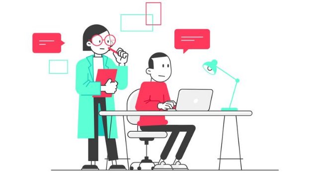
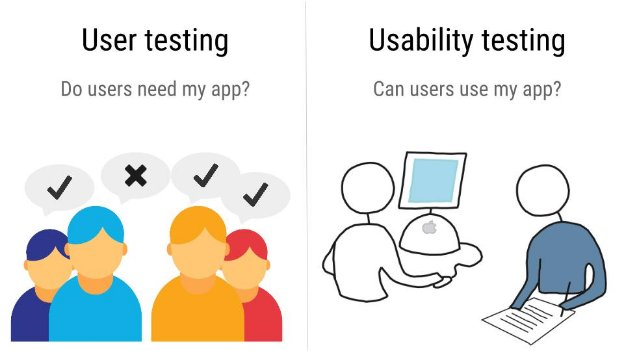
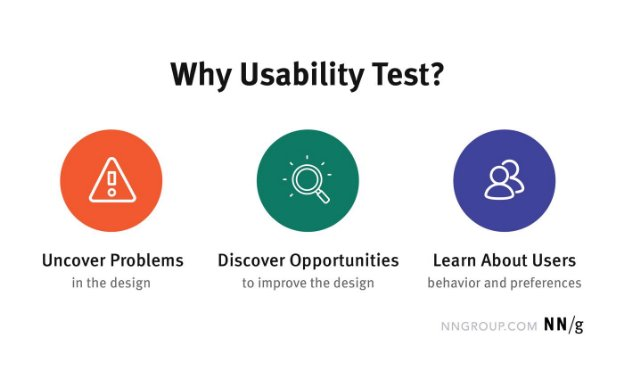
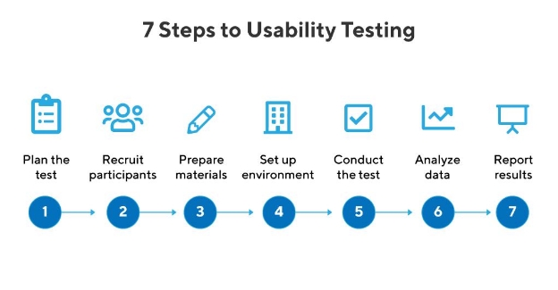
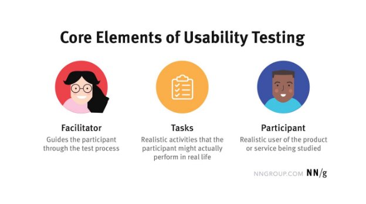

What is Usability Testing?

Usability testing is a form of testing your product with users to see if the product is usable. Remember, that we are **not testing the user**. We are **testing the product** and identifying any issues that the user is having with it. It’s really important to clarify this as the user is your partner in identifying product issues. We are not looking to change the user’s behavior during testing, but we are trying to understand it. The below image is a great example of what a usability test could look like.

During a usability test, a facilitator or moderator provides a series of tasks to the customer. These tasks can involve several aspects of the product such as different screens, locations and interfaces.

User Testing vs Usability Testing

The key difference between user testing and usability testing: when you are user testing, you are looking to see if users **need your product**. However, when you are usability testing, you are looking to see if users **can actually use the product**.

Why Usability Testing?

The key reason for anyone to perform a usability test is to identify some key issues before the product gets built. Oftentimes, a prototype is a perfect template to help you with usability testing. You can identify what key issues customers have before the product is even built.

The three key areas to look for when usability testing:

- What problems are in the design?
- What opportunities are there to improve the design?
- What behaviors and preferences are users exhibiting?

Design Problems

As users go through the tasks, what are some of the key areas that they are getting stuck on? Often, you’ll see customers visibly get stuck when you ask them to perform a task. If this happens consistently, it’s important to take note of it and have a plan to resolve it later.

Design Opportunities

As users perform tasks, make sure to ask open questions and keep an open mind. There could be possibilities for improvement in the flow and workflows. Sometimes you may find that you could collapse several different actions by simplifying it. Other times, you may find that you need to clarify some additional steps for the user so they know what action to take.

User Behavior and Preferences

Finally, it’s important to look for quirky user behaviors. Human behavior contains a lot of small indicators and information. As they go through their product, make sure to take note of key behavioral patterns that could also help you improve the overall product experience.

Elements of Usability Testing

The general process of setting up a usability test is as follows

1. **Planning the Test.** Understanding who the target audience is and what tasks to run for the users.
1. **Recruiting the Participants.** Now that you know the target audience, it’s now time to recruit and gather the people that fit that target.
1. **Prepare the Materials.** Now that you know the tasks, it’s important to prepare your prototype and what the user will be doing for you.
1. **Set up the Environment.** It’s important that you create an environment that is close to the real environment that the user will be using the product in. For example, if the user will be using this app while cooking, consider doing the usability test in a kitchen.
1. **Conduct the Test.** Be the facilitator and guide the user through the set tasks in the environment you set up. Gather the necessary data from the test for further analysis.
1. **Analyze the Data.** Now that you have the data, it’s important to look for patterns and any room for improvement in the prototype and the product.
1. **Report the Results.** One you have made your recommendations, we need to share them accordingly. If the product needs to change, work with engineering. If the prototype

needs to change, work on it yourself or with a UX Designer. Perhaps you need to run a follow up test, consider setting up another Usability Test.

Elements of a Usability Test

There are three elements of every usability test:

- The facilitator/observer
- The tasks
- The participants

In most cases, at the prototype phase, you usually are the **facilitator**. It falls on you to guide the participants through the usability test. This is a great opportunity for you to work with potential customers directly.

The tasks are a series of guidelines that you want to give the user. These tasks will help you identify key areas and assumptions that you have on how your user would use the product. Now, you can put them to the test. Some examples of tasks could be:

- You are considering ordering some groceries. Go to MyGroceries.com and put together a cart of groceries.
- You are shopping for clothes. You have a cart full of clothes. Please checkout using your mastercard.
- Someone has rung your doorbell. Use your Ring app to answer and let them in.

Finally, the participant, the most important part of the usability test. Making sure that you gather the right kind of folks to test your prototype is key.

Keep these three elements in mind when designing your usability test and you will thrive. For more details, review this [Usability Testing guide from Nielsen Norman Group](https://www.nngroup.com/articles/usability-testing-101/).
