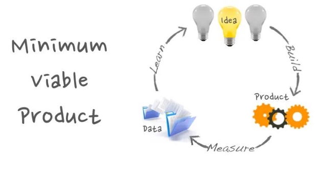
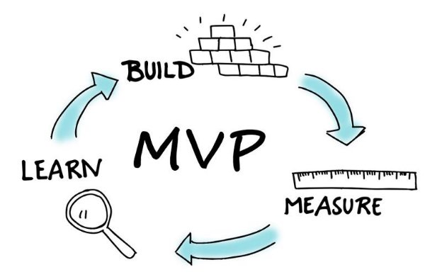
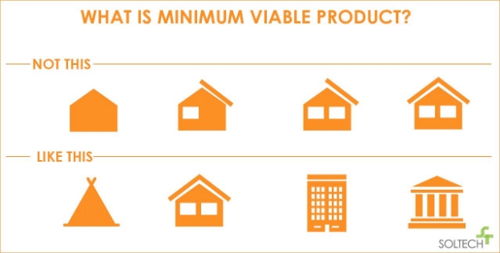
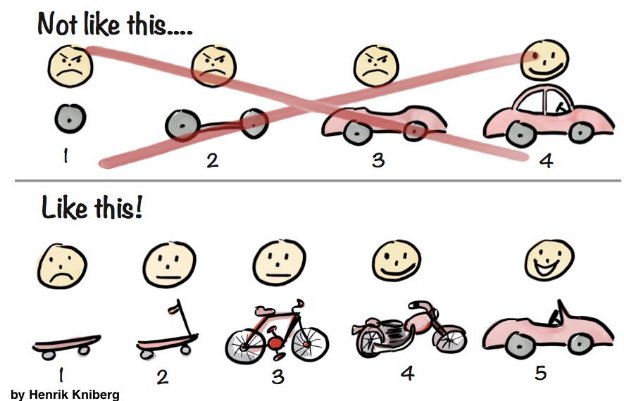
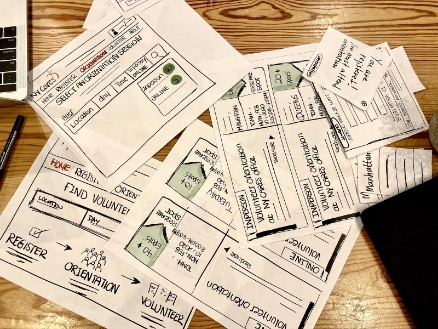
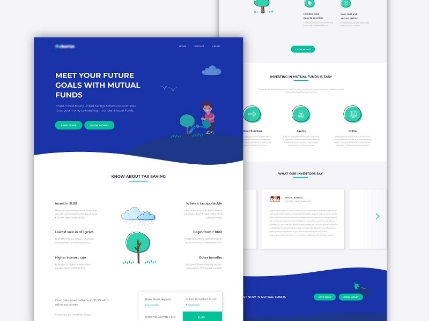
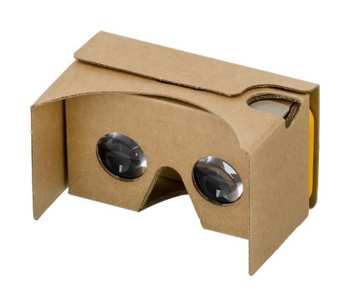
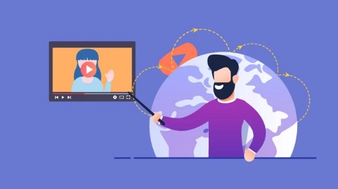
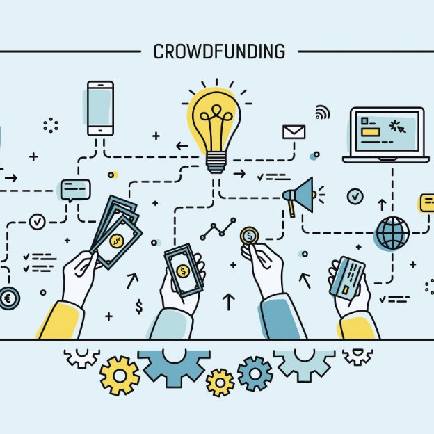

**What is an MVP?**

MVP is a concept popularized by [The Lean Startup by Eric Ries](http://theleanstartup.com/). He suggested that the MVP is a version of a new product or feature that you can gain the maximum amount of validated learning from customers while putting forth the least amount of effort.

Simply put, an MVP, or a Minimum Viable Product is the smallest part of the product that you can build to validate and gain an understanding of your users.

**Minimum** - least amount of effort required

**Viable** - provides or describes value to the customer **Product** - solution or portrays a solution

Nowadays, MVPs are also referred to as MVEs - [Minimum Viable Experiments](https://usercenteredstartup.com/the-mve-minimum-viable-experiment/). These are carefully designed experiments that allow you to test and validate an idea and understand your user’s behavior.

Why use MVPs?

There are many reasons to use MVPs, let’s look at them now.

**Least Amount of Effort.** The biggest value that MVPs provide is that they are experiments that help you identify if you are on the right track to building the final product.

The hallmark of MVPs is that they require the least amount of effort that allow you to test your product ideas with your customers.

**Maximum Validated Learning Gained.** You can truly understand if your product has a market demand - if customers are actually interested in using your product before actually building it at all. Think back to the [Dropbox Explainer video](https://www.youtube.com/watch?v=iAnJjXriIcw) that raised $48 million dollars. Think of all the product concepts that are getting crowdfunded on [Kickstarter](https://www.kickstarter.com/) and [Indiegogo](https://www.indiegogo.com/) on a daily basis.

**Data is Gold.** The data that an MVP provides can easily sway stakeholders and investors to invest in your product. Oftentimes, a [proven MVP](https://steelkiwi.com/blog/what-mvp-and-why-it-necessary/) is required in order for you to raise funds in startups.

Caveats

**Minimum vs Viable.** However, there are concerns that product teams these days are focused on the **M** (minimum) and not the **V** (viable) when it comes to MVPs. It’s true that the MVP needs to amount to the least amount of effort possible, but the most important thing is that your MVP needs to be valuable to the customer. Either it must solve a customer problem or help you validate an idea that you have.

**Functional vs Non-functional MVPs.** Consider the below image. There are two ways to dissect a solution:

1. Non-functional - A scope driven approach
1. Functional - A minimum approach that delivers value to the customer

If you consider the scope-driven approach, you can say that the absolute minimum product for a car is a tire or a wheel. But it’s not valuable to the customer. If you give a customer a wheel and say “use this” - what would the customer do with it? What value would you get out of that MVP? Probably nothing until you deliver them a car for them to put the wheel into.

However, if you consider the minimum approach that delivers value, you would say “we aim to solve a transportation problem and eventually build a car. But for now, we’d like to understand how this skateboard helps you get from point a to point b.” Now this is an MVP; this not only allows the customer to ride the skateboard, but it also allows you to gather data about how the customer uses a product.

Types of MVPs

There are many types of MVPs:

- Paper Prototypes
- Ads and Landing Pages
- Wizard of Oz and Concierge
- 3D and Cardboard Models
- Explainer Videos
- Crowdfunding

[**Paper Prototypes**](https://www.youtube.com/watch?v=GrV2SZuRPv0) are a great, inexpensive and fun way to test your product. Check out the video where the interviewer allows the user to interact with a series of paper to simulate a product.

**Landing Page and Ads** are one of the fastest ways to see if there is demand for your product. Many companies these days run test ads to see if there is enough demand. The ads typically lead to a landing page that explains the product functionality and asks for customer information such as an email address.

**Wizard of Oz and Concierge** are inexpensive ways to simulate a product’s functionality. Zappos and Amazon are great examples of these prototypes. Both companies used a website to take orders. Once the customer orders came in, the owners went to the stores to make purchases and manually shipped the products to the customer. The key difference between Wizard of Oz and Concierge is that customers are aware that there is a human that is simulating a product function in concierge prototype.

**3D Models + Cardboard** are great prototypes for physical products. They help test product models and functionality without having to rent out factory space or expensive machinery. [Google Cardboard](https://arvr.google.com/cardboard/) is a great example for anyone to use to inexpensively experience virtual reality without spending hundreds of dollars on a VR Console.

**Explainer Videos** are a fantastic way to test an MVP. Dropbox used their [explainer video](https://www.youtube.com/watch?v=iAnJjXriIcw) to raise $48 million dollars for simply [explaining how their product works](https://www.shortform.com/blog/dropbox-mvp-explainer-video/).

**Crowdfunding** is a great way to show off your prototype, raise funding for your product without ever having to build a single product. [Kickstarter](http://kickstarter.com/) and [Indiegogo](https://www.indiegogo.com/) are websites that help facilitate entrepreneurs with prototypes and gather funding from potential customers.

