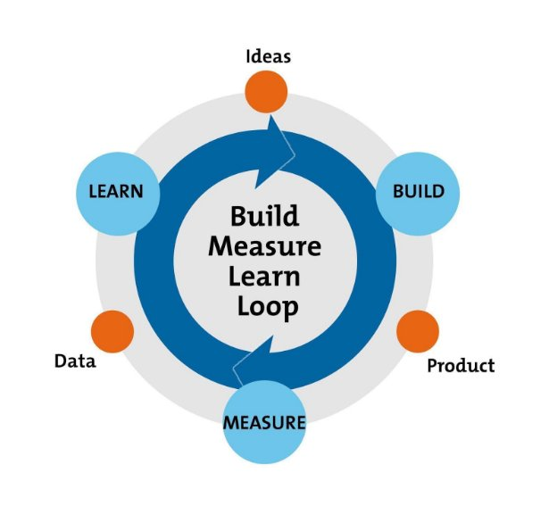
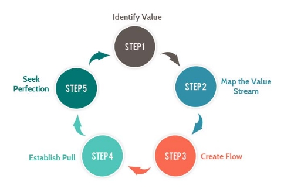
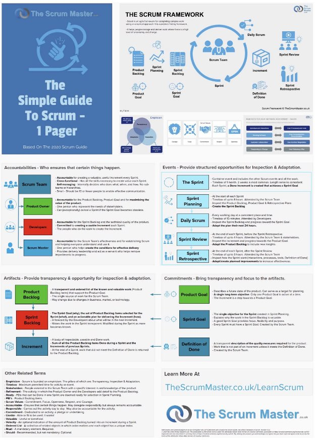
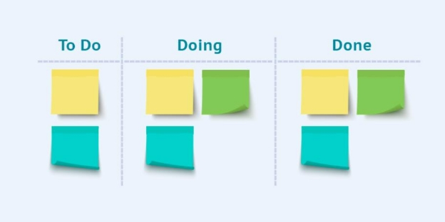
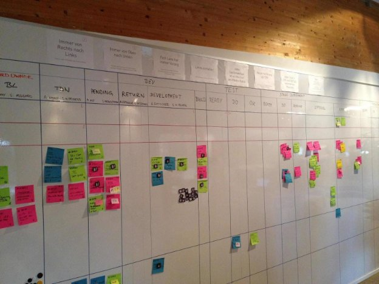
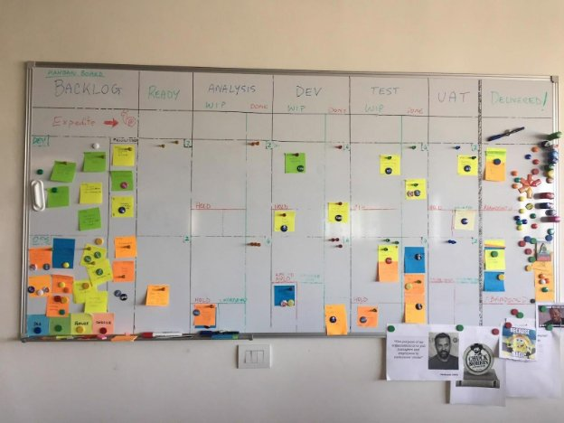
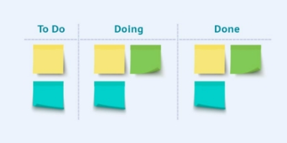

What is Agile?

Setting the Stage

<https://i.pinimg.com/originals/ee/91/67/ee916723a4511aa9d5237cb63912cfc5.jpg>

Consider how technological advancements are achieved: we know that most Research & Development, most Product Development, most Computer Science is advanced by:

1. small teams of people,
1. who have complementary skills,
1. who spend significant time together,
1. who have great autonomy,
1. who are motivated by shared goals.

That’s how Bell Labs advanced the telephone in the early 20th century; that’s how Boston Dynamics has advanced robotics technology; that’s how DARPA in 1957 invented “Internet Protocol” (e.g., IP addresses) and E-mail.

Values & Principles

That manifesto, and a set of 12 principles that accompany it, describe a way of working similar to our earlier list:

1. small teams of people,
1. who have complementary skills,
1. who spend significant time together,
1. who have great autonomy,
1. who are motivated by shared goals.

With important additions: frequent delivery, relentless emphasis on quality, and customer-centricity.

As we learned in early sections section 9.1.1, the Agile development methodology is an iterative approach to software development that builds Product software incrementally from the start of the project, instead of trying to deliver it all at once near the end.

It works by breaking the Product Vision Projects down into Incremental features (e.g., User Stories) (user stories, prioritizing them, and then continuously/frequently delivering them in a short two weeks cycles (that is called iterations).

The Agile approach really focuses on the people doing the work and how they work together. TSolutions, the work itself gets done by through the collaboration between self-organizing cross-functional teams utilizing the appropriate practices for their context.

What are Development Methodologies?

As a product manager, you will encounter many of the following models and methodologies. You will almost never encounter one of these in a pure form at an organization; rather, it will be a combination of practices that reflect these models and ideals. They are good to keep in mind so that you can experiment and learn what works in your environment.

So far in the course, we have learned about what product management is, what product managers do, how they create personas, and how they communicate and present their data. Now, we will dive into what it takes to actually build your products, what methodologies your development teams should use to deliver on those requirements, functionalities, and features for your products.

All successful projects are managed well and to execute them well you as a Product Manager and your Development Manager need to be well aware of different methodologies that can work best for the product and/or project at hand.  All methodologies have different strengths and weaknesses and they exist for different reasons.

In this section, we will review the most commonly used software development models methodologies and why they use methodologies exist.

Agile Development: Iterative & Incremental Development Methodology

Teams typically use Agile practices methodologies to maximize the feedback from end users and stakeholders, to ensure that feedback influences the work in progress, and to deliver features/adjustments frequently into the hands of end users. Doing so minimizes the risks of such as defects, cost overruns, and misinformed changing requirements when working on adding new functionality or features. In Agile methodology development teams usually:

- Learn to deliver code into production environments multiple times per day. Example: it is said that the teams at Amazon push code on average every 11 seconds.
- Work in close proximity with end users. Example: DigitalOcean hosts frequent meetups with end users and customers to enable open communication about their Products, and launched a “Customer Council” in 2015 - a select group of end users around the world who are flown to Manhattan a few times per year to spend time with the developers.
- Employ decentralized and consultative decision-making to achieve optimal alignment and speed (of decision-making). Example: team members are responsible for making decisions and taking action with respect to all aspects of the Product implementation.

the teams at Amazon develop the software in iterations that contain mini increments of new functionality. There are many forms of Agile practices development methodologies including ScrumCRUM,  Extreme Programming (XP), and Test Feature Driven Development (TFDD), Kanban.

These practices that enable rapid adaptation, and the desire to make software more adaptable, have fueled technological advancements including:

- Object Oriented Programming
- Version control systems
- Open source software
- Microservices architectures
- Containerization (e.g., Docker, Kubernetes)
- Continuous Integration/Continuous Delivery platforms

Waterfall Development Methodology

Waterfall methodology is a convention adopted in large enterprises because it matches their prevailing systems of management, namely: division of labor, centralized decision-making, and the belief that high quality software products are the result of rigorous up-front planning. considered to be the most traditional software development method. It’s essentially a linear method that consists of sequential steps in software development which we see in the image above and have seen in previous content about SDLC. It states that each step must be completed before the next step can start. In this methodology, the re is no process of going back to modify the project or direction is intentionally difficult — the rationale for this is often “through rigorous up-front planning, we are confident that all the decisions made in early phases of the SDCL were correct”.

Rapid Application Development Methodology

Rapid Application Development (RAD) methodology is still observed in many enterprises and is a partial evolution between Waterfall and IID (Iterative & Incremental Development) — it’s a hybrid of sorts. Think of a waterfall where the middle phases allow for some experimentation regarding the design and architecture.

Proponents of the idea argued RAD consists of a process that produces a high-quality system with low investment/start-up costs. As it allows developers to quickly adjust to shifting requirements in a fast-paced and constantly changing market. And this ability to quickly adjust and make changes is what allows for low investment costs.

The process consists of four phases: requirement prioritization, user design, construction, and cutover. Meaning user design and construction phases iterate repeat until the user/customer confirms that the product or service meets all requirements. You might see the sequential nature of RAD is similar to Waterfall (requirements gathering first, and when all requirements are documented and approved, the next phase can begin); followed by a more Agile pattern wherein the team can Iterate on the design; followed by eventual “launch” or “cutover” phase (like Waterfall). It is common to see a hand-off from the developers to a operations/support group. Whereas, in a more Agile environment, the development team would continue to be responsible for ongoing support and evolution of the Product.

DevOps Development Methodology

DevOps is This methodology consists of a set of practices that evolved from Extreme Programming (XP).support an overall organizational culture. Meaning the DevOps practices Development methodology enable an application development team to perform many of the tasks previously reserved for systems administrators and platform engineers.centers around bringing software development and information technology teams to work together.

Imagine a Product Development team that produces a website and a mobile app. In 2022, that team not only writes the software for the website and mobile app, but DevOps tools exist so

they can also:

- Push their code into cloud environments where the website is automatically tested and eventually published at a public-facing web server,
- And deliver the mobile package to the relevant App Stores for iOS and Android.

In ancient times, before 2010 ƪ(˘⌣˘)ʃ , that team would write the software for their website and mobile app, then pass their code to others who would prepare the server environments, the IP addresses and domain names, and all supporting infrastructure. These were specialized and time-consuming tasks.

DevOps practices and tools combine software development(Dev) with information technology operations (Ops) allowing teams to build, test, and release software more quickly and with greater efficiency & speed.  It focuses on DevOps improvising time to market and decreasing the failure rate of new releases. Teams can more rapidly make adjustments to the software in production environments to deliver features or fix errors. and decreasing the overall lead time between fixes and maximizing reliability. This method combines software development(Dev) with information technology operations (Ops) allowing them to build, test, and release software more quickly and with greater efficiency & speed.

DevOps is allowing more Agile approaches because it reduces the division of labor and the “hand-offs” we often see in Waterfall environments.

Lean Startup /Kanban Development Methodology

Eric Reis’ book called Lean Startup described a pattern of rapid experimentation. The “Build > Measure > Learn” loop that he described has since influenced Product Designers and Software Developers.

This pattern was already embedded in earlier content such as the Truth Curve and MVP.

Lean/Kanban Method

Lean methodology focuses on the creation of easily changeable software. This development methodology focuses on developing software in ⅓ of the time, with a very limited budget and a very little amount of required flow. It works on the basic lean principle of optimizing the whole, eliminates waste, builds for quality, defers commitment, and delivers fast!

Kanban is a strategy for making a workflow visible, improving the stability of the workflow, and ensuring the capacity of a team or organization is balanced with the demands placed on them. Kanban visualizes both the workflow and the actual work passing through the development cycle. The goal of Kanban is to identify potential roadblocks in your process and resolve them so the work can flow through cost-effectively at an optimal speed.

At a minimum, a Kanban board makes 3 states of work visible:

- “To Do”: This column lists the tasks that have not yet started. (aka “backlog”)
- “Doing”: This column consists of the tasks that are currently in progress.
- “Done”: This column consists of the tasks that are completed.

Fun Fact: ‘Kanban' is a Japanese word that translates to illboard” or ‘card signal’ which indicates “available capacity (to work)”. Kanban has evolved from lean and just-in-time (JIT) production philosophies , where it is used as a system that tells: what to produce, when to produce it, and how much to produce.

We’ll examine Kanban in more depth in a future lesson.

-OR-

Software Development Methodologies

There are several SDLC can be applied through a variety of processes. The most common for modern digital products are:

- Waterfall
- Agile
- Hybrid (water + agile)
- Lean

Waterfall

The Waterfall process is sequential. It was originally a method for shrink-wrapped software that could only launch once. Now, with the web, that constraint is lifted. Waterfall may still be used in hardware product development, or when you need to launch a version of your product and need to manufacture at scale.

Agile

Agile methodology is a project management approach that takes into account unpredictability because its basic tools are designed to incorporate flexibility into development. There are several types of Agile development frameworks:

- Scrum
- Lean
- Kanban
- Extreme Programming (XP)
- Crystal
- Dynamic Systems Development (DSDM)
- Feature Driven Development

Hybrid

A hybrid approach will involve sequential or Waterfall processes, in the beginning, followed by Agile or iterative development.

Lean

The Lean process is commonly used by technology startups. The Lean process focuses on creating a minimum viable product (MVP) and ensuring that there is a Product-Market Fit.

Lean tells you to optimize the end-to-end process, from the initial idea of collecting revenues. This ultimately creates value for your customer. Lean principles focus on flow more than anything else; bottlenecks must be removed. Lean is a type of Agile process, just like Kanban and Scrum.

Other

Many other models have been published, and there’s no end to management fads in the world of business. You may encounter the terms below. We list them here so you can explore these in future knowing they are derivatives of the concepts we’ve already covered, in no particular order:

- Scaled Professional Scrum
- Large Scale Scrum
- Scrum@Scale
- Scaled Agile Framework
- Modern Agile
- Crystal
- Disciplined Agile Delivery
- Rational Unified Process: RUP
- Rapid Application Development
- Dynamic Systems Development Method

Each of these (and many others) claim to offer unique or specialized solutions for managers. When in fact, they all borrow from a common set of patterns we’ll see in the next lesson.

Scrum

What is Scrum?

Scrum , like Agile, is one of those words that you might hear a lot without actually knowing what it means. It’s simpler than you think; Scrum is just a framework for getting things done that combines specific Agile practices methodology.

Why do we need a framework? Well, it’s important that people make agreements together about how they’ll coordinate their activities to get things done. A team might agree they should:

- Meet frequently to ensure they know what each other are doing,
- Execute a plan in brief increments, and after each increment check how the plan can be improved,
- And have particular roles and responsibilities for people in the team.

Scrum is a set of patterns that is known to help teams make agreements about:

- What meetings will we have on a regular basis to build, measure, and learn together;
- What roles will help us clarify who is responsible/accountable for prioritization (Product Owner), for quality and delivery (the Developers), and for team development (Scrum Master);
- What documents will help us keep track of the work to do, the work in progress, and the work done? (i.e., Product Backlog, Sprint Backlog, and the Done Product);;
- And how can we focus our effort toward important milestones (e.g., Product Goal, Sprint Goal).

At any given time, there are an unlimited number of things the development team can be working on. If you’re developing a new product, it could be features you want to include. If it’s an existing product, it might be customer complaints/bugs or stakeholder requests. You need a way to continuously prioritize these issues and address them efficiently so your team doesn’t get buried. So what is this framework?

Let’s take a second to think about an example. Say you’re coordinating and cooking a big meal for your family. There are a lot of things that have to be done, but luckily, you have a framework in mind for how to manage it all. It probably looks something like this:

- **Recipe selection:** review potential recipes and select recipes you can manage with the time and skills you have and that match the occasion.
- **Ingredient list:** take stock of what we have and then make a list of items to purchase
- **Preparation:** Pre-prepare any ingredients that must be
- **Cooking:** Give everyone who is helping cook a task. Organize tasks so that food is done at the same time.
- **Serve:** Serve the food. Get everyone’s feedback so you know what to change in the recipes for next time.
- **Cleanup:** Clean all the dishes. Make changes to recipes. Make sure everything is ready for the next time you want to cook!

You: Managing operations and helping things run smoothly

Person 2: In charge of picking up ingredients and preparing prepping the marinade Person 3: In charge of cutting up meat and vegetables

Person 4: In charge of oven

Person 5: In charge of cleanup

Scrum is very similar. There are designated jobs that different team members fill, there are meetings  “rituals” that make up the main structure of what happens, and there’s time for preparation, doing the work, getting feedback, and reviewing it. Now we’ll take a closer look at the parts of Scrum each of these more closely and use our examples to draw parallels.

What is Kanban?

Kanban is a strategy for making a workflow visible, improving the stability of the workflow, and ensuring the capacity of a team or organization is balanced with the demands placed on them. Kanban visualizes both the workflow and the actual work passing through the development cycle. The goal of Kanban is to identify potential roadblocks in your process and resolve them so the work can flow through cost-effectively at an optimal speed.

At a minimum, a Kanban board makes 3 states of work visible:

- “To Do”: This column lists the tasks that have not yet started. (aka “backlog”)
- “Doing”: This column consists of the tasks that are currently in progress.
- “Done”: This column consists of the tasks that are completed.

Fun Fact: ‘Kanban' is a Japanese word that translates to illboard” or ‘card signal’ which indicates “available capacity (to work)”. Kanban has evolved from lean and just-in-time (JIT) production philosophies , where it is used as a system that tells: what to produce, when to produce it, and how much to produce.

Kanban Principles and Practices

Kanban has evolved from the practice of Lean Manufacturing and is increasingly used in “knowledge work” environments such as Digital Product Development.

[The Kanban Guide](https://kanbanguides.org/) defines Kanban as:

A strategy for optimizing the flow of value through a process that uses a visual, pull-based system. There may be various ways to define value, including consideration of the needs of the customer, the end-user, the organization, and the environment, for example.

Kanban comprises the following three practices working in tandem:

- Defining and visualizing a workflow
- Actively managing items in a workflow
- Improving a workflow

In their implementation, these Kanban practices are collectively called a Kanban system. Those who participate in the value delivery of a Kanban system are called Kanban system members.

First, it’s important to understand what it is that is valuable to the customer; then map the flow of work from a customers’ request to delivery for that customer; then manage and improve the workflow by studying where bottlenecks may occur, where people may be overburdened, or where customers’ expectations may not be perfectly met.

In essence, Kanban seeks to balance customer demands with team capability and develop a stable system that consistently meets customers’ needs.

One of the most recognizable features of a Kanban System is the Kanban “Board” - a physical or digital illustration that defines and helps visualize a workflow.

https://spartez.com/assets/blog/20160919\_blogpost\_suyac-campaign\_submission-1/Datei\_000 -5.jpeg

https://www.2ndquadrant.com/wp-content/uploads/2017/06/IMG\_7844.jpg

You might see these boards and think, “but that looks like Waterfall?”

There is an essential difference between the Waterfall sequences and these Kanban Boards:

- A Kanban System purposely limits the amount of Work in Progress. (Think one or two features at a time.)
  - A single feature (or couple of features) will be analyzed, then developed and tested, then checked with Users to confirm the feature meets their needs, then delivered.
  - Then the next feature will go through the same workflow, and so on.
- But in a Waterfall, there’s no limit to the amount of work that can simultaneously be in progress and, in fact, Waterfall and the SDLC model often \*require\* that:
  - ALL the features be defined clearly in the Backlog, and only then
  - ALL the features will be analyzed and requirements gathered, and only then
- ALL the features will be developed, and only then
- ALL the features will be tested… and so on.

The Kanban method follows a set of principles and practices for managing and improving the flow of software development.

**Four Foundational Principles:**

1. **Start with what you are doing now:** Kanban method strongly emphasizes not making any change to your existing setup or process right away. It must be applied to your current workflow or process. It works best when it’s overlaid on your current process. Any changes that are needed can occur incrementally over a period of time at a pace that your current development team is comfortable with.
1. **Agree to pursue incremental, evolutionary change:** Kanban encourages you to make small incremental changes rather than making radical changes that might lead to resistance and fear due to uncertainty within the team or organization. It is designed to meet with minimal resistance.
1. **Respect the current process, roles, and responsibilities:** Unlike other methods, Kanban does not impose any organizational role changes while following Kanban, as it sees value in existing processes, roles, and responsibilities. The team will collectively identify and implement logical changes as needed.
1. **Encourage acts of leadership at all levels:** Kanban encourages continuous improvement at all levels of the organization and it states that leadership acts don’t always have to originate from upper management. Team members at all levels can provide ideas and show leadership to implement changes to continually improve the way they deliver their product or service.

Now, let’s take a look at **Six Practices of Kanban**

1. **Visualize the workflow:** This is the very first step in implementing the Kanban method. You need to visualize this on either a physical board or an electronic board. Below is a sample of the Kanban board.

Each Kanban card represents a work item. When you start working on an item , you pull that item from the “To Do” column to “Doing” and when that item is completed, you move it to the “Done” column. By doing it this way, you can easily track the progress and spot bottlenecks of activities.

2. **Limit Work in Progress:** Limiting work-in-progress (WIP) is fundamental to implementing Kanban.  By limiting WIP, you are encouraging  your development teams to complete the work at hand first before taking up any new development work. Hence, work currently in progress must be completed and marked done.
2. **Manage Flow:** The overall objective of implementing Kanban is to create positive changes within your software development. And in order to create those changes, the development team needs to identify possible areas of improvement. Once you go through the first two practices, you can observe some of the challenges, analyze them, and then implement changes.
2. **Make process policies explicit:** It’s recommended that in addition to visualizing the process you also visualize the policies, rules, and guidelines for how you do the work. You can do this by formulating them clearly, allowing all the team members to understand how to do any type of work in the system. Policies can be defined at the Kanban board level, where each work item in columns can be a checklist of steps to be done for work item-type, entry-exit criteria of being in that particular column, or anything that helps team members manage the workflow on the Kanban board.
2. **Implement feedback loops:** Feedback loops are the key part of a good system! Kanban method encourages and helps you implement a feedback loop. Kanban helps you achieve these four specific ways: the stand-up meeting, the service delivery review, the operations review, and the risk review. The purpose of feedback loops is to provide information and compare expected outcomes against actual outcomes and then make necessary adjustments.
6. **Improve Collaboratively:** As we discussed above Kanban is a continuous improvement process, which allows teams to make small changes incrementally. It encourages us to use the scientific method by forming hypotheses and testing them,  (Remember hypothesis testing from week 7!) and then making changes based on the outcome of our tests.

In Summary

Trying to learn what is Kanban can be challenging at first, but now that you know what it is, you can make the most out of the main benefits of Kanban:

- Kanban boards help you visualize your work.
- Kanban is typically easy to adopt & implement -  you can just start with what you have.
- WIP limits empower you to become more efficient.
