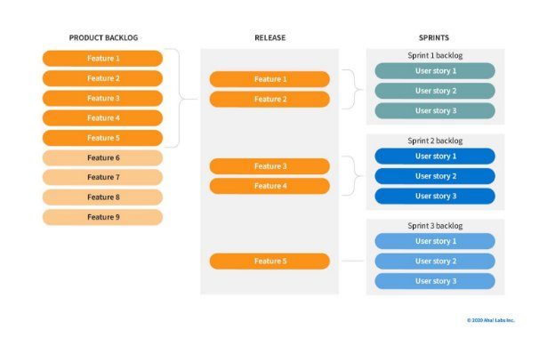
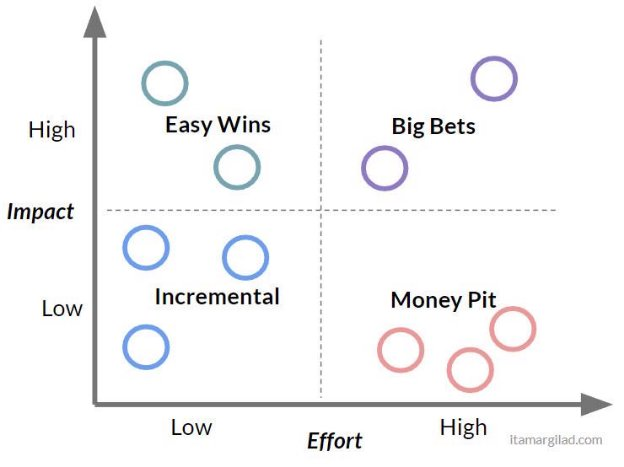
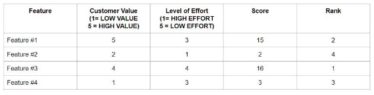
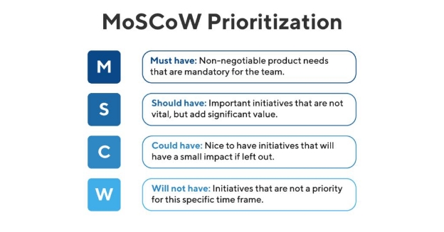

Backlogs

What is a backlog?

We’ve touched on this in previous lessons, but a backlog is essentially the to-do list for a product. It’s a combination of features that have yet to be built and issues with existing features that need to be adjusted to mentor applications that are owned by the Product Owner. In this lesson, we’ll look at some of the components of a backlog and why they’re so important.

What’s in a backlog?

Depending on the type of backlog and the project being worked on, backlogs can contain features, user stories, bugs, tickets, experiments, tasks, ideas, or other items.

Backlog management software like Jira help Agile teams manage the backlog, organizing items into larger groups, and classifying them based on priorityTeams can then  select items for Sprints, and track which items have been completed and which have not.

Why is the backlog important?

The backlog defines the future of the product. It’s a compilation of all the ideas and features that everyone from the leadership team to the end user have thought of. Agile teams draw from the backlog to plan what they’ll work on next. That’s why it’s very important that it be organized.

Backlog Grooming and Refinement

Because ideas and issues are continually being added to the backlog, someone needs to be reorganizing or “grooming” it frequently. This is the job of Product Managers, or in Scrum teams, tThis is the job of the Product Owner. When the product owner grooms the backlog, what is he or she looking for? What is a refined Product Backlog?

- Priorities are current and correct.
- Issues/stories are grouped if necessary correctly.
- Any issues/stories that are no longer relevant are removed.
  - Note: this doesn’t mean stories that you can’t accomplish at this time. These are issues or stories that will never be built and have no further usefulness to the product. If it’s possible it might be useful at some point, it should be kept.
- Items near the top of the Product Backlog, these are the items the team will implement next, have been broken down small enough the team has confidence they can be implemented in a few days.
- Items lower in the backlog don’t need to be detailed; they represent work in a more distant future (a few weeks away, or months).

However, creating a backlog is just the first step. You can’t accomplish everything on the backlog at once, or even over the course of a month. You have to continually choose what things are the most important to accomplish with the limited resources you have. We call this prioritizing, and that’s the topic for our next lesson.

Prioritization

What is prioritization?

Prioritization is the act of deciding which items in your Product Backlog shall be done prior (before) other items.relative level of importance that we give an issue or task. Prioritization is fundamentally about sequencing the work and  Prioritization is essential when you have limited resources.

It’s the same as when we look at our daily schedule and we have to decide what the most important thing to get done next, then next, then next in that time is. We weigh a lot of factors.

Many Product Managers consider The two most important factors to guide the prioritization of their Product Backlog:  are the effort required, and the impact/value it will have.

Level of Effort (LOE)

Level of Effort is the energy or time and resources required to complete the Product Backlog Item (e.g., is task or story). For example, in your daily schedule, brushing your teeth would be an example of something that has a low LOE, while cooking dinner would have a higher LOE, and cleaning the house from top to bottom would have the highest LOE.

In development, there are lots of ways to measure the level of effort required. Here are a few different ways that we’ll focus on it:

- Pebble, Rock, Boulder
- T-Shirt sizing (XS, S, M, L, XL)
- Story Points
- HoursManhours

Source: https://greenestreetfriends.org/academics/social-emotional

**Pebble, Rock, Boulder** is a fast way to get a rough estimate. Think of it in terms of how much effort would be required to move them. A pebble would be easy and quick. A boulder would take a considerable amount of time, strategy, and strength to move.

**T-Shirt sizing** allows a little more detail and flexibility than pebble, rock, boulder. The chart above shows how this team is defining each size by the number of hours roughly required to complete the task.

**Story Points** enable you to give a numerical value to the amount of effort required to complete a task. Some teams prefer this to time-based methods (like hours) so that their team members focus more on the completion of the task rather than allowing the time to tell them when they should be finished. Read more about story points [here](https://www.atlassian.com/agile/project-management/estimation).

**Man Hours** are simply a description of how many hours it would take one person to complete that task. For example, if it would take two developers three hours to create a database for this website, then that task would be assigned six man hours (, since it takes two people three hours each, and would therefore take six hours for one person to do it on their own). This seems to be the most specific, but is the least reliable of the ways we list here, but this also makes it the hardest to estimate accurately.

**How do we know how long it will take?**

You don’t! And can’t. Product Development is complex with significant uncertainty. As a Product Manager, you should not expect any estimate to be accurate - rather, you can expect the estimate to, at best, represent the current thinking among your team members. CThese are conversations to have with your developers, engineers, designers, and the others will help individuals working on your project.

If your team has done similar work in the past, they might be able to give you reasonably better estimates based on work they’ve done previously. You might also use other products  the company has released to get an idea of the effort required for certain parts.

Often, experienced Product Managers talk in terms of ‘Forecasts’ rather than ‘estimates’. Think of it like this:

\- When the weather report indicates 35 centigrade and 80% humidity tomorrow, you can make smart choices about the clothing you wear; but you certainly don’t believe the temperature will be precisely 35C with precisely 80% humidity. In fact, in most seasons, it’s reasonable to conclude the weather report is likely to be wrong and it’s smart to plan for both rain or shine.Regardless of which method you use, make sure you’ve defined what each category means so that every team member has the same understanding and can use the method in the same way.

Thinking in terms of forecasts, and allowing for surprises and variability can help you set appropriate expectations with stakeholders and customers.

Impact/Value

Impact deals with how important this is to your project and your company — how much value might be derived from this.. Does this item have a lot of dependencies? In other words, are there a lot of other things that we cannot get done until we complete this? We also look at how it will affect revenue, customer satisfaction, and numerous other metrics. How we can estimate impact will be covered in a future lesson (e.g., the Pirate metrics!) but for now, Estimating impact is more difficult than measuring effort, but as the Product Owner and/or Product Manager, just know that it is essential to your role that you you should develop have a good understanding of the impact the features of your Product is likely to have for based on all the work you’ve done previously to understand the customer, and the value you provide, and how that comes together in the business.

Bringing them together

When we prioritize, we focus first on things that are **low effort** and **high impact**. These are called **Easy Wins** because they are the things that are relatively easy for us to do, but produce the greatest benefit. For example, in our morning routine, we would say that getting dressed is a high priority, because most/all of your other activities for the day depend on you being dressed, and it’s relatively low effort.

Next, we look at things that are **incremental** and **big bets.** We need more information about the scenario to decide whether these are a good choice for the company and how they should be prioritized. We want to **avoid the money pit,** because it will cost us a lot of effort with very little reward, so it doesn’t make sense to do. Those will be our very lowest priorities.

Now that you’ve learned some of the basics of prioritizing, our next lesson will be on different frameworks you can use to refine the process.

Prioritization With Respect to Incremental Delivery

Some Product Managers argue all the talk about "effort versus value" is distraction.

Rather, we might ask ourselves: what is the next thing we shall do and how can we do that in small, reversible steps?

Example:

1. Your rent is due tomorrow.
1. You don't defer that work because "it's a lot of effort". Rather, you think, "How can I raise the money and make payment with the least amount of effort?"

Example:

1. The best feature to release next is \_\_\_. It will increase revenue / improve UX / etc.
1. You don't defer that work because "it's a lot of effort". Rather, you think, "How can we build \_\_\_ in increments and get feedback along the way to ensure its implementation delivers the impact we want?"

Prioritization With Respect to Focus

Compare Queen’s prioritization strategy to the Spice Girls’ prioritization strategy: https://www.youtube.com/watch?v=hFDcoX7s6rE <https://www.youtube.com/watch?v=gJLIiF15wjQ&t=46s>

Stakeholders want it all, they want it all, and they want it now. But as Product Manager, you must bring focus to the work. You must determine what you really want, “what you really really want” to ensure the Product evolves toward your Product Vision.

If you prioritize the Product Backlog effectively, you may deliver features into the market that are valuable to the end users and customers, and your product may achieve great success! If you prioritize the Product Backlog ineffectively, you are likely to jeopardize the success of the product.

Prioritization Frameworks

There are many, many ways to prioritize in product management. This[ guide from Product Plan ](https://www.productplan.com/learn/product-management-frameworks/)lists 37. Don’t worry, we won’t be going over all of them. We’ll be highlighting a few of the most common and easy to use so that you have a few options in your toolbelt and can experiment with others as you expand your knowledge base.

Stack Rank

Stack Rank expands on what we discussed last lesson. You rate each feature based on customer value (a form of impact) and the level of effort it requires. By multiplying these two values together, we come up with an overall score for that feature. The higher the score, the better ratio of high value to low effort it has, and therefore, the higher priority. Each feature is then ranked from highest priority to lowest. For example, in the table below, Feature #3 is ranked first, and so would be the first to be worked on.

MoSCoW

MoSCoW is popular because it’s quick, easy to use, and easy to communicate if you’re trying to present your reasoning to stakeholders. MoSCoW splits your product features into four categories:

- **M**ust Haves
- **S**hould Haves
- **Co**uld Haves
- **W**on’t Haves

The below image from Product Plan summarizes it well.

https://www.productplan.com/glossary/moscow-prioritization/
