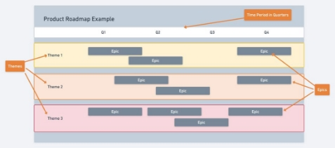

Introduction to Roadmaps

What are Roadmaps? Why use them?

Now that we have covered a lot of different product concepts, let us take a look at what Product Roadmaps are and how they bring these topics together.

Product Roadmaps are visual documents that allow you to lay out the work that your product needs to do over a rough timeline that brings alignment between both the product team and the stakeholders. They outline functionality that will be available in your product, and how that functionality intends to unlock new business value opportunities over time, and how the product evolves.

Product Roadmaps can be built using simply Powerpoint and Excel or you could leverage roadmapping tools such as Aha, Atlassian, or Roadmunk.

Why use product roadmaps?

- Great communication tool for your stakeholders

o Highlights key milestones

- Marketing team can coordinate new put together marketing collateral to pitch your product
- Support teams can prepare to support your product
- Amazing tool to keep your development team aligned
- Ensures that you're on track to deliver organizational goals as well

Components of a Roadmap

One way to approach roadmapping is by When people talk about a product roadmap, they’re generally referring to a “theme-based” roadmap. This is what one might consider the classic roadmap. There are many versions of the theme-based roadmap depending on the audience for the roadmap and the use, but the following components generally stay the same. One version that is significantly different structurally is the GO product roadmap, which will be covered in the next lesson.

Key Components of a Roadmap

**Themes** are general focus areas that are set by the organization based on the objectives that executives or the CEO sets for the company. These themes will help the product team and their roadmaps better align to the company's main goals for the fiscal year.

**Epics** are the features or feature sets that can be broken down into user stories or tasks that can be implemented and executed by development teams.

**Timelines** (organized by years, quarters, months) are most often in quarters to match up with organizational goals for the given year. These allow us to show when the product team can potentially deliver features and functions over the course of the year.

Sample Roadmap

Here is what a general roadmap structure looks like visually:

The **timeline** is typically located at the top and usually broken down into quarters. **Themes** are swim lanes that stretch horizontally across the roadmap.

**Epics** are laid out according to when they would be worked on and released within the theme that they are relevant to.

A Warning About Timelines

When a roadmap is displayed with calendar dates, stakeholders and teams can easily begin thinking of those dates as “deadlines”.

And what happens when a team looks at deadlines? They will cut quality to be sure they hit the deadline. And most of the time, a date is just wishful thinking — most often, dates on a roadmap aren’t fixed dates but are hopeful estimates.

Consider producing roadmaps with no dates at all — focus instead on showing the sequence of releases and what business opportunities align with that sequence. Example:

- Rather than say, “We must release feature X by September.”
- Your roadmap might visualize it this way: “When we deliver feature X, we can support more customers.”

Which of those is more motivating? Which of those is more meaningful to stakeholders?

Building a Product Roadmap

How does one build a product roadmap, though? Let’s walk through an example to see how a company and product manager goes from objectives and key results to a finished roadmap.

Scenario

Consider that a credit card company wants to become mobile-first since they found out that most of their customers are on mobile devices. Here is what their high level strategy and roadmap might look like:

**Objective:** to support our new customers based on their needs

**Key Result:** to provide an amazing omni-channel experience and retain 80% of our new customers **Initiatives:** create a compelling desktop and mobile experience for our customers

- **Theme:** To create a world-class mobile application
- **Epics:**
  - Login + Face ID
  - Account Summary
  - Statements
  - Bill Pay
  - Scheduled Bill Pay
- **Theme:** To improve our website to integrate and support the mobile application
- **Epics:**
  - API for Login
  - API for Account Summary
  - API for Statements
  - API for Bill Pay
  - API for Scheduled Bill Pay
- **Theme:** To improve our website to provide a great mobile-web experience
- **Epics:**
- UI/UX Design + Prototype Testing
- Login Revamp - Mobile Web
- Account Summary Revamp - Mobile Web
- Bill Pay Revamp - Mobile Web
- Scheduled Bill Pay - Mobile Web

**High Level Strategy**

**Roadmap**

GO Product Roadmap

The GO Product Roadmap is a text/table-based version of a roadmap that is visually simplistic. It was invented by Roman Pilcher and the name GO comes from "Goal Oriented" - since the roadmap is focused on a specific goal that the product attempts to achieve.

The key areas of a GO Product Roadmap:

- **Date** - when will the product goal be met?
- **Name** - what is the name of the version or release?
- **Goal** - what is the goal the product will achieve? What benefit will customers gain? What is the value proposition?
- **Features** - what deliverables will the product need to meet?
- **Metrics** - how will you measure the success of the goal?

GO Product Roadmap Example

In this example, the GO roadmap is set up to release a new mobile game with a dance theme. The roadmap is broken down so that each quarter has its own goal.

For quarter 1, they want to release a version 1 focused on acquiring new users in a free way. So they want to launch a basic game with multiplayer functionality and Facebook integration. To measure the success, they want to rank as the top 10 dance apps in the app store for downloads.

For quarter 2, they want to launch a version 2 to drive some in-app purchases. So, to make that happen, they want to enable customers to purchase dance moves and create new dances. For this update, success will be measured by seeing how many users download the app and activate (make a dance move purchase).

For quarter 3, they want to release a version 3 that focuses on retaining their existing customers. For that, they want to release new characters and floors, while improving the visual design, so that they drive a better user experience for new and existing customers. To measure success, they want to look at daily active players and how long the users use the app in one session.

Finally, for quarter 4, they want to release a final version 4 to acquire a new segment of users that are interested in street dances and competition. To reach that goal, they want to bring in elements of street dancing and competition into the app. They will measure success by monitoring overall and new segment downloads.
