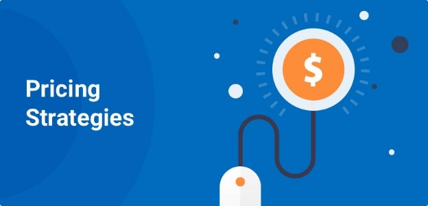
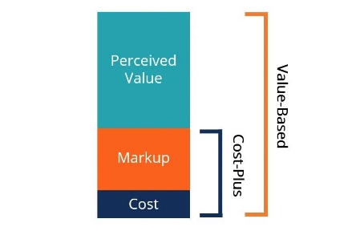
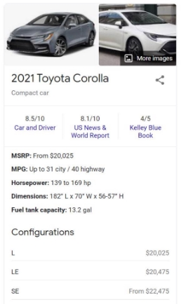
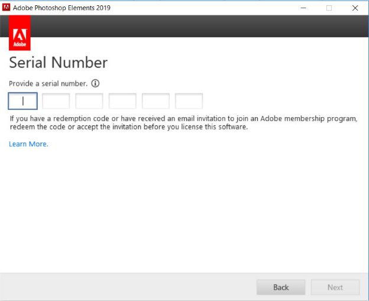
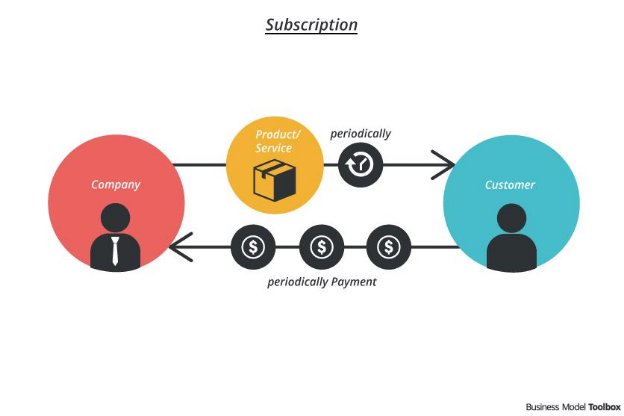
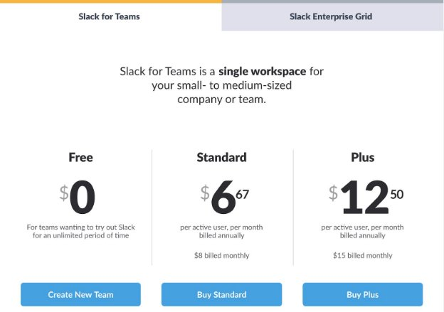

Pricing Strategies

Pricing is a core of how your product will generate revenue. There are several pricing strategies and here are some that will get you thinking about what is helpful to your product.

Cost

Cost-based pricing typically involves you taking into the account of the cost of your product. This is very common in physical products such as eCommerce where the product’s production cost is taken into account when pricing the product. Let’s say that the cost of producing a piece of apparel is $3.00. If the company decides to sell the product for less than $3.00 - they would be at a loss. Using cost-based pricing, you would start with the cost of production and add a **margin** that allows the company to make a profit on the product. In this case, the company decides on selling the product for $4.50. With the cost of production at $3.00, the company would be making a 33.3% margin.

Value

Value-based pricing takes into account not only by considering the production cost of the product, but also understanding the benefits that it provides the customer. Let’s consider vehicles for examples. Toyotas are known to be very inexpensive whereas Bentleys are known to be very expensive. Why? Toyotas are targeted to the average consumer whereas Bentleys are targeted towards the luxurious. Value-based pricing allows both Toyota and Bentley to price their products based on the value or the perceived value of the product. For Toyota, the perceived value of the consumer is efficiency, and for Bentley, it is luxury and a status symbol.

Competitive

Competitive-based pricing takes into account similar products and services that the competition offers and sets the pricing relative to them. The thought process behind the competitive pricing is that customers typically compare and contrast different competing products when making a purchase decision. Pricing is a strong part of that decision making process. If your product is not priced competitively, then you may not even be considered.

Continuing on with the vehicle example, let’s consider Honda vs Toyota. If you look at the flagship vehicles for both, they are the Honda Civic and the Toyota Corolla. Considering both models are very much in competition with each other, the Civic and Corolla will always be priced competitively relative to each other. Neither Toyota nor Honda will price a Corolla or a Civic outside of this range, because they would no longer be able to compete adequately in the market.

 

When pricing your product, it is very important to consider aspects of the above three strategies to provide the best possible price for your product, not only from a profit standpoint but also from a customer value perspective.

Pricing Models

There are several pricing models, but we will focus on three key ones.

Flat Fee Model

Flat fee models offer the purchase of the product for a one-time fee. The best example for this pricing model is a brick and mortar store. When you purchase groceries, you are paying a flat fee to take home those tasty bananas or any other physical goods. In software, this model was very popular when it came to licensing a product. Adobe was a great example of this. They licensed their products such as Photoshop for a flat fee. Customers would pay this fee to gain access to a serial number, which then unlocked the product for them to own and use.

Subscription Model

Subscription-based products offer the usage of a product for a given time period. Think of a gym membership: typically, you pay a monthly subscription for access to their equipment. As long as you are subscribed to their service, you will continue to have access to their gym. Another great example

Oftentimes, subscription based products offer the free usage of a product for a short period of time (7, 14, or 30 day free trials). This free trial acts as a hook to get customers to integrate the product into their life and form a habit. This incentive proves to be very effective when it comes to introducing a product to customers.

Freemium Model

Freemium models are a product of the past decade. In these, a limited version of the product or service stays completely free. However, for an additional fee (flat or subscription), customers can gain access to more premium features.

This model is very common in [app-based games](https://www.businessofapps.com/news/how-to-choose-the-best-pricing-strategy-for-your-mobile-app/). Most games are free, but offer other “in-game purchases” so that they don’t wait 10 minutes for their digital crops to complete growing or give you additional in-game currency to keep playing longer.

Another great example is Slack. A limited version of Slack is completely free, forever. It works well if you send 10,000 messages. However, as your business or initiative grows, you’ll eventually have to consider the premium version.

MRDs

What is an MRD?

An MRD, or Market Requirements Document, is a precursor to the PRD.

The MRD answers “**Who**” for a product. Who will benefit from this product? Who is it being sold to? Who makes up the market? How big is the market? We’ve talked previously in the class about opportunities, getting to know your users, market sizing, and the competitive landscape. All of these live within an MRD and help determine if the product has a market to support it.

Like the PRD, the MRD relies on research and input from various teams.

Components of an MRD

- Market Analysis
- TAM/Other sizing metrics
- Competitive Analysis
- User Personas
- Value Proposition

Why does the MRD struggle in Agile?

Remember in class how we talked about updating our personas? This is one reason why the MRD struggles in an Agile environment. If this information gathering is only done once, at the beginning of the product development process, then those personas are “set in stone”. Once the MRD is approved and the next stage of the process begins, it’s very difficult- and sometimes impossible- to go back and make changes.

However, both the PRD and the MRD have been adapted to suit the changing times. That’s what we’ll talk about in the next lesson.

PRFAQs

Pioneered by Amazon, the PRFAQ is a product development tool that puts the focus solely on the customer. While the PRD and MRD are almost entirely internal facing and the product brief is somewhere in-between, the PRFAQ focuses on the external by creating a picture of what the customer should see at the end.

The PRFAQ adheres to the Agile methodology’s idea of putting the customer first and working to support that. In fact, Amazon uses the term “working backwards” to describe this process of defining the customer value first and then backtracking to fill in the details needed to make it happen.

What is a PRFAQ?

PRFAQ stands for Press Release and Frequently Asked Questions. It is a two-part document. The first is a (generally 1 to 1.5 page) press release. This press release is set in the future and describes what your product launch looks like from the customer’s perspective. It is intended to briefly explain your offering, why it is significant, and outline the benefits it produces for the customer. Although it is an internal tool (for use in aligning your teams and defining a product), the idea is that if everything goes well, this would be the press release that you would send out when your product actually launches.

Structure of a Press Release:

- **Heading:** What are you releasing?
- **Subheading:** Who is it for and why?
- **Body Paragraphs:**
- Press release date and location
- Summary of the problem and solution
- What’s the background of the problem? Why is it urgent?
- Why is the solution amazing? Really sell it.
- Customer quote and a company quote
- **Conclusion:**
- Call to action- how does the customer find out more?

The second part of the document is the FAQ section. This should answer all the additional questions people may have after reading your press release and explain concepts or terms that the average person at your company might not know. Like the product brief, you should anticipate the questions people might have. One good way to address this is to show your press release and draft to coworkers and see what questions they have for you. Below are some questions you can ask yourself to help brainstorm questions to add to your FAQ.

- What are some concerns I think people will voice?
- Which complex parts need more explanation?
- What terms am I using that people might not understand?
- What are common questions that people you have shown this to are asking?
- What about my solution is the hardest to sell? How can I make it more convincing?
- What data can I provide to support this proposal?

Although the press release is strictly limited as far as page count goes, the FAQ section is more forgiving. However, try to stay on topic and not get too far away from your main offering so that your purpose remains clear. Don’t forget that this is still a high level document, so you won’t be getting into details like how the engineering team will build the features or anything of a similar granularity.

In the next section, we’ll take a look at some examples.
