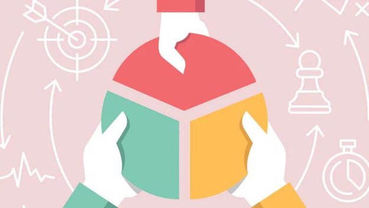

Who are Stakeholders?

Let's consider this scenario: your sister asks you to buy a birthday cake for your niece’s birthday party. How do you go about deciding what cake to buy? How do you decide what size, shape, flavor, etc?

Think of the people you would need to talk to or people you would need to take into consideration when deciding this. For example, you would think about what flavor of cake your niece likes, how old she is, what color/design would she want on the cake, how many people are at the party, do people at the party have any dietary restrictions, etc. The people you take into consideration or need to talk to as you decide about the cake are your “stakeholders”.

In this scenario, your stakeholders would be:

Stakeholder

A stakeholder is an individual, group, or organization who is “impacted” by the outcome of your task. The impact means a change for the person or group or organization. It could be positive or negative. They could be your customers, partners, approver, etc. It is important for any product team to understand the stakeholders as they influence the definition, build, delivery, and success of your product

Understanding your Stakeholders

You want to focus on the important stakeholders. Here is a framework you can use to capture information and understand your stakeholders.

1. **Context** - We start by trying to understand each stakeholder’s role and responsibilities. What does their day look like? Who reports to them and who do they report to? What are they measured by?
1. **Aspirations for Self and Company** - We must understand an individual’s goals. What do they want to achieve? What motivates them? Why are they at this company? Even though they may all want the company to be successful, each will have slightly different ideas of what defines success and what specific goals they want the company to achieve. Understanding what the goals that drive the stakeholders are can be a powerful motivation tool, especially given the product manager’s reliance on influence to get things done.
1. **Fears for Self and Company** - On the opposite side, we have fear. What keeps them up at night? As product managers, we are agents of change. Change can be scary to stakeholders as it can have a direct impact on them and their teams. When things change, stakeholders can turn to self-preservation, which causes them to retreat and pursue avenues that keep the project from moving forward.  Most senior stakeholders take pride in their work and want the company to do well. In order to align ourselves with the stakeholders, it’s important for us to understand what their fears are and what risks they see for the company.

This is a good general framework, but for certain projects, we'll want to tailor the categories to address specific things we want to know about the stakeholders. The way we define this helps us understand the stakeholders.

Understanding stakeholders helps teams better understand why certain product decisions may exist and why a stakeholder may request a certain feature. It’s important to understand some distinctions within the stakeholder category.

Stakeholders vs. Shareholders

One easy way to break down the difference between stakeholders and shareholders is to look at the names themselves.

Stakeholders have a **stake**, or some personal interest, in the success of the business, product, or project. Somehow, their success is tied to yours. Usually, these people are not directly financially invested in your business.

Shareholders have **shares**, or purchased financial portions, of your company or project.

Shareholders are a subcategory of stakeholders because shareholders invest money in the business, and so are automatically stakeholders. However, since groups like employees and local communities do not necessarily invest in the business, they are stakeholders but not shareholders. This is an important distinction to make because it tells you how best to prioritize your stakeholders when you make decisions that impact each one.

Who is the most important stakeholder of all?

The customer is the most important stakeholder of all. Why? What’s a business without customers? The purpose of a company is to create value and positive outcomes for its customers. Remember the business model canvas - a business is nothing without its customers (Customer Segments) and the value (Value Proposition) it creates for them.

Stakeholder Analysis

What is Stakeholder Analysis?

Stakeholder analysis involves asking three key questions:

- Who are my stakeholders?
- How do I categorize them?
- How should I manage them?

These three questions give us three action items:

- Define and identify stakeholders
- Categorize stakeholders by role and interaction
- Use a tool like the Influence-Interest Grid to use categories to determine how best to communicate and work with the stakeholders.

Key Benefits of Stakeholder Analysis

The core purpose of stakeholder analysis is simple; you want to ensure that all stakeholders are supported and leveraged so that they can, in turn, support your product's success. Some key aspects of that are:

1. **To know where to go for help.** By maintaining good relations with stakeholders, you can keep them informed on your product's process and request help from stakeholders when you need it.
1. **To create alignment among stakeholders.** As you engage with your stakeholders, you need to know which of them needs to sign off and which of them needs to be informed of a decision. As you'll come to learn, alignment among stakeholders is really important to a product's success.
1. **To resolve issues and clear roadblocks.** As you work through various aspects of your product, you will inevitably run into blockers. Stakeholder analysis allows you to identify how to work with stakeholders to resolve the issue at hand.

In the next lesson, we’ll look at defining and identifying stakeholders.

Different Types of Stakeholders

After learning more about the stakeholders, we can categorize them. Their level of involvement and expectations guide our working relationship with them. Stakeholders in a business are categorized in 3 ways:

- Internal or External
- Primary or Secondary
- Direct or Indirect

Internal or External

**Internal stakeholders**

- Inside the company
- Primarily employees and those directly associated with the company
- Examples: dev team, marketing team, executives, sales

**External stakeholders**

- Outside the company
- Individuals or organizations that work with or are affected (positively or negatively) by the success of the company/product
- Examples: investors, suppliers, users, competitors, media

Primary or Secondary

**Primary stakeholders**

- Working on or contributing to the product/project
- Usually have a financial stake/economic investment
- High involvement, high investment, high interest
- Examples: dev team, users, designers, investors

**Secondary stakeholders**

- Not directly involved, but affect the product/project or are affected by it
- No financial stake/economic investment
- Involvement ranges, but generally lower investment and interest
- Examples: legal team, business competitors, media

Direct or Indirect

**Direct stakeholders**

- Day-to-day direct involvement
- Engaged throughout the process
- Examples: employees, investors

**Indirect stakeholders**

- Interested in the final result
- Not involved in the development process
- Examples: users, suppliers, logistics carriers

A breakdown from osome.com

Stakeholder Buy-in

What is Stakeholder Buy-in?

When you think of a buy-in, you often think of a financial transaction. In fact, many buy-ins are financial transactions. For instance, when a partnership forms from a sole proprietorship, the new partner pays money to buy into the business.

A stakeholder buy-in, however, is generally non-financial. This type of buy-in involves the acceptance of a concept or idea, such as a project or a design. The stakeholders who buy in agree to commit to the proposer's plan of action.

Importance of Stakeholder Buy-in

As a product manager, you are leading ideas and outcomes across the organization, most of the time for teams and individuals who do not report to you. Hence, you need the support of these various teams- your stakeholders. Not only do you need the assistance of your fellow employees to work on the project, you also need approval for the resources and support from those surrounding you. If you encounter resistance from board members, employees, management, or other key shareholders, your project is unlikely to be successful. You will feel as if you are working against those around you. Collaborated efforts are always better than rebellious efforts.

Key Internal Stakeholders and their Needs

Stakeholders are working towards one or more goals as well. They are measured by success and want to hit their targets. The key is to find the common ground and align on key goals. What problem are they trying to solve? Every demand and feature request they make is based on the assumption that it will somehow help them achieve their goals. By fully understanding their motives, you’ll be able to empathize with them and work better with them.

For example, let’s look at what some of the main stakeholder groups typically want:

**Engineers:** They want to know the vision for the product and how their work contributes to getting there.

**Executives:** They are mostly interested in strategy and the big picture. How will the product contribute to the success of the company and their business group goals?

**Sales:** They care about how the product or new features are going to give them a competitive edge to help get new customers and retain existing customers. Selling more is what they care about. They are a source of valuable input since they spend a lot of time in the market and with customers.

**Marketing:** They want to know what’s unique about the product and how it can benefit the customer so that they can develop a story around it.

Managing External Stakeholders and their Needs
