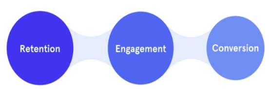
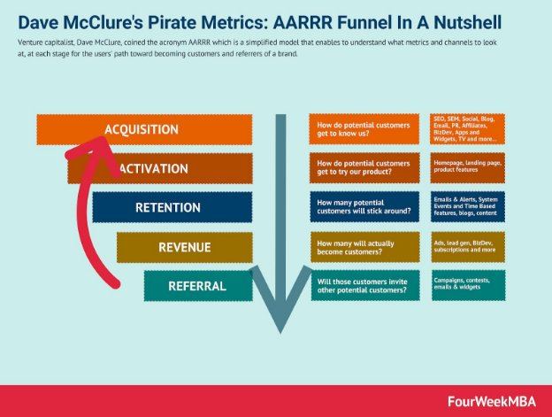
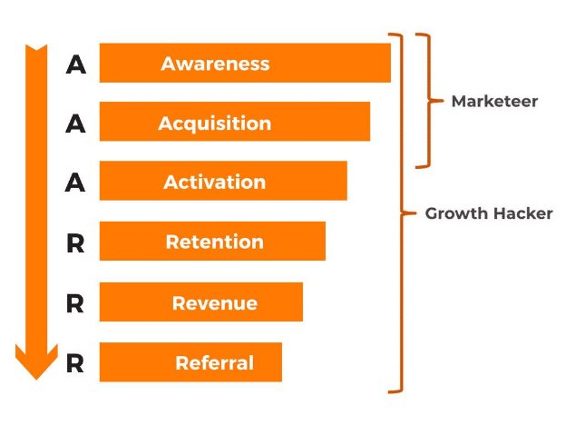

The Importance of Data Analytics for PM

As product managers, whether it’s competitive analysis, customer research, usage analysis etc, you are always analyzing data. The data you will work with will usually be either quantitative or qualitative datasets.

Let’s say we have a list of 100 customers who reviewed your product, a coffee maker. 70 out of those 100 have at least one problem with it. Each one of them has submitted a list of their problems. Without analysis, you have a huge pile of complaints. However, if we sort that data, and use a pareto chart to measure the frequency of each problem, we might find that 50% of the complaints are about water leaking from the reservoir in the back. Now we have a specific feature to focus on.

Collecting data is the first step. However, it requires analysis to make it meaningful, especially in terms of product management.

Quantitative data can be counted. It measures quantities, and therefore uses numbers. Qualitative data is descriptive. It is generally more text-based and not as easily measured.

You would collect qualitative data when using in-depth interviews, documents, focus groups, case study research, and ethnography. The results of qualitative methods provide a deep understanding of how people perceive their social realities, and in consequence, how they react to it.

You would have quantitative data when collecting ratings, product usage, conducting experiments, etc. Quantitative data is concerned with measuring things.

However, other research methods, such as controlled observations and questionnaires can produce both qualitative and quantitative information. For example, multiple choice, yes/no, rating scale, or checkbox questions on a survey would generate quantitative data since these produce either numerical data or data that can be easily sorted into countable categories. Questions like “Provide additional feedback” or “Describe your experience” would provide qualitative data.

Analysis makes it possible to turn measurements into insights and action.

Analyzing Quantitative Survey Data

Survey data can be analyzed in many ways. However, whatever method you use, you'll first want to examine your data and group it. Separate the quantitative data from the qualitative. If your target population is between the ages of 20-30 year old, separate those individuals in your data set. If you're looking for features to improve on your product, select individuals who reported a complaint. Then you can begin to define characteristics of the data set and display it.

The following are common measurements used to characterize data sets:

- **Mean:** An average. A sum of all the data points divided by the number of points collected.
- **Median:** The middle value for a data set when the set is ordered from least magnitude to greatest.
- **Mode:** A measure of the values that occur in the data set with the most frequency.
- **Range:** The distance between the highest and lowest values in the set, between which all other points fall.

Data is also analyzed visually by creating charts such as the following:

|
**Bar Graph**

● Shows the frequency of numerical or qualitative responses
||
| - | - |
|
**Scatterplot**

● Shows the spread of data and can be used with a trendline to show correlation between two factors
||
|
**Pie Chart**

● Shows the portion of the whole that each response category represents
||
|
**Line Chart**

● Shows changes in frequency over time
||

|
**Histogram**

● Shows the distribution of frequencies over a data set
||
| - | - |
|
**Pareto Chart**

● Shows the frequency of responses in order of highest frequency to lowest as well as the cumulative percentage
||
Many companies will now generate many of these for you. Google Forms, Qualtrics, and Survey Monkey all offer snapshots of your data with charts that they think will be useful to you. This is a good starting point and can help with spotting important trends, but often you’ll want to tweak settings or set new parameters to investigate particular questions.

However, just because you've come to a conclusion numerically or visually doesn't necessarily mean that the result is accurate or representative of the population. We'll cover that in the next two lessons.

Sufficient Sample Size

Sample size and sample populations can have a significant effect on your survey results and subsequent analysis.

Let’s say we stop five people on the street outside a coffee shop and ask them, “Do you like coffee?” Chances are, most or all of these people will say yes. Can we then assume that close to 100% of the population enjoys coffee, since our survey said 5 out of 5 people do? No, we can’t. The sample size is too small, and the population is not representative of the whole, since our population pool of coffee shop patrons are more likely to enjoy coffee.

This is a simple scenario, but a researcher must ask themselves what a sufficient sample size is to accurately represent the population. You also don’t want to pick a sample that is too large; if you try to ask every single person in a city if they like coffee, you will be spending a lot of time and resources to arrive at an answer that could have been achieved with half as many.

There are equations to use to figure out exactly how many people you should sample to fall within certain confidence intervals (see <https://www.qualtrics.com/experience-management/research/determine-sample-size/> for more details), but a good rule of thumb is roughly 10% of a population, and between 100 and 1000 responses. Keep in mind that response rates for web surveys are often below 30%, so you’ll have to send it out to far more people than you expect to hear back from!

What are Metrics?

What are Product Metrics?

Product metrics are quantifiable data points that help businesses track and gain insights into the success of their product or service. Gaining these key metrics can help you assess your product performance by checking to see if it meets the original business goals and if the product strategy is working. Without knowing these metrics, evaluating the performance of your product or service might just end up becoming a guessing game.

Why Product Metrics Matter and Why should Product Managers Track Them?

To put it simply, you can only move what you measure. Those days are gone when product managers used to decide what a product should look like or what a customer might want to see. Gut instinct and speculation from a small segment of your user base are no longer viable strategies for making product decisions, big or small. If you want to stay ahead of the curve, edge out the competition, and—most importantly—drive value for your potential and existing customers, you need to set the right metrics for your business and track them diligently.

Product managers uses product metrics to:

- Learn how your user/customer base interacts with your product or service.
- Learn which features are most popular, underutilized, or identify those that are missing from your product or service offering.
- Learn more about user/customer satisfaction from using your product or service.

So, now you might be asking yourself, which metrics should I be tracking as a Product Manager? Let’s look at some of the key product management metrics that are commonly used today.

- **Revenue**: Sales revenue that is generated from your product or service
- **Engagemen**t: The frequency and cadence of key actions
- **Conversion**: Driving purchase, form-fills, sign-ups, etc…
- **Retention**: Users coming back, re-purchasing your product or service
- **Active Usage**: Daily, weekly, monthly, or annually active users
- **Net Promoter Score (NPS)**: Customer Satisfaction

But, of these, which metrics matter the most? Below are the top 3 metrics for...:

1. Retention
1. Engagement
3. Conversion

While other matrices are also important that doesn't mean you should only use the above three metrics. As a Product Manager, you will have to use a combination of metrics as businesses and products are all unique and have different goals based on stage and ambitions.

Vanity vs Actionable Metrics

Let’s consider a scenario. You’re at work, halfway through a big research project that upper management is interested in. Your boss sends you an email and asks you to send over some numbers to give a snapshot of how the project is going. You look through your notes and realize you have a few options.

Interviews Scheduled: 300 Interviews Completed: 150 Usability Tests Conducted: 40 Hours worked: 480

Which do you send? The most impressive would be the hours worked and the interviews scheduled. That certainly makes it seem like you’re getting a lot done. But if you schedule an interview and don’t end up interviewing the person, how much has that contributed to your overall goal? The answer is that it doesn’t. This is what we would call a **vanity metric**.

Vanity metrics get their name from “vain”, a word that means prioritizing and putting a high value on appearances. This is exactly what a vanity metric does; it looks good, but there’s no substance underneath.

The opposite of a vanity metric is an **actionable metric**. Actionable metrics are directly linked to the success of our objectives and can be acted upon. This is what we want to aim for as product managers. Because so much of what we do is data driven, we want to pick metrics that tell us what’s going on. Otherwise, it defeats the purpose of using metrics in the first place. Metrics are our way to measure progress. They shouldn’t be a tool to boost ego. If we aren’t doing as well as we wish, we need to know so that we can make changes to improve.

Vanity vs Actionable Metrics in Action

The challenge with vanity and actionable metrics is that sometimes it’s hard to tell which they are. People don’t intentionally choose vanity metrics; they choose a metric that they think makes sense, but over time, they realize that that metric doesn’t actually reflect the actions of their users. That being said, there are some metrics that tend to be vanity metrics and others that tend to be more actionable.

Pageviews is one that people commonly target. You may think that that sounds like a good indicator. People are visiting your site! However, when you track page views, you’re lumping in the people that accidentally clicked on your page and exited without looking at anything with the same people who browsed the site for hours. What you’re really looking for is engagement. How many people clicked on the articles on your site? How many purchased something?

Callrail.com has an [excellent list](https://www.callrail.com/blog/vanity-metrics-vs-actionable-metrics/) of vanity metrics and some more actionable counterparts (check out Step 3).

AARRR Metrics

What is AARRR?

Every year September 19th is celebrated as International Talk Like A Pirate Day. Well, today isn’t September 19th, but we can still discuss one of the most important metric frameworks to live by if you are just trying to launch your product or service or a company: The AARRR framework. It’s also referred to as the Pirate Funnel or the Pirate Metrics based on its naming convention.

AARRR is an acronym that describes the five stages a user/customer goes through on the path to becoming a paying user/customer.

1. Acquisition: Your first interaction with the customer. First impressions.
1. Activation: Your customer’s connection with your product/content. Known by some as the “Aha!” moment. “This is something I need.”
1. Retention: Your customer comes back. They continually engage or repurchase.
1. Revenue: How your customer’s actions create profit for your company.
1. Referral: Your customer recommends your product/content to other people they know based on their positive experience.

Who created AARRR and Why?

Dave McClure, a Silicon Valley investor and founder of over 500 startups, developed the AARRR framework. McClure saw that many startup companies were easily distracted by superficial metrics; they were making decisions based on gut feelings or based on what they found online, such as likes on social media.

With AARRR, he had twofold goals which he wanted to achieve. One was to show young companies how to narrow their focus on metrics that can directly impact the health of their business and products or services. The second was to help these companies use the right data to gauge the success of their product management and marketing efforts, then improve those initiatives that weren’t working.

Here is a summarized version of McClure’s own sample of the AARRR metrics chart.

https://www.google.com/url?sa=i&url=https%3A%2F%2Ffourweekmba.com%2Fpirate-metrics%2F&psig=AOvVaw34kn0Z0Mh\_QJj3vnlo5BtC&us t=1608233475218000&source=images&cd=vfe&ved=0CAIQjRxqFwoTCOjylN-e0-0CFQAAAAAdAAAAABAD

AARRR: Acquisition

Acquisition - “Where are our users/ customers coming from?”

Acquisition is the first A in the AARRR framework and describes how people find you and eventually turn into customers.  Eventually this A refers to all of the channels you as a Product Manager use to introduce people to your product.

This could include :

- SEO
- Social Media
- Marketing Campaigns
- Advertising

It’s very important to view the acquisition part of this framework holistically. This means not just looking at the site visitors, but also understanding how those site visitors convert into customers for your product or service. You as a Product Manager want to track every aspect of your customer journey and not just look at the final conversion to paying customers.

Here is an example of a customer journey for a SaaS business :

*Website visit -> email signup -> webinar participation -> call with sales team -> conversion to customer.*

All those steps, before converting to a customer, are considered  micro-conversion and those can be measured to:  understand and optimize the customer’s journey.

AARRR: Activation

Activation - “How good is the user’s/customer’s first experience?”

As we learn more about this framework, we will discover that there are some parts that overlap between Acquisition and Activation.

Activation is really about the first meaningful experience the customer has with your product. It is not enough to get people to download your application, make them sign up, or get them to buy your product or service. The crucial moment is  that “Aha Thought”--  the first time the user/customer realizes the real value in your product or service.  The time between when the user/customer signs up to use your product or service and when they say “Oh, wow, I really like this” is called activation.

The reason we include customer conversion under acquisition and differentiate it clearly from activation is that just because someone that signs up to use your product or service is converted as a customer doesn’t necessarily mean they are using it. This needs to be looked at differently for various types of business.

Example of Activation: if you are a Product Manager for an application that is released on IOS and/or Android, then you should look at activation after people download / sign up for your application. Do they login once and never come back? An activated customer is someone who keeps coming back to use your product or service.

AARRR: Retention

Retention “How many of your users/customers are you retaining and why are you losing the others ?”

Customer retention is probably the most important thing you as a Product Manager look at when evaluating not just your company’s marketing efforts but the entire product or service success.

High retention means that people regularly come back to use your product or service. If you are a Product Manager for an E-commerce platform, this would mean that someone buys from you, not once, but multiple times. If you are leading an application that is being sold in IOS and/or the Android app store, then this would mean that users keep coming back and they keep on opening and using your application.

Another concept you  should be aware of as a Product Manager is called customer churn. Customer churn  is the opposite of customer retention. It is essential for you to measure your customer churn rate because it will tell you if you have achieved a good product/market fit or not. If many people stop using your product or service after they make a purchase, something might be wrong with either your product/ service or how you have messaged it in the market.

Secondly, you always want to make sure that your customer churn rate is lower than your customer retention rate. A lot lower!  Why, you might ask? Because that’s the only way to achieve growth.

You can think of it like a leaky gas tank: it doesn’t matter how much gas you pour into your tank (how many users/customers you acquire), the gas tank won’t get full (your company nor your product or service will achieve growth) because it is leaking gas from the bottom of the tank (your customers are churning).

Remember:

**Customer Acquisition Rate > Customer Churn Rate = Growth**

**Customer Churn Rate > Customer Acquisition Rate = Burning a lot of money**

AARRR: Revenue

Revenue - “How can you increase revenue?”

If you have optimized your offering based on the above four AARRR metrics, then revenue should already be flowing in nicely! Revenue and figuring out how to monetize your product or service is crucial when launching a new product or service. Take Facebook or Instagram, for example-- they both started out as purely social, non-monetary platforms but are successful today  due to the huge advertising business they have incorporated.

So, how do we increase revenue for a product or service? You can increase revenue by increasing your Customer Lifetime Value (CLV) and decreasing your Customer Acquisition Cost (CAC).

Your customer lifetime value (CLV) is the amount of revenue you earn from a user/customer during their lifetime as a user/customer of your product or service.

Your customer acquisition cost (CAC) is the amount of money you spend on acquiring your user/customer. That includes the cost for marketing, sales, meetings, or whatever it takes to get your user/customer to convert. A good standard for growth is a 3:1 ratio of CLV to CAC.

AARRR: Referral

Referral - “How can you turn your users/customers into your advocates?”

The best way to drive growth of your product or service is through referrals. Why would you spend a huge amount of money on marketing to deaf ears when you can have people they trust rave about your product or service to them.

To drive referrals, you need to have a thought-through systematic process in place that incentivizes and generates them on a consistent basis.

One of the most successful examples of this method is used by Dropbox. Early on, They figured out  that their referral program was one of the main drivers of their product's growth.

There are two metrics that you as a Product Manager should keep a close eye on in terms of referrals. The first is the **Net Promoter Score (NPS)**, which is an index that typically ranges from -100 to +100 and measures how willing your users/customers are to recommend your product or service. It also lets you know how satisfied and loyal your users/customers are to your product or service.

Another metric is the **Viral Coefficient**. The viral coefficient is typically the number of users that a customer refers to you. A viral coefficient of three would mean that one customer on average refers three new customers to you. Your viral coefficient needs to be larger than one to have growth for your product or service. The graph below shows you the exponential user growth you can have depending on your viral coefficient, i.e. the number of people being referred to you by a customer. As you can see, increasing that coefficient by even a relatively small amount creates a significant increase in the number of your users.

