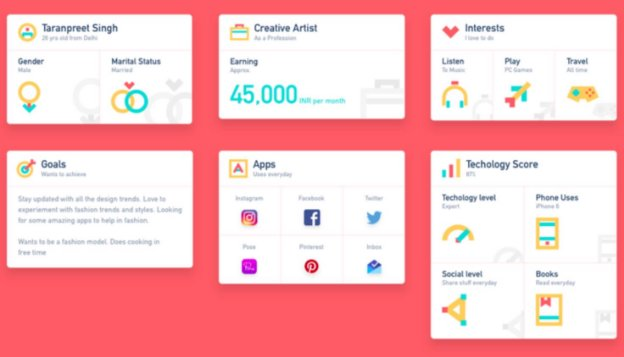
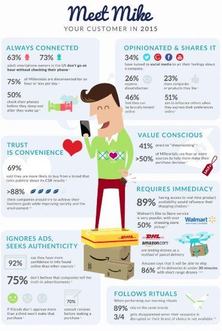
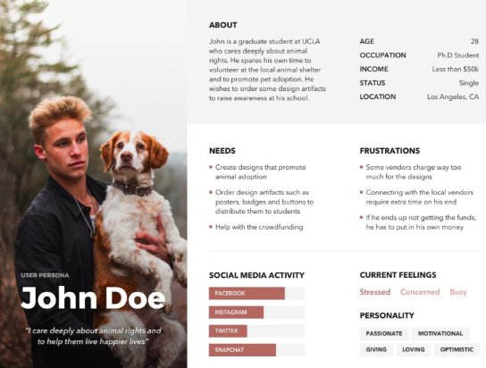
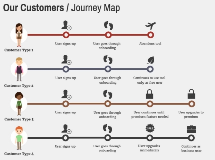

Key Data Points

Not everything that you get from surveys and interviews will be useful. If you don’t determine what’s useful and what’s not, the not-useful data can accumulate and keep you from utilizing the data that is. So how do we decide what data is important?

Key Data can be broken down into two questions: what data do we need, and where does that data need to go?

What do we need?

Let’s look at an example persona: Binh is a 25 year old who is looking for his first home. We collect a lot of data around our user pool that will inform Binh’s persona. We find that this population has on average $25k in student loans, 95% own a car, 72% work for a company with digital offerings, and 85% of them like drinking flavored carbonated water.

The first three data points are helpful in building our persona and something we would want to communicate to internal stakeholders. The carbonated water statistic is an example of data that we probably don’t need; either it was a result of a question we no longer need the answer to, or it was discovered when we were trying to find the answer to another question. Many of these unnecessary data points can be identified with common sense.

If you have questions about whether or not data points would be useful to other teams, go back and review your analysis of your stakeholders, and if you’re still not sure, open up a conversation with those stakeholders. Try to ask general questions about their needs so they don’t become bogged down.

Where does it need to go?

Once you have pertinent data, what do we want to do with it? Where, or to whom, does it need to go? Internal stakeholders like marketing, sales, and engineering teams will all view the data differently based on how it pertains to their work.

Remember from our previous lessons that there are many different types of stakeholders, and each type has different expectations and will need different data. We used an Influence/Interest Matrix to categorize stakeholders and identify their information needs. Use those categories here to help guide your decisions on which data to share with which stakeholders.

Additionally, you don’t want to just dump a bunch of pages of statistics in someone’s inbox. Unlike you, who have been working on the data and know the meaning and significance of each metric, these stakeholders aren’t familiar with the data and would essentially need to re-analyze it. So how do we take this persona/user data and turn it into a format that will be easy to communicate and understand? Our next lesson will focus on visualizing data with personas.

Visualizing Data

Now that we’ve sorted our data and figured out what’s relevant and what’s not, how will we share it? As you gather data on your users, you need to be able to quickly and effectively communicate those findings to others and put them in a format that you and your team can use.

1. Charts and Graphs
1. Statistics
1. Data Tables
1. Icons
1. Infographics
1. Visual Tools

Tools for Visualizing Data

1. Charts and Graphs

We talked about this last week, but it should be mentioned again because charts and graphs are one of the quickest ways to turn quantitative data into an easily understood format. Make sure that your format matches the type of information you’re trying to display.

2. Statistics

We also mentioned statistics in our earlier conversation about data and research. Using a few key statistics can help describe a data set without going into a lot of unnecessary detail. Range, Median, Mode, and Mean, can tell you what a set looks like without having to list it. Keep in mind, though, that statistics should always be reviewed to make sure that they accurately reflect your findings, because statistics can easily become misleading if context is not provided.

3. Data Tables

However, sometimes there is a benefit in seeing the data set. This is most effective when the set is small (able to be contained to one page), and the data itself does not require a high degree of background knowledge or explanation. Data tables can also be used to display collections of aggregated data, like statistics for several categories, in a clean format.

4. Icons

Icons allow you to add context and information effectively. Icons are useful because they communicate information in concise packages without adding heavy text that turns readers off. These days, people are familiar with a common set of icons, allowing them to quickly understand without a significant learning curve. Using these icons helps you illustrate complex concepts or ideas related to your persona with ease.

Let's look at an example. Below, we have a persona that utilizes a variety of icons to help illustrate and organize the whole guide.

Illustration via Icons

5. Infographics

Infographics, image-heavy tools for laying out information, are an outstanding way to communicate visually. Why not take advantage of this and turn your user persona into an infographic creation?

Take a look at the below example to see how we can use visuals like icons, fonts, and conceptual images to make our persona more engaging. Looking at the infographic briefly gives us a good snapshot of Mike. Keywords that describe his behavior are called out and bolded, making it easy to read. Icons draw our attention to certain facts and make them easy to remember.

User Infographic

6. Visual Tools

Sometimes, the data is represented and used for analysis at the same time. Two examples of this are the persona and user journey map. Both take input from user interviews and help product managers communicate their user/customer’s needs as well as serving as an input for other tools.

The persona, in particular, is one of the most important tools in a product manager’s toolbox. We’ll focus on this in the next lesson.

Persona

Customer Journey Map
