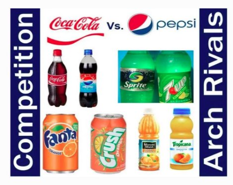
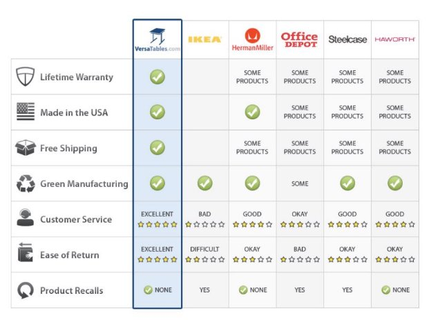
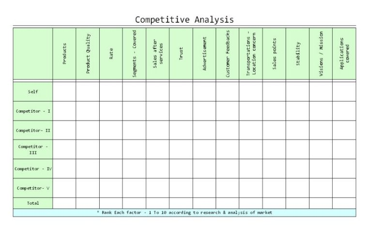
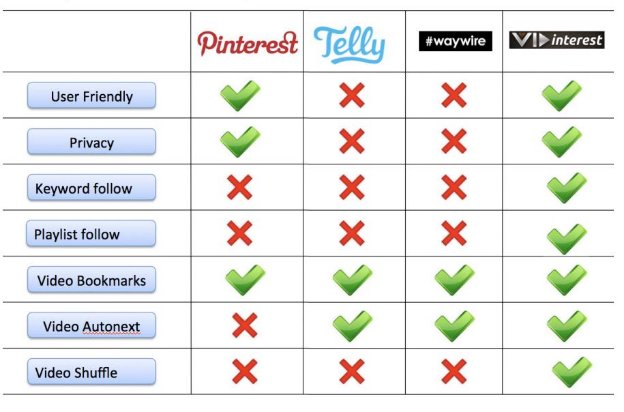
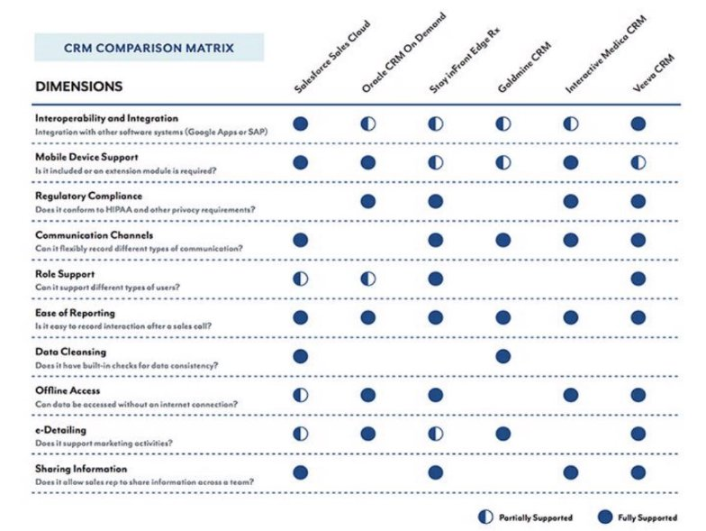
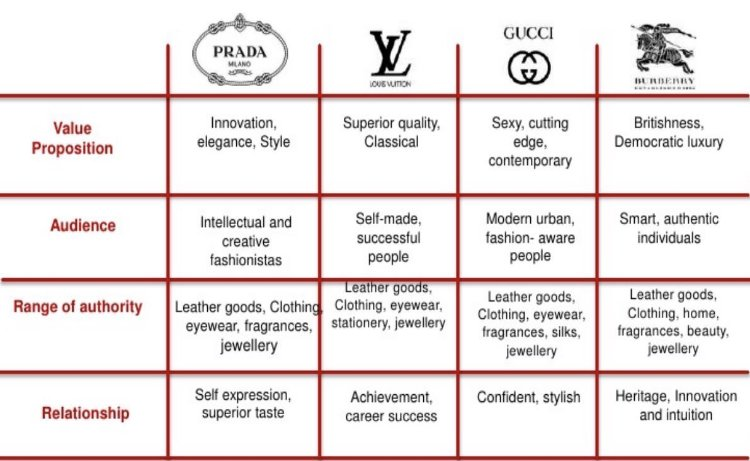

Who are Competitors?

Let’s start with the definition of competitor.

A competitor is a person, business, team, or organization that competes against your product or service or your company. Your loss is their gain, and vice versa. In basic terminology, if someone is trying to beat you in a race, that person is your competitor.

While “competitor” is a general term, there are more specific titles that tell us more about the relationship between two companies. “Rivals” are typically the same size company as yours and make similar products or services.  If the two companies are leaders in their field, we refer to them as “arch rivals”. Examples of arch rivals are Coca-Cola and PepsiCo, companies who make similar products and have very similar market share.

5.3.2 Different Types of Competition

In this section, we will talk more about types of competition and why it’s good to have competition in the market.

Competitors - Targeting Customers

Competitors not only make similar products or services, but also sell them at similar prices, and thus target a similar customer group. For example, in the car market, Toyota and Honda are both competitors. However, Toyota and Rolls Royce, a luxury car manufacturer, are not competitors.Although they both make and sell cars, they are not targeting the same customers, because they sell their cars at vastly different price points.

Competition - Good for Consumers

When competitors compete to gain market share, the winner is the customer. The customer wins because competition ensures top quality. If two companies offer similar products or services  at similar prices, quality will determine what the customer buys. In order to stay competitive, both companies are forced to continually increase the quality of their product or

service. If the company has no competitor, then it has market monopoly, which is generally considered to be detrimental to the consumer, because the company has no incentive to improve a product the consumer has no alternative to

Types of Competitors : Direct and Indirect

**Direct Competitors :** Papa Johns and Pizza Hut are an example of direct competition; both companies make pizza and focus on a delivery-heavy service. Another example is Apple’s iPhone and Samsung’s Galaxy mobile devices. They both sell at similar prices and target the same customer group. Based on this information, we can tell that these two companies are direct competitors.

**Indirect Competitors :** Dominos and McDonald are considered to be indirect competitors of each other. Although both are considered fast food, one makes pizza while the other makes hamburgers. They both target customers who are hungry and want to find a cheap & filling meal, but since the product offering to satisfy that need differs, they are not direct competitors . Indirect competition exists when two sellers make different products but target the same customer group.

Competitive Analysis Matrix

Definition : *A chart that compares your product or service to your competitor(s)*

A competitive analysis matrix makes it very easy to compare your product offering to that of your competitors. This allows you to learn more about your market segment and identify opportunities to differentiate your product or service from competitors, which can lead to creating better products/services and developing stronger marketing strategies.

In simple terms:

- It’s a great input for your strategy and looking ahead on where you would like to take your product or service offerings.
- It can help you develop and explain your positioning in the market.
- it’s a strategic visual that the business plan reader, your leadership team, expects from you.

What is a Competitive Analysis Matrix?

A competitive analysis matrix is a tool that compares the characteristics of multiple products or services within your market segment to identify differences, strengths, and weaknesses. This in turn helps you as a Product Manager uncover your own competitive advantage (what you have that others don’t) and identify opportunities to grow your business. They can vary in complexity.

Some are just a chart (like the above example) with a product’s features/benefits paired with a list of competitors. Others have features plotted on multiple axes to be able to show more relativity between competitors and where a particular company is positioned in the market.

Examples of features include:

- Benefits
- Price
- Quality
- Ease of Use
- Types of Features
- Distribution/Sales
- Certifications
- Endorsements
- Warranties

Why is competitive analysis important for your product or service?

One thing you should know about profitable growth is this: only companies that design and deliver more distinctive products or services can command a higher margin and thus be more profitable. If your product or service is only competing based on cost, then your future will be at risk. Continually seeking out ways to make your product or service more unique and distinctive grows your competitive advantage, and by delivering measurable benefits to your customers, your product or service will be on the road to developing profitable growth now, as well as in the future.

Tips for Creating a Competitive Analysis Matrix

1. **Be selective about the categories you include**

Not every category is important. Think about what’s most important to your customers/users and what has the greatest impact on them.

2. **If it’s the same for all competitors, don’t include it**

If all of your competitors are based in the U.S., that doesn’t need to be one of your categories. It doesn’t give you any additional information and only serves to clutter your graph.

3. **Be consistent**

Remember that the benefit of the matrix is easy comparison. That being said, you’ll want all your competitors to be compared with the same terminology. For example, if you were comparing restaurants, you might factor in average wait time. You wouldn’t want to say “short” for one and “15 minutes” for another, because the viewer won’t know whether 15 minutes is considered more or less than short. And speaking of vague metrics...

4. **Choose specific metrics**

The more specific you can be, the better. For example, if you’re comparing storage on laptops, saying “256GB” and “1TB” is more helpful than “Low storage” or “High storage”.

-----optional example-----

Why do we bother with creating a competitive analysis matrix?

When you’re making a big decision between two things (whether it’s a car, house, laptop, or something else), you likely have a list of characteristics that you compare them based on. Otherwise, it might be overwhelming. Think about this list of things you could compare two houses based on:

- Cost
- Square footage
- Number of Bedrooms
- Number of Bathrooms
- Schools in area
- Size of yard
- Angle of driveway
- Size of garage
- Color of siding
- Proximity to parks

This is a short list, but we could go on and on. The thing is, though, that you will only need some of these characteristics- not all- to make a meaningful comparison. For example, square footage is probably high on your list, because space is one of the primary functions of a house. However, the color of the siding is probably less important, because you could paint the siding if you wanted to. So, when you’re trying to decide which house to buy, you figure out which characteristics are most important to you and make a comparison based on those.

Identifying Opportunities

In this section we will go through an example to understand how to find the right opportunities to work on.

Let’s look at the office furniture industry and its competitive landscape. All of these companies below make’s office furniture including office chairs, standing desks, tables, room dividers...etc.

In this scenario, I will be acting as a Product Manager for HermanMiller Products. Looking at the competitive analysis matrix above I see that there are certainly few improvements we need to make in product as well as operational service side.

Key Opportunities To Improve Upon:

1. Improvement in Customer Service Experience
1. Improving Quality of the Product
1. Shipping Experience

HermanMiller is known for leveraging the power of our design to improve people's lives. And compared to our competitors we are ahead in build quality and manufacturing operational efficiency. At the same time when we compare against VersaTables we can see we have few key areas where we can improve our offerings and become #1 choice for our customers.

Each of the three components we listed touches different departments within our company and it’s job for a Product Manager to figure out which key opportunity I want to focus on first, prioritize and involve those departments.

Again here are the three key opportunities driver for us to be #1 in market :

1. Improvement in Customer Service Experience
1. Improving Quality of the Product
1. Shipping Experience

If you were a Product Manager for HermanMiller which one would you select and prioritize ?

Example: Competitive Analysis

Here we will look at various examples of competitive analysis matrices.

All follow the basic template below, but have adapted it to their needs and the marketplace they’re addressing.

Example 1 : Office Furniture

Example 2. Online Competitive Landscape for Image Sharing, Video Sharing Platform

Example 3. Let's do Competitive Analysis on Players in the CRM Marketplace.

Example 4. Here is an example of Brand competitive analysis.

