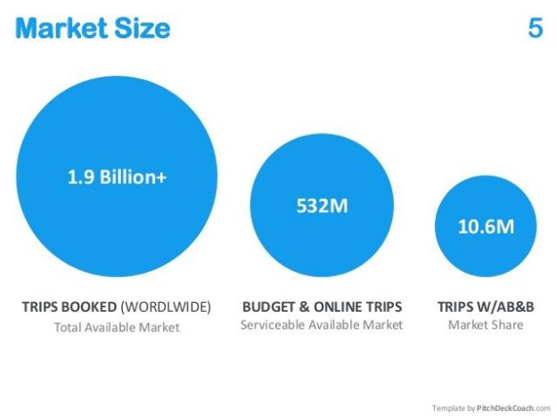

What is TAM-SAM-SOM?

How do you know how much money your business might make? How do you know how big your business or product could grow in the future? How do we explain all of that information to someone else in a way that makes sense?

Well, a huge part of figuring these calculations comes down to understanding your market. Who might need this product?Who tends to buy this product? How many will they buy/ how many can we sell? Once you as a Product Manager start to answer these questions, that’s where you will get your TAM-SAM-SOM information.

TAM-SAM-SOM is a way of understanding your business’s relationship to market size. The market size for cell phones globally is very huge, but if I decide to start making cell phones then it’s pretty unlikely I will ever be able to reach much of that market. So, what market can I reach? This is what TAM-SAM-SOM can help us understand. Applying this concept of TAM-SAM-SOM to a new product opportunity evaluation is essential. All new products should have a clear understanding of realistic and attainable goals so that you have a target to meet. This framework also provides insights into the market that the product or service will be entering into, which is important for any product or service to be successful.

What do those acronyms stand for ?

**TAM** stands for Total Addressable Market

**SAM** stands for Serviceable Available Market **SOM** stands for Serviceable Obtainable Market

TAM: Total Addressable Market

Total Available Market (TAM) is the estimated total demand in the world for this product or idea. Some key characteristics are:

1. TAM is typically represented by a monetary value (in terms of dollars, pounds, riyals, etc). For a given time period - let's say annually - it represents how much revenue this product or idea can drive.
1. TAM forces us to ask a couple of key questions:
1. What is the total demand for this product or idea?
2. What is the revenue opportunity for this idea if there were no obstructions?

Let's consider an example: What is the TAM for milk in the United States?

In order for us to accurately answer this, we need to learn a few techniques.

Top-Down Estimation

In this technique, we first look at how many individuals are available in a given area. Then we calculate what is called Average Revenue Per User (ARPU). To calculate that, we need to multiply the unit cost of the product and the frequency of purchase within a year in order to derive the total revenue opportunity.

Considering our example: What is the TAM for milk in the United States?

1. First, we need to identify how many individuals are in the US. That is roughly 340 million.
1. In terms of consumption, let's say that each person drinks a glass - 8 ounces per day.
1. The unit cost of milk is $3.20 per gallon or $0.20 per glass.

So our Total Addressable Market for milk is:

TAM = 340 mm x ($0.20 per glass x 365 days) TAM = 24,820,000,000

$24.8 Bn Annually

To recap, you can see that we did the following:

1. Identified the number of individuals in a geographic region pertaining to this product or idea
1. We calculated the average revenue per user by using the following formula:
   1. ARPU = Unit Cost X Frequency of Purchase within a Year
1. Finally, we calculated TAM by using the following formula:

a. TAM = Number of Individuals X ARPU X Time Period

Now, let's get some practice in!

**Bottom-Up Estimation**

In this technique, we start at the bottom. We first identify how much of the product or idea is or would be used. Then, we multiply it by the unit cost of the product for a year in order to derive the total revenue opportunity.

Let's continue using our previous example: What is the TAM for milk in the United States?

1. First, let's see how much milk is consumed. Research shows that it is 17 gallons per person per year. In this case, we need to multiply this number by 340 mm people in the US to get the annual usage of milk.
1. The unit cost of milk is $3.20 per gallon.

So our Total Addressable Market for milk is:

TAM = (17 gallons x 340 mm) x ($3.20 per gallon) x (1 Year) TAM = 18,496,000

$18.5 Bn Annually

When it comes to accuracy, bottoms-up tends to always be more accurate than the top-down, since we target how much the product would be used, rather than looking at how many people would purchase this product.

To recap, you can see that we did the following:

1. Identified the number of units of the product would be utilized
1. We then multiplied that by the cost of the product
1. And finally the time period

TAM = Product Usage X Unit Cost X Time Period

Now, let's get some more practice in!

**SAM - Serviceable Addressable Market**

Serviceable Addressable or Available Market (SAM) focuses on the portion of your TAM that you can actually reach. In other words, with the current business model, current company's services/offerings, and the channels that you have currently established, what portion of the market is available to us today for reach. So SAM typically depends on the following:

1. Current Business Model
1. Current Services and Offerings
1. Currently Established Channels

For example, let's say you are a restaurant business that is just starting out. You are still defining out your business model and potentially have limited distribution channels. It's unlikely that you'd be able to open a restaurant in both Washington and Florida at the same time. You'll be impacted by geography.

**Scenario: Operation Milk**

Let's continue on with our Milk example. We established that the TAM for Milk in the United States is roughly 18.5 Bn Dollars. Let's also consider that with our current business model, we are only able to deliver milk within the state of Florida. What would our SAM be?

The best way to calculate the SAM is to use our previously calculated Top-Down Estimate. Since we know that [Florida's population is 21.48 million](https://www.google.com/search?q=florida%27s+population), we can update the TAM formula to calculate and filter down our Top-Down Estimate.

SAM = 21.48 mm x ($0.20 per glass x 365 days) SAM = 1,568,040,000

$1.57 Bn Annually

No matter how big your total addressable market (TAM), it doesn't make much of a difference if you don't have a way to grow your SAM within it. The SAM helps our focus on our total addressable market so that our company can focus on the immediate impact it can make.

**TAM - SAM - SOM for Airbnb**

**Here is a great example of TAM - SAM - SOM in action. The above image has been taken from [Airbnb's pitch deck](https://www.slideshare.net/PitchDeckCoach/airbnb-first-pitch-deck-editable).**

**The founders clearly laid out what they thought their market was like. For this, they started with trips that were booked with Airbnb - which was their immediate target market or SOM (Serviceable Obtainable Market).**

**Then the next level up is the SAM (Serviceable Addressable Market) - which was the online trip booking ecosystem.**

**Finally, their end goal - TAM (Total Available Market) is the number of total trips booked world wide!**
