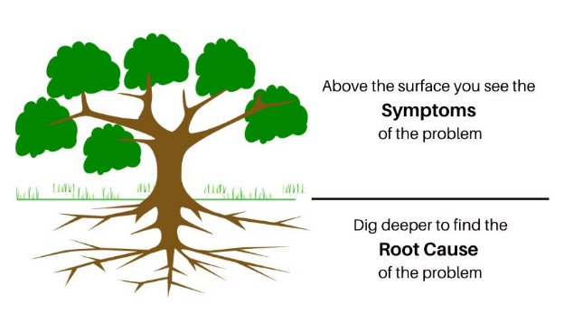

**What is a problem?**

A great way to think about a problem is in a storytelling setting:

- **Customer**. Consider the hero - your customer is the hero
- **Problem**. In any good story, the hero always has obstacles or a villain. That is the problem.
- **Solution**. The hero has to go through some sort of a journey or transformation in order to overcome that problem

Why is it so important to identify the problem? If you don’t know what the problem is, you can’t craft an effective solution. You’re also likely to waste time and money developing something that customers won’t want.

So before we even think about a solution, we need to identify the problem. What it is, how prevalent it is, who is facing it, etc.

Problems are typically defined using **problem statements**, which we’ll talk about in the next lesson.

What are Problem Statements

A problem statement is a succinct and specific summary of the issue being faced by your users and the issue your solution will address. Your users may have many problems that they want you to solve, but in order to create an effective solution, you’ll need to narrow the scope to something manageable.

There are many different definitions of a problem statement, and people format them in many different ways, but regardless, there are certain things a problem statement should and should not include.

Should Include

- Who is facing the problem (user/customer)
- Specific issues (backed by research/people’s experience)
- User goal/motivation

Should NOT Include

- Anything about a solution
- Vague, unmeasurable statements

Examples

Good Problem Statements:

As a business owner, I need to notify my customers about hours of operation changes so that they don’t come when we’re closed and become angry.

As a photographer, I’m trying to upload my portfolio to the website, but it returns an error message that says “Incompatible File”, which makes me want to use a different website.

Teenagers from ages 14 to 18 lose approximately 2 hours a day due to inefficiencies in school scheduling, which is causing them to get less sleep and be less attentive in class.

Note: As we said, you’ll come across many types of problem statements. Some, as you can see, are more specific and would be used when you have issues with a current product you’re troubleshooting. Others are more general, as you would have when you’re just starting to investigate a problem.

Bad Problem Statements:

People don’t like Facebook because it annoys them. [Not specific in terms of users or the problem]

Tesla drivers want a Tesla with Alexa integration. [There’s no problem here, just a solution]

People hate long commutes to work, so they want a taxi service that picks them up at their house.

[Vague and jumps to a solution]

Reasons to write a good problem statement

- Gives your research a manageable scope
- Makes your solution more likely to be targeted and valuable
- Focuses your team

Root Cause Analysis

To identify and investigate problems, we need to perform a root cause analysis. This analysis allows us to ask questions or follow a guided path that allows us to understand the underlying cause behind a visible problem or a suggested solution.

Why is this important?

Let’s say a customer tells you they’re late to work in the mornings. You build them an awesome alarm clock. Surprisingly, you start getting lots of negative customer feedback. “I’m still late for work!” “Your product is terrible!” Is it? Is that the actual problem? Probably not.

The real issue here is that you didn’t know what the customers’ problem was. “Late to work in the mornings” was a problem for them, but it was a symptom instead of a root cause. What if they’re late because of traffic? A new alarm clock won’t help with that. Customers can’t always explain to you what the problem is, so you have to be able to use different tools to figure out what the root cause really is before you start problem solving.

Most of the time, stakeholders tend to come to you with solutions or undefined problem statements. It's important that you are able to work with them or by yourself to identify the underlying root cause so that you can find an appropriate solution. When you focus on a problem without understanding the deeper meaning, the solution you would come up with will tend to be incomplete.

But how do you do root cause analysis, and when do you know when you’ve gotten to the root cause? There are several methods of root cause analysis, but we are going to focus on the two most popular and simple methods:

- 5 Whys
- Fishbone Diagram

5 Whys

The 5 Whys method is a popular root cause analysis tool that allows anyone to get to the underlying problem by simply asking the question "Why?" continuously, in creative ways.

How?

In its simplest form, when you are performing root cause analysis by yourself, you can ask "Why?" continuously to get the root of the problem. However, when working with others, asking "Why?" over and over again, can prove to be annoying.

So it's important to ask the question based on the context of the previous answer. Let's take this example from a stakeholder or colleague:

|**Stakeholder/Colleague**|**Product Manager**|
| - | - |
|I need the system to allow me to bulk upload|Why do you need to bulk upload to the platform?|
|Because I have 500 items that I am inputting manually|Why do you have 500 items? What are these items?|
|
They are zip codes

I need to target all the zip codes in a specific city
|Why do you need to target those zip codes?|
|Because the platform doesn't have a way to target cities.|
Counter Measure: So if you were able to target cities,

you wouldn't need to bulk upload?
|
|So - in the above practical example, you can see how the product manager asks the question|
|"Why?" in thoughtful ways to keep the stakeholder/colleague engaged and eventually identifies|
|the root of the problem.|
Key Takeaways

1. The stakeholder/colleague already jumped to a solution that he/she was proposing.
1. By getting down to the root cause, we identified that the bulk upload feature is not the correct solution.
1. The correct solution was actually the city targeting feature.

Where and When?

The 5 Whys method can be applied practically anywhere. It is not exclusively to identify problems from stakeholders. Here are some situations that you can apply it in:

- When team members bring problems or solutions that need to be solved
- When you don't understand why some feature is built
- When you have a problem that isn't related to a feature or your product that needs to be solved
- When you need to clarify that the solution you are building is tied to the right problem
