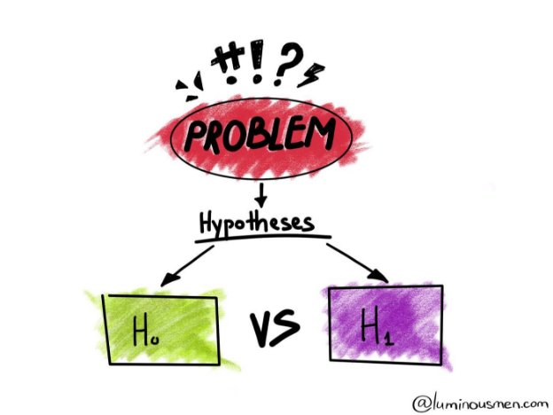
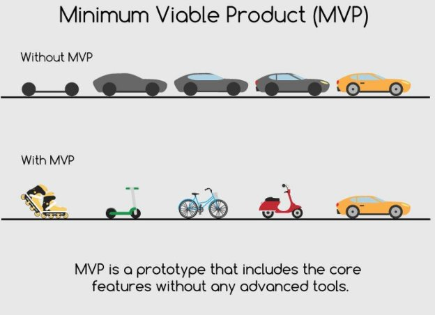
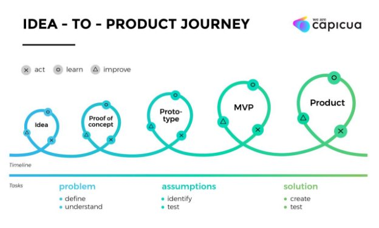
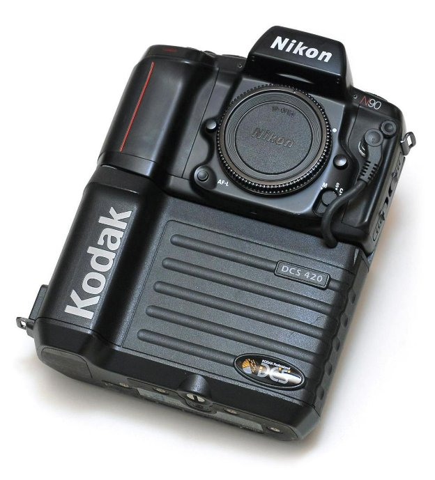
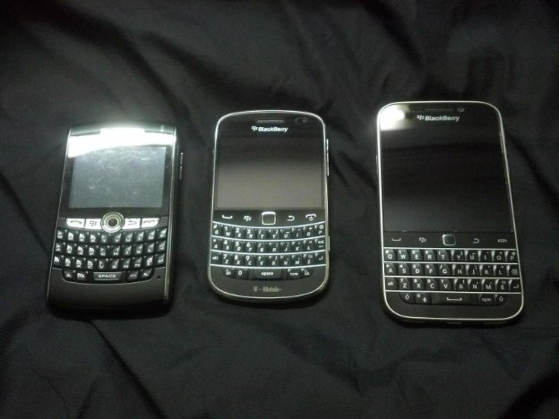
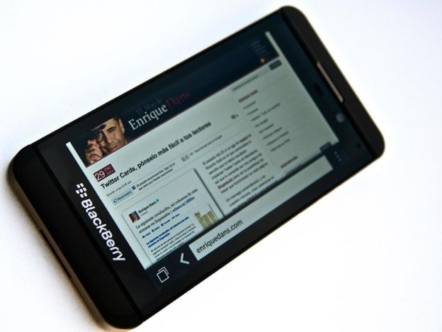

Assumptions and Hypotheses

Assumptions are things that we assume to be true. Usually we make assumptions based on our own experiences or things that we’ve heard. For example, “Most people don’t like waking up early”.

A hypothesis, on the other hand, is a testable prediction about what we think will happen when we do something. “If we produced an alarm that was more pleasant to wake up to, people would buy it because it would help them wake up happier in the morning.”

See the difference? Assumptions and hypotheses are an essential part of the problem definition phase because we are identifying what we don’t know and what we need to test. That way, when we get feedback, we can use it to move forward instead of trying to figure out what in the process is flawed.

Example

Let’s say it’s summer. You wake up and put on clothing that you would wear for hot weather. Why did you do that? You haven’t checked the weather outside yet. However, you know from experience that summer tends to go with warmer temperatures, so you made an assumption that today would also be hot. You then hypothesized that if it’s hot outside, you’d be most comfortable in lightweight clothes. To recap:

**Problem:** I’m uncomfortable if I’m not dressed for the right weather.

**Assumption:** It’s summer, so today will probably be hot.

**Hypothesis:** If I wear lightweight clothes, then I’ll be more comfortable in the hot weather.

Why use them?

Assumptions are powerful, because they enable us to make decisions and test things without having to research every little detail. However, equally important is knowing when you need to test your assumptions. For example, going back to our weather example, what if we step outside and it’s raining? Then we’d have to go back inside and change. But we could have done a test to collect some additional data before we went outside. We could have looked out the window or checked a weather app. The same is true with companies and products.

AirBnB made a very risky assumption when they assumed that people would allow strangers to stay in their houses and that other people would want to stay in a stranger’s house. So they first tested this with their own house. (This is also an example of an MVP, which we’ll talk about later.)

Hypotheses, on the other hand, connect our problem and the beginnings of a solution. Any solution we come up with is, in some form, a hypothesis, because it’s untested. We think that it will solve our problem, but we don’t know that. So we write it out as a hypothesis so that we can test it before we develop it further.

Hypotheses Revisited

Think back to the first few weeks of the course when we talked about hypotheses. At the beginning you were making assumptions about your problem and hypothesizing about potential solutions. Now that you have more information, you’re able to test those hypotheses. So let’s quickly recap before we jump into experimentation.

In the simplest term, a hypothesis is a prediction that you create before running your experiment. It is essentially an if(cause)-then(effect)-because(reasoning)  statement.

If I add gasoline to my car, then my car will run, because without gasoline the car cannot be driven around.

**Where do hypotheses come from?**

Doctors and scientists observe nature, medication, or a drug and ask many questions that lead to a hypothesis. Product Managers also get inspired by observations, opinions, previous experience, or new discovery patterns from their customers and users. These observations are often associated with various problems and questions.

For example:

- Who is our target audience?
- Why does our customer do this and not that?
- How can this user be motivated to take a particular action?
- How can we encourage a particular segment of users or customers to sign up for our service?

**What makes a good hypothesis?**

Unlike doctors and scientists, product managers don’t have the luxury of spending too much time on hypotheses, but the key thing every product manager should recognize is that their hypothesis needs to be clearly defined and well formulated.

A good hypothesis has the following components:

- **The difference you are validating:** This is the change that you are introducing to your product or service. It could be you are introducing a new landing page, or introducing new functionality, or introducing a new design. Be sure to be specific. How are you planning to fix it? Some solutions may work, some may require iterations before it finally works which means each is a hypothesis in its own right.
  - As an example if you are introducing a new design for your website your hypothesis that you want to validate should include:
    - This specific new design will increase the conversation rate by 2.7x times.

And Not

- Redesigning our landing page will increase our conversation.
- **Prediction on the impact we expect to see based on the difference we introduce:** The expected impact should clearly be defined on what you expect to see as a result of introducing this new change.
  - Continuing with our example from above:
    - We expect that making the design change will increase the usability of our website and will reduce latency time when the user is trying to complete some action by 4.7x times.

And Not

- Our new design will increase the overall usability.
- **Target group:** Who will be impacted by this change? Many times we assume that everyone will be impacted but that’s rarely the case. Recently one of the product

managers from my team was working on setting up a new chat box on our existing website page. Once you are on our website a chat box will pop up that will ask,” What problem we can help you solve today? Please subscribe to learn more about our solutions offering.” Once the solution was ready, in our meeting he suggested that we test this change with all of our population and there was a problem. Well, some of our site visitors already are our subscribers hence they don’t need to subscribe again. For these users, the answer to this pop-up will always be no. Hence I suggested rather than testing this for the entire population, he should be testing this change with people who are not currently our subscribers., Now, this is not easy to do as there is a lot of data gathering required but this is the only way to get good results.

- Suppose if we have about 1000 visitors and 500 of them sees the pop-up and the other half do not. 495 of the people who see the pop-up are already subscribers and as a result, all of them say no, and of those 5 remaining visitors only 1 say yes, it’s going to look like his conversation rate is 1 out of 500 or .002%. However, if he limits his testing to the people who haven’t subscribed then his conversation rate is 1 out of 5 or 20%. This is a huge difference.
- **How long:** We shouldn’t be running our hypothesis testing for an arbitrary amount of time or stop the result when one of our hypotheses is showing us the results we want. Adding a duration time to test your hypothesis will help to ensure that everyone is on the same page when results are shared.
  - Continuing with new design example:
    - We will introduce this new design that will increase the conversation rate, the usability of our website, and will reduce latency time when the user is trying to complete some action. All of these results will be validated after 7 days of introducing this change.

Remember, it is easy to come up with assumptions of experimentation and hypothesis testing but if you want to get the most out of your efforts then make sure you are starting with a good hypothesis.

MVP

What is an MVP, why is it needed and how to create it correctly?

Do you want to create a startup, but are not sure of its success? Or is it necessary to understand whether a new feature in an existing product will be in demand? **Looks like it's time to launch the MVP!**

MVP (“minimum viable product”) is an early version of a product that has a set of all the main features, but still needs to be tested on real users. It allows creators to find bugs and problems in the field, collect customer feedback and refine the product. With an MVP, you can evaluate the viability of an idea and improve it without spending a lot of money.

In this article, we will talk about the benefits of MVP for business, discuss the stages of creation, and tell you why you should choose NoCode tools to launch the first version of the product.

What is MVP

Briefly, this is an early version of the product with all the main features. The essence of MVP is to quickly turn the concept in your head into a practical solution that can be tested on real users.

A product MVP has two main goals:

- **Getting feedback from users** so that you can understand whether people need your product and in what direction it is worth moving on;
- Testing hypotheses for an already existing product.

Stages of creating an MVP

1. **Research the market.** See if someone makes a similar product, what strengths competitors have. Take the best from them and turn them into something unique, trying to avoid the mistakes of others.
1. **Study the behavior of the target audience.** What exactly does Users need and what are main pain points? Why should User use your product? How will it improve people's lives? Build a user journey from the moment they realize their needs to the start of using the product. Determine the main idea and goals of the future product. And move on to the next step.
1. **Define the range of basic functions.** Think about what should be in the product so that it can meet the needs of users, add it to the project. But it is important to remember: do not try to fit everything into the MVP at once. Its main feature is precisely that it is necessary to get by with "little blood" in order to understand the demand for the product as a whole and not spend all your resources on it.

**At this stage, rely on the following rules:**

- Always add only features that will solve user problems. For example, if you're building an MVP for an accommodation booking app, it's best to limit yourself to the bare essentials. You should not immediately raise all the creative practices of Aviasales and cram a bunch of tests into what kind of monument you are in Vladimir. Leave it for the final version of the product.
- Don't go overboard in trying to meet as many audience needs as possible. Otherwise, resources will be spent, time will be wasted, you will stuff the product with functions, and the market will not need it at all.
- Launch MVP as soon as possible: identify the main features and work with them first.
4. **Design an MVP project.** Here you need to decide on the format (landing page, prototyping, e-mail newsletter, etc. - we'll talk more about the types of MVP later). Now run MVP and test hypotheses.
5. **Refine the product taking into account the feedback and make a Blueprint** - a map of user interaction with the product. Find out how users actually behave with the product, build their path, analyze it, refine the scenario of interaction with the MVP.

**You can rely on the following metrics:**

- Number of user interactions with the product;
- NPS (consumer loyalty index);
- LTV (customer lifetime value).

A **Blueprint** or **Service blueprint** is a user-designed, desired path within a product. It is built on the basis of a **customer journey map**(CJM), which is the user's actual journey through the service.

**CJM** shows the customer experience as it is and helps you understand how to lead the user to the solution you offer.

As soon as people start using the product, you will understand what exactly works and what you missed. Perhaps you chose slightly the wrong colors and button layout, didn’t finalize usability, went too far with elements, or vice versa - didn’t add something. Relying on audience feedback is your key to winning.

Who needs an MVP

As we have already said, MVP is suitable for everyone: both beginners and mature businesses.

A startup needs an MVP, because with it you can choose the right development trajectory at the start with minimal investment and get a chance to grow into a successful, global project.

For a large business, creating an MVP will be useful in the case of introducing new features into an already working product or creating new lines of business. For example, before launching a new educational course and recruiting teachers, an online school should make a landing page and open a pre-registration to see if it will be worth it. So MVP will help reduce the risk of unnecessary spending in case of an unsuccessful launch.

Types of MVPs

Most often, to create the first version of the product you need:

1. **Landings**. Perhaps they are familiar to everyone. One page website. Ideal for introducing the audience to the product and allow you to get the first leads. A landing page can be created using **Bubble** or **Tilda**.
1. **Prototypes**. Yes, the very creation of an MVP is the development of a prototype. But in this case, it is not necessarily a product that can be used. It can be a video demonstrating the functionality of the product, or a research article that tells about the principles of the service. This view is often used by gamedev studios. Even in the trailers of movies and TV shows, you can catch a distant connection with the MVP prototype.
1. **Email newsletters or chatbots**. This kind of MVP will help you focus on the product story and make it detailed. In addition, because you will have direct contact with the audience, you will be able to quickly receive feedback and gradually improve your idea. To set up an email campaign, you can use **NoCode** tools such as **Sendpulse** or **Unisender**, and **Chatforma** will help you create a chat bot.

**It is not necessary to use only one type of MVP - they can also work together!** For example, you can release a promotional video with a thesis about a product and invite you to go to the web-site to register for alpha or beta testing. Or start introducing the audience to your service through a chatbot that will lead to a landing page, for example, to sign up for courses.

Why Choose NoCode for MVP Creation

When developing an MVP, it is important to quickly respond to user feedback and have flexible work tools at hand. If each edit drags on for several weeks, then it will not be possible to launch and finalize the MVP soon, and the release of the main product may be greatly delayed. And it would also be great if the MVP didn’t “steal” a large part of the finances from the main product.

The main advantages of NoCode tools are high development speed and lower cost compared to traditional site or application assembly. In addition, NoCode allows you to make changes in just a few hours, if you choose the right solutions. It turns out that NoCode is ideal for launching an MVP.

MVP Examples

We hope that the examples below will inspire not only startup owners and those who are just thinking of creating them, but also employees of large companies.

**Product Hunt**

Product Hunt is a social network for developers to share product ideas, experiences, discuss the latest IT, design and marketing news, ask questions, and even look for jobs or employees.

Product Hunt grew out of a mailing list on the NoCode tools **MailChimp** and **Telescope** - she was the MVP of the project. Its founder, **Ryan Hoover**, has been interested in startups for a long time and one day he realized that the Internet does not yet have a resource for discussing exactly new products. In 2013, he decided to launch an experiment - an e-mail newsletter with news about startups and a rating of the top 5 projects over the past day. In a couple of weeks, the subscriber base grew to 200 people and turned into a full-fledged product: a website and an application.

*In 2014, Product Hunt raised $7 million in funding, and in 2015, Ryan Hoover received the annual Crunchie Award for Best New Startup of 2014.*

**Zynga**

It is a mobile and browser game development studio made famous by **FarmVille** and **CityVille**. Launched in 2009 on Facebook, **Zynga** became the developer with the most active users, with 40 million monthly users playing the studio's games on Facebook.

In game development, **Zynga** regularly uses MVP: the studio creates landing pages and short commercials (“sneak peeks”) about new games and features of existing ones in order to get feedback from players and find out in which directions it is worth developing their products. The studio also uses pre-registration to recruit a player base before launch. Sample on video: <https://www.youtube.com/watch?v=ygEFAC5DEGw>

**Tesla**

Tesla  made a single web page (a minimal product) accepting $1000 reservations of the Model 3. They were testing whether there was widespread interest in the product. (The page received 373,000 reservations in 3 months.) <https://i.ytimg.com/vi/9kWHMb6uSxE/maxresdefault.jpg> 

What is the result

MVP is an indispensable tool if you need to quickly test the concept of a product and not screw up with the launch of its full version.

It must be remembered that MVP is **only a test version of the product**. Its goal is **to collect information and study** the ground for a full-fledged release. It shouldn't take long to create an early version, and it doesn't have to have every single feature you want in the final project.

To save time and money when creating an MVP, NoCode development is well suited. You can sign up for a free consultation on our ZeroToOne website. In half an hour we will answer all questions, select the necessary tools for your idea, estimate the cost and terms.

A few important points:

- An MVP is minimal. Often, it's one "thing" (a single feature, a landing page, a sign-up form).
- An MVP is valuable to our learning process. The feedback we seek from an MVP will help us validate or invalidate an assumption we've made about our product, about our user, or about our marketplace.
- An MVP is product: it is something we must produce and actually put into the hands of end users.

Watch out for "Confirmation Bias"

Our own biases, opinions, assumptions, are often the biggest barrier we face in Product Management.

**What is Confirmation Bias: "Confirmation bias is the tendency of people to favor information that confirms their existing beliefs or hypotheses."**

Confirmation bias affects us all and is very powerful.

**Have you ever heard of Kodak?**

[https://upload.wikimedia.org/wikipedia/commons/1/17/Kodak_DCS_420_Digital_Camera_Back_01_%2 8white_bg%29.jpg](https://upload.wikimedia.org/wikipedia/commons/1/17/Kodak_DCS_420_Digital_Camera_Back_01_%28white_bg%29.jpg)

And did you know the Kodak company invented the digital camera?

Through the 20th century, and into the early 2000's, Kodak's business relied on the manufacture and sale of high quality film. As they diligently studied the market and the potential future of their digital camera technology, they concluded that if the digital camera were to succeed it would destroy their sales of film. All their market research confirmed their prior assumption that film was the most important product in the company's future. So, as their competitors were rolling out digital cameras, the Kodak executives killed the idea.

Kodak filed for bankruptcy in 2012.

**Ever heard of Blackberry?**

[https://upload.wikimedia.org/wikipedia/commons/0/06/BlackBerry_8820%2C_BlackBerry_Bold_9900_a nd_BlackBerry_Classic.jpg](https://upload.wikimedia.org/wikipedia/commons/0/06/BlackBerry_8820%2C_BlackBerry_Bold_9900_and_BlackBerry_Classic.jpg)

The Blackberry was the world’s first smartphone and in the mid 2000’s it appeared to be an unstoppable product. But the executives were stubbornly attached to the assumption that their customers wanted a physical keyboard.

They undertook user research, focus groups, and design experiments. They’d ask people, “Do you like the Blackberry Keyboard?” And people would say, “Yes, it’s easy to use.” They’d ask people, “Would you prefer our physical keyboard or an on-screen keyboard?” And people would say, “I’m used to the physical keyboard and I like it.”

So, the Product Managers would conclude the physical keyboard is best! (After all, which Product Manager is going to tell the executives they are wrong?)

Meanwhile, flat-screen competitors (iPhone, Android smartphones) gained market share.

Finally, in 2013, Blackberry released the Z10 touchscreen. But it was too little too late, the competition had already won.

https://upload.wikimedia.org/wikipedia/commons/c/c2/BlackBerry\_Z10.jpg

**Ever Heard of Google Plus (G+)?**

Or Clippy the Microsoft Office Assistant? Or Netflix’s Auto-play-Previews?

Behind every failed product, behind every hated feature, you may find a Product Manager suffering from confirmation bias. They are so confident that they pay attention to the information that confirms their assumptions; and they ignore information that may disprove their assumption.
