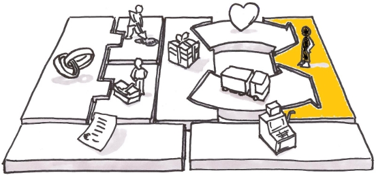
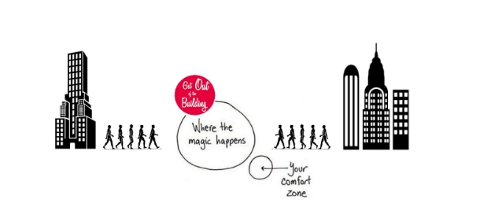

Users vs Customers

You may have noticed that we seem to use “user” and “customer” interchangeably when we talk about the people that will be receiving our product. However, there is a difference between them.

**Customers** are the people who are **purchasing** your product. **Users** are the people who will **use** your product.

Example: A mom buys a toy for her daughter. The mom is the customer. The daughter is the user.

Where it gets tricky is that you can have a situation where the user and the customer are the same person.

Example: You buy a new car. You are both the customer and the user.

So for any given product, your customer and user might be the same person, or they might be different people. This is why we sometimes use the words interchangeably. One of the first things you want to ask yourself when you’re identifying your problem and looking for users/customers is: are my users and customers the same? This will help you identify the correct groups to target and set you on the right path for developing and marketing your product.

Always keep in mind: *Develop for users; market to customers.*

**Customer Segments**

Customers are at the heart of any business model. Without customers, the business serving them would not survive for very long. So for that, it’s paramount to understand and define your customers as a primary task. Without knowing who your customers are, it will be very difficult to know what problem you’ll be solving, let alone how you’ll solve it.

Types of Customer Segments

More often than not, businesses often have different customer segments, and therefore need to ensure that each segment’s need is being met appropriately.

Customers can be grouped into separate segments if:

- Their needs require and justify a distinct offer
- They are reached through different distribution channels
- They require different types of relationships
- They have substantial different profitabilities
- They are willing to pay for different aspects of the offer

An example of this we can look at is: think of Diet Coke and Coke Zero. The two products have similar ingredients but they are aimed at different target markets.

Customers and Markets

Customer segments can further define what kind of a business model that you will approach which includes mass market, niche market, segmented market, diversified market, and multi-sided market. Let's take a closer look at each of them.

**Mass Market:** Comprises a large group of customers with very similar needs and problems. When we say this product has reached the "mass market" - it means that a particular product or service is being purchased by larger proportions of customers. An example of mass-market products includes computers, cars, insurance or mobile Phones.

**Niche Market:** This is a small market segment comprising customers with specific needs and requirements. In this case, the product is typically tailored to meet these particular needs. An example of this is Flytographer. This business connects travelers with a professional photographer from a particular destination which the traveler is visiting. Since the need is very specific, this would be considered a niche market.

**Segmented Market:** This is a marketing strategy that involves breaking customer segments into groups according to their different needs and problems. An example of this will be, a bank might provide different types of services to their wealthier clients vs. regular clients who only have checking accounts with them.

**Diversified Market:** Offers a variety of services to serve two or more customer segments with different needs and problems, which have no relationship to each other. An example of this can be Amazon. They have products for customers like you and me but they also serve enterprise clients with their products like AWS (Amazon Web Services) and Prime Videos.

**Multi-Sided Market:** Is a platform that serves two or more customer segments that are mutually independent of each other. An example of this is a newspaper. A newspaper caters to its reader by providing newsworthy content at the same time they also need to prove to the advertisers that it has a larger readership in order to get the funding from them to produce and distribute the newspaper. In this scenario, the newspaper is dependent on both of these two distinct segments in order to be successful.

Key Questions

While focusing on this section, remember to always ask the following questions:

- **Customer Segments:** Who are we creating value for?
- **Target Customer:** Who are our most important customers?
- **Differentiation:** Why will they buy products from us?

**Conducting Customer Research**

We’ve talked about ways to categorize and group customers, but how do you find out about them in the first place? And once you’ve classified them by customer segments, how do you pursue the knowledge that will help you create products that will satisfy them?

There are a number of different approaches to customer research, all of which have their benefits and drawbacks, but we always recommend that you interview and talk to your customers whenever possible. This is one of the best ways to get detailed, specific feedback to grow your knowledge base. But in case that’s not possible, it’s good to know some of the other ways you can conduct research. Here are some of the most common methods and how we’ll be covering them in this course.

**Data Detective Method:** This involves looking at existing data. It could be market research, performance data, or simply googling competition and comparing it against your product or service to understand what's known about the customer.

- Market analysis, competitive analysis matrix

**The Impersonator Method:** In this method, individuals try to put themselves in the shoes of the customer and experience what they are experiencing. Now, this can be difficult as we have a personal bias that can come into play when we use this method. Because of this, it tends to be less successful than other methods. But if one can be objective, it can be a great way to build empathy with your customers and understand where they are coming from.

- Empathy map, user journey map

**The Journalist Method:** In this method, an individual actually goes and interviews customers to get direct feedback on their current experiences and what they desire to see in the future from the product or service.

- Interactive interviewing

**The Anthropologist Method:** In this method, the individual is observing the customer in their natural habitat. This allows the researcher to study the customer’s current processes and get an up-close experience of the details as they watch a product or service being used.

- Interactive interviewing

Finding Users

Once you have identified your users, the next steps are to find them and interview them. Here are the best strategies for finding and recruiting users/customers to interview.

1. **“Get out of the Building”**

A commonly repeated phrase in the design industry, it embodies the idea that it is always best to go find your users - see if you can schedule some interviews in person. There is no direct alternative to finding users in their natural habitat.

2. **Leverage Existing Channels**

If you're working for somewhat of an established company or product, there are several easy ways that you can reach your users. It's likely that some departments within the company have already established channels for gathering user insights. Having good relationships with these stakeholders is important.

- Customer Service/Success Department
  - This team supports customers every day - especially with specific issues regarding the product. You could leverage this team to help you recruit customers or even send surveys out on your behalf to start gathering data.
- Marketing Department
- This team owns all of the touchpoints for your customers. They’re also experienced in the best way to reach customers and can help you determine the best ways to do so.
- Sales Department
- This team engages with your customers in order to close business. You can definitely leverage this team to recruit users for you or help you gather insight.

3. **Social Media**

Social Media is a great place to find potential customers.

- LinkedIn is a great place to reach out to potential users especially on the B2B side.
- Twitter is a great location to reach out to potential users both on the B2B and B2C side of things.
- Facebook and Reddit are great for surveys as you will see in the next section.

4. **Online Groups**

There are several online forums and groups where you can find users that fit your profile. These are great places to go to engage users with a survey and drive them towards an online interview. Some examples are:

- Facebook Groups
- [Google Groups](https://support.google.com/groups/answer/1067205?hl=en)
- [Reddit Subreddits](https://www.reddit.com/subreddits/)

You can also use these to find users to send initial surveys to and capture their email addresses in case you want to reach out to them in the future.

