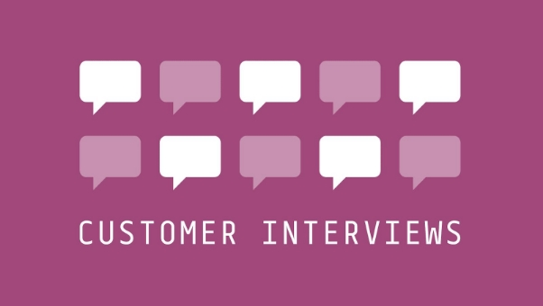
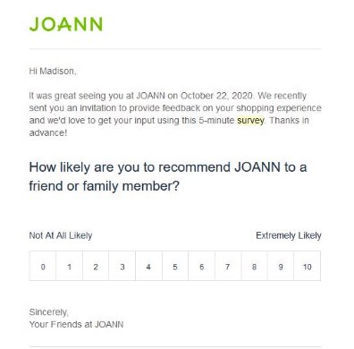
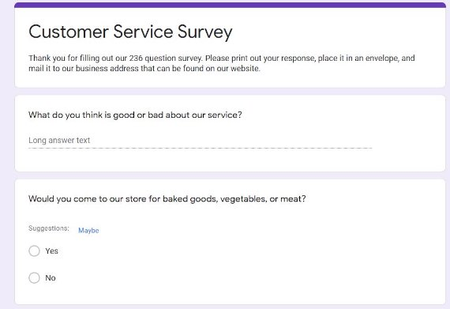
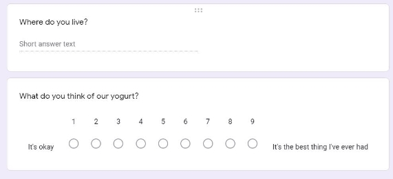

Types of Questions

By now, you probably realize that asking the right question is at the heart of product management. In this lesson, we will explore some common questioning techniques that work well for product management discussions.

Questions can fall into several categories such as:

- Open Questions
- Closed Questions
- Leading
- Empowering
- Disempowering

Let’s take a deeper dive into each of these to understand when to or not to use them, if at all.

Open and Closed Questions

**Closed questions** are satisfied by a single word or very short, factual answer. For example, "Are you hungry?" The answer is "Yes" or "No". "Where are you from?" The answer is generally the name of your town that your family originates from.

**Open questions** elicit longer answers. They usually begin with words like “what”, “why”, or “how”. An open question asks the user to demonstrate his knowledge, experience, emotions, or perspective. "Tell me" and "describe" are also great ways to open questions. An open question expresses your curiosity in learning more. For example:

- Tell me about…
- Describe a time…
- Help me to understand how…
- Explain what you’re seeing here…
- Show me what you would do next…
- Share with me what you were thinking…

Closed questions are helpful for gathering concrete data points to questions that you already know a good deal about and can predict the answer format. Open questions are helpful when you are exploring new territory or seeking deeper knowledge about a particular topic. As an interviewer, an open question can help you get started. It will also help the participant/customer/stakeholder feel more comfortable and confident.

Leading Questions

A leading question is one that encourages a person to give a particular answer. Leading questions should be avoided in research because they introduce bias and influence the way participants respond. As a product manager, your job is to uncover truth and honesty, and this includes gathering user feedback that isn’t tainted by your own hopes or expectations. Your job is to listen; the questions merely provide you the opportunity to do so.

https://aea365.org/blog/objection-thats-a-leading-survey-question-by-carla-hillerns-by-carla-hillerns/

Some Examples (to avoid):

- Our website was user-friendly and responsive, wasn’t it?
- If you enjoyed this conference, shall we conduct another conference in a similar manner?

Interviews

Interviews should be part of any product discovery process. Interviewing customers is a pivotal part of turning theory into facts.

Why is it important to interview our users?

So far, all of the information that we have identified about the user is theoretical. We have looked at trends and drawn assumptions regarding the users' behavior. We need to turn those assumptions into facts by identifying what is true and what is not. Interviews help us get down to the details to ensure that we are building the right product for the right people.

In the next few lessons, we’ll go over the difference between customer interviews and user interviews, modes of interviewing, and some examples.

Types of Interviewing

There are several ways to interview customers. We can categorize them in two major ways: **interactive** or **hands-off**.

Interactive interviews typically require your direct involvement with the user in order to gather insights. Hands-off interviews don't require a lot of supervision. Though interactive interviews are more valuable, hands-off interviews are a bit more scalable - meaning you could potentially get several individual interviews worth of data in the same amount of time. A few examples of popular methods that fall under each category are below.

INTERACTIVE

- **User Interviews:** a one-on-one session where a researcher asks a user/customer structured questions
  - Benefits: one-on-one environment allows for very detailed answers and a deeper understanding of a user’s experience from beginning to end.
  - Drawbacks: When asked directly, sometimes the user may not fully understand their own goals or may feel pressured to give what they think is the *correct answer*.
- **Focus Groups:** groups of users/customers that are asked to participate in activities or questions regarding the product or service while being observed
- Benefits: Input from numerous individuals gives a better idea of what the consumer segment as a whole feels.
- Drawbacks: Participants may feel afraid to speak up outside of their common group consensus.

HANDS-OFF

- **User Surveys:** predetermined sets of questions sent out or administered to users/customers
- Benefits: A greater number of individuals can be reached in a short amount of time and the data is often easier to analyze.
- Drawbacks: You often receive a variety of answers, some of which may not be related to the product or service being used by users, and your data is limited

to what you ask directly. Let's dig into each of these a little bit deeper.

Interactive Interviews

Interactive interviews are where you are interacting directly with the user, typically co-located with them to gather as much information as possible. Non-verbal behaviors such as facial expressions and body movement may offer more insights about how the user/customer feels, especially if it contradicts the user/customer’s answers.

Most people think of a face-to-face interview when this is mentioned, but there are many other options that your team can use.

- **Face to Face.** In this type of interview, you are typically sitting face to face with users to gather data directly. This is one of the best ways to interview users as you have

the full range of data: what they are saying, what they are feeling, and their facial expressions as they express their goals and challenges.

- **Panel Interview.** In this type of interview, you are also sitting face to face with a user or a customer. But this time, you might have a few users that you can interview at the same time. These interviews work well when you are interviewing the same group of people or need to have different types of customers for a specific interview.
- **Phone Interview.** In this type of interview, you are typically on the phone with the customer. The challenge here is that you're unable to see the user/customer, so it's hard to read the users' emotions. However, this method is more flexible and allows you to reach users/customers that may not be located in the same area.
- **Remote Video Interview.** As the world moves towards more remote-based work, this is easily becoming the best way to interview your users (only second to Face to Face) by allowing you to see the person being interviewed with the added flexibility of not being restricted by location.
- **Lunch/Dinner Interview.** As the name suggests, these interviews are a bit more casual. The lunch or dinner acts as an incentive to bring the user into a comfortable environment to have a casual chat. These are a bit more challenging as it might prove to be difficult to take notes while eating.

Customer vs User Interviews

Before we talk about interviews, let's quickly recap on Customers vs Users.

Recap on Customers vs Users

**Customers** are those who purchase your product. They may not actively use your product, but they are definitely playing a pivotal role in your product's success.

**Users** are those who use your product on a daily/weekly basis. They usually don't have the buying power, but they are the end user for your product and who it should be designed for.

There are typically clear relationships between users and customers. Here are some examples:

- A parent purchases a[ comic book](https://www.marvel.com/comics/characters/1009165/avengers) for a child.
  - **Customer:** Parent
  - **User:** Child
  - **Product:** Comic Book
- A boss has to purchase a[ JIRA](https://www.atlassian.com/software/jira?&aceid=&adposition=&adgroup=63482467404&campaign=1439934479&creative=453989704984&device=c&keyword=atlassian%20jira&matchtype=e&network=g&placement=&ds_kids=p38600553109&ds_e=GOOGLE&ds_eid=700000001558501&ds_e1=GOOGLE&gclid=Cj0KCQiA7qP9BRCLARIsABDaZziaLulKD8XHg2Jgs6l1O5SiUYDaM_ENvOsaP50cY39tFLMCSG0v5gUaAvTGEALw_wcB&gclsrc=aw.ds) software subscription for his team.
  - **Customer:** Boss
  - **User:** Team Members
  - **Product:** JIRA

As long as the product is delivering value for the user, the customer will continue to pay for it. So it's important for us to understand both sides.

**Customer vs User Interviews**

*Why are the interviews different?*

Remember that the customer's and user's goals are often very different. We already identified two major changes:

- **Purchasing Power:** Customer has the buying power, the User typically does not.
- **Return on Investment:** Customer cares about how successful the User is using the product.

In an interview, we’re trying to find out more about the target group’s habits and needs. For users, this is all about the design of the product. Why do they need this product? How would they use it? What problems does it solve for them? What problems might it create?

For customers, the goal is to find out what would make them purchase this product. Yes, they care about whether or not the product meets the user’s needs, but only how well it does or doesn’t. You want to know how much customers are willing to pay, what they expect to get for their money, and how they weigh alternatives.

The differences in what you’re trying to find out dictates the type of questions you will pose to the individual being interviewed and the types of techniques you will use to discover this information.

Now that we understand the differences between Customer and User interviews, let's look at a few interview question examples to understand how this plays out.

Examples of Interview Questions

In order to deepen our understanding, let's go through a few examples of interview questions to  see how you can gather key insights as a product manager.

Tips before you Interview

1. Remember to keep in mind the tips for asking good questions that we learned in the last chapter.
1. Focus on open questions.
1. If you're planning to launch a new product, remember to focus on the specific feature set or the part of the product that you’re launching.

User Interviews

Understanding User Behavior and Motivations

- **Understanding the User’s Day to Day**
- Walk me through your day to day activities ...
- **Understanding the User’s Goals**
- What is the most important goal (in relation to the task or product)?
- What are some other goals (in relation to the task or product)?

Uncovering Challenges

- **Challenges**
- Tell me about a time where you faced a big challenge (related to the task or product)?
- Talk to me some more about how you approach specific challenges (related to the task or product)?

Identifying Purchasing Power

- **Purchasing Power**
- Would you pay for this product?
- Do you need approval from someone to get access to this product?

Customer Satisfaction

- **Recommendation**
- Would you recommend this product or service to a family member or a close friend?
- **Review**
- How would you describe your past and current experience using this (particular product or service)?
- **Missing Features**
- Is there any way this (particular product or service) isn't supporting your needs currently?
- **Improvement**
- How can we improve our product to better suit your needs?

Customer Interviews

Many of the questions in the User Interviews can also be applied to a customer, but the key questions that would be different are regarding the purchasing power and goals.

Understanding User Behavior and Motivations

- **Understanding the Customer’s Goal**
- What is the most important goal (in relation to the task or product)?
- **Understanding the Customer’s Relationship to the User**
- Who will use this product?
- **Success**
- What does success look like for those users?
- How does it impact you?

Getting a read on Return on Investment

- **Purchasing Power**
- Would you pay for this product?
- How much would you pay for this product or service?
- **Return on Investment**
- What value does this product have to provide you with for you to continue to invest in it?

**Closing Questions**

These can be used for both user and customer interviews.

- **Missing Questions**
- What other questions we haven't asked you today that you think would be very valuable for us to know?
- **Contact Information**
- Can we contact you if we have any other questions or for possible further research for this (particular product or service)?

These are by no means the only questions you can use in interviews, but they provide a good basic framework for things you should be thinking about when interviewing both users and customers.

How to Survey

What makes a good survey?

Chances are, someone has asked you to take a survey in the past year. It could be anything from reviewing a recent product you purchased to participating in an in-depth questionnaire for research purposes. As a product manager, surveys are an invaluable source of information that help you get to know your users/customers and make informed decisions about existing or future products.

However, to take advantage of the rich source of data surveys can provide, you need to be able to get people to respond to them. Although response rates vary with type of survey, respondent population, and industry, on average, response rates hover around 30%. So it’s important that you create a survey that gives itself the best chance of success.

In the following lessons, we’ll cover three features of good surveys, things to be considered when writing survey questions, and examples of good and bad surveys.

3 Key Features of Good Surveys

There are a lot of things that can make a survey favorable or unfavorable in the eyes of the public, but overall, a good survey- one that the majority of respondents will answer and will produce valuable data- has the following characteristics. It is:

- Short
- Accessible
- Incentivized

**Short**

Short is a relative term, but in general, the longer a survey is, the more likely your respondents are to abandon it or not even attempt it in the first place. This applies to both the number of questions asked and how much effort/time is required to answer each question. In other words, ten questions may not be a lot if it’s ten true/false questions you know off the top of your head, but ten long-answer questions would take much longer.

In general, you should aim for a survey that takes ten minutes or less. Surveys that take longer than this would likely have to be heavily incentivized to generate sufficient responses.

**Accessible**

The easier it is, the more likely people are to respond. For web based surveys, the less links you have to click to access the survey, the better. Also make sure that the format of your survey is accessible to the population you intend to distribute it to. For example, you wouldn’t want to conduct a web-based survey if one of your questions was “Do you own a computer?”

**Incentivized**

This covers both monetary and nonmonetary incentives. Incentives are anything the respondent can expect to receive as a result of participating in the survey. Maybe this is tangible, like receiving a coupon for giving a store feedback on their last order or being entered into a raffle to win a t-shirt after answering a company’s survey.

It could also be intangible, like answering a survey given out by researchers trying to improve social equality and feeling good about supporting that cause. Or the opposite could be true; maybe the user hated using the product/service, and he or she wants to rant about it. Either way, there is a driving factor of satisfaction that acts as an incentive.

This all boils down to one point: think about what incentivizes the respondent to participate in your survey. If you can’t come up with anything, you may need to provide something.

6 Guidelines for Formatting and Formulating Survey Questions

1. Don’t ask leading questions

We covered this in a previous lesson, but it’s worth going over again since it’s easy to overlook things when you’re using a new format. The idea is that you shouldn’t phrase questions in a way that predispose your reader to a particular answer.

- Example: How much do you love cookies? [If the respondent doesn’t like cookies, this question is very difficult to answer. A better way to ask it might be “On a scale of 1 to 10, how do you feel about cookies? 1 being strongly dislike and 10 being strongly enjoy”]
2. Use the proper answer format for the question

Make sure that the format that the respondent will use to answer (including multiple choice, check boxes, sliding scales, short-answer, and others) match the question.

- Examples:
- What’s your favorite meal of the day? [Multiple choice]
- What’s your favorite fruit? [Short answer]
- On a scale of 1 to 10, 1 being strongly disagree and 10 being strongly agree, how would you rate your feelings on the new dress code policy? [Sliding scale]
- Which of the following tools would you consider using to solve this problem? [Checkboxes]
3. Make sure that you’ve provided enough options for the respondent

Although it’s not possible to predict every answer a respondent could give, think through the question and consider your respondent pool carefully to ensure that your answers cover most expected circumstances. Often, survey writers will give an “other” option in case respondents do not feel that their answer is represented.

- Example:
  - How do you get to work? [Providing only the answers “Walk” and “Train” as options ignores many other popular forms of transportation, like cars, bikes, and buses. This forces respondents to choose options that don’t fit them well, which skews your data.]
- This applies to follow up questions as well; if a previous question asked if a consumer had experienced something and then the next question asks about it, you should provide a “Not applicable” option or something similar to prevent answers that would skew your data.
4. Only ask relevant questions

In order to keep your survey short and get the maximum amount of meaningful data, make sure that all of your questions are relevant to the topic you’re investigating. Also be careful not to ask identifying questions. Many respondents will quit a survey if they feel that endangers their anonymity or asks about information that they would prefer to keep private.

- Example: Don’t ask for a respondent’s birthday unless it is necessary to your survey. If you wanted to group your respondents by age, you could instead ask them “Which age range do you fall into? a) below 20; b) 21 to 30; c) 31 to 40; etc.”
5. Ask one question at a time

A trap some survey writers fall into is writing questions that ask more than one question. If you ask multiple questions and provide only one set of answers, you risk invalidating your data and frustrating the respondent.

- Example: “What do you think of the iPhone’s battery life and app layout?” If the answers are “Good” or “Bad” or a sliding scale of agreement, there’s no way to tell which feature the respondents are talking about. If you think it might be confusing, go ahead and create two separate questions.
6. When in doubt, elaborate.

Especially when using technical terms, write out unfamiliar acronyms and provide brief explanations where necessary.

Qualitative vs. Quantitative

Survey questions fall into two broad categories: qualitative and quantitative. Quantitative questions are numerically based. You can count the responses and measure them with numbers. Qualitative questions are based on written descriptions. Both are important in surveys. Quantitative is often easier to analyze and presents a more direct and easily presented view. Qualitative allows you to dig deeper into the customer/user’s perspective and is often helpful for revealing issues or opportunities that you were not aware of.

Final Tip

Take your own survey! Before you send it out to anyone, take it for yourself. You’ll find a lot of mistakes and potential frustrations by testing the course that weren’t obvious when you were writing it.

Survey Example Walkthrough

Now that we’ve gone over what goes into a successful survey and good questions to ask, let’s take a look at some example surveys and identify the features that make them good or bad.

Examples of Good Surveys

Joann Crafting Store Customer Experience Survey

**What about it is good?**

- 5 minutes- small time investment
- Limited clicks- first question in embedded right on the page
- Straightforward question and well-defined scale

Examples of Bad Surveys

Customer Service Survey

**What’s bad about this?**

- 236 questions is too many under any circumstance
- You have no idea how long the survey will take to complete
- The return process is complicated and requires the respondent to do research and spend their own money to return it
- The first question is too open ended
- The second question is asking multiple questions at once
- The third question is vague and potentially invasive
- The scale is random (there seems to be no reason why it couldn’t have been 1-5 or 1-10) and the scaling is biased. There is no consideration for a respondent who doesn’t like the yogurt. The wording “the best thing I’ve ever had” is also an example of leading the respondent.
