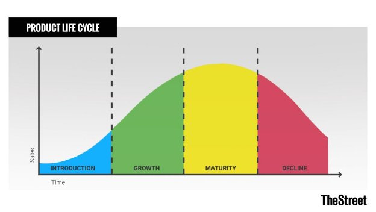
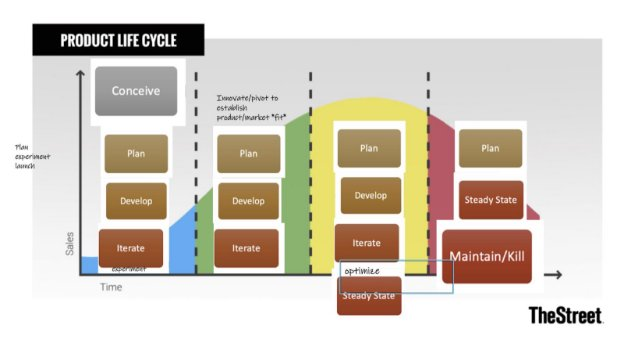

Product Life Cycle

The product life cycle describes the life of a product through 4 notable phases: introduction, growth, maturity and decline.

**Introduction**

During Introduction, the product is new and untested, which implicates that potential customers may be unwilling or reluctant to purchase it. At this stage, companies typically face customers who are early adopters, low sales, little to no profits, high customer acquisition costs, varied competition.

**Growth**

The product enters the growth stage if the product meets existing market needs or stimulates previously unaddressed market needs. In this stage, the business experiences increasing sales, decreasing customer acquisition costs, an increase in customers and profits, but also a rise in competitive forces.

**Maturity**

Maturity stage is reached when the sales growth of the product slows down. During this stage, companies try to capture customers by competing on price and increasing marketing. In this stage, sales peak, customer acquisition cost is low, profits are high, and the number of competitors becomes stable.

**Decline**

Once the sales of a product start to fall or profitability can not be maintained, it has reached the decline stage. In this stage sales and profits are falling, better alternatives show up in the market, the cost of maintenance is too high.

Let's look at some examples. **General Electric**

- Time: Industrialization
- Category: Hardware
- Stage: Decline

**Exxon Mobile**

- Time: Industrialization
- Category: Service & Delivery
- Stage: Decline

**Microsoft/Apple**

- Time: Consumerization
- Category: Software/Enterprise
- Stage: Maturity

**Google**

- Time: Internet
- Category: Internet
- Stage: Maturity

**Amazon**

- Time: Internet/Cloud
- Category: Internet/Cloud
- Stage: Growth

**Salesforce**

- Time: Digital Transformation/Cloud
- Category: Software
- Stage: Growth

**Tesla**

- Time: Digital Transformation/Cloud
- Category: Hardware/Software
- Stage: Growth

**SpaceX**

- Time: Digital Transformation
- Category: Hardware/Software
- Stage: Launch

**Netflix**

- Time: Digital Transformation/Cloud
- Category: Software
- Stage: Growth

Product Development Cycle

Conception

The product cycle starts at the conception of an idea to solve a problem for a group of people who will become customers of the product if they are willing to pay you to solve that problem. The conceive phase consists of the following:

- Problems are everywhere and waiting to be solved. As a product manager, it is your job to identify problems, understand their root cause, and determine whether or not they are worth solving. Example of a problem: "Consumers pay too many late fees for video rentals."
- Hypothesis - an idea that can be tested. Example: Consumers will subscribe to a monthly fixed fee to rent movies online, if they can avoid a late fee.

Planning

The planning activity is about validating hypotheses you have formed about the customers' problems. In this phase 3 questions need to be answered:

1. Is this problem painful enough that, if there is a solution, the customers will pay to use it? This is done by performing:
1. **User Interviews**
1. **Competitive Research**
1. **Surveys**
1. **Answering the 10x question**: Changing behavior is challenging. Unless a solution is 10x better than the existing method of coping, users will likely not change the way they currently do things.
2. Do enough customers have this problem?
2. Can a solution be built with reasonable resources, capital, and time?

Development

During development, the product manager is typically busy discovering solutions with help from the team. The PM works with designers and developers/engineers. Features and requirements are explored, implemented and delivered to end users The Product Manager communicates the priorities to the team and their stakeholders, and formulates a release plan and go to market strategy.

Launch

Product commercialization begins when features are delivered into the hands of end users. The product manager may work directly with marketing personnel on product positioning and pricing, as well as sales and support personnel to ensure everyone can support the product.

Iterate

When a product is in market, it is the product manager’s responsibility to analyze its performance and prioritize future improvements. The product manager can plan the future releases of the product and develop a roadmap by:

1. Determining which hypotheses are being tested?
1. Which features are being implemented to emergent needs?
1. Is there adequate tracking to understand how people are using the product, and if they are satisfied?

The product manager can iterate by:

1. Gathering early feedback from customers and proposing changes in the product to create an even better solution for the problem.
1. Running live tests with the product (if possible) to determine if users respond better to different interfaces, designs, or workflows.  This is known as **A/B Testing.**

Iteration continues until there is a validation of **Product-Market Fit** or the understanding that you have the right solution for the customer that has the problem. Once Product-Market Fit has been achieved, there can be significant growth in users and a high degree of customer satisfaction.

Steady

Once Product-Market Fit has been achieved, it is the product manager’s responsibility to ensure the ongoing growth and success of the product.  In this phase the product manager must:

1. Consistently review data to ensure strong performance and customer satisfaction while achieving growth goals.
1. Continue customer research to understand what features and improvements will lead to even more satisfaction, engagement, and retention. May lead to new hypotheses that spur the development of new products.
1. Manage the ongoing *backlog* or the list of features and improvements the product team will implement to ensure continuous improvement.
1. Work with others such as sales, marketing, and support to ensure teams are trained on new features and improvements.

Maintain or Obsolete (End of Life)

When growth subsides and opportunities to innovate are exhausted, the product manager must analyze what resources should be devoted to the product on an ongoing basis. The product manager must decide and prescribe one of two directions:

1. If the product is successful and stable, the team may focus on providing ongoing maintenance without investing in major new features
1. If the product is not successful, the product manager and team will consider “sunsetting” the product and determine end-of-life and transition plan for existing users by:
1. When will the product be turned off?
1. Can existing users get their data out of the product?
1. Can existing users be attracted to alternative products?
1. Creating a communication and support strategy for existing customers and users.
1. Retrospective: What was learned from this product, and how do those learnings apply going forward.
