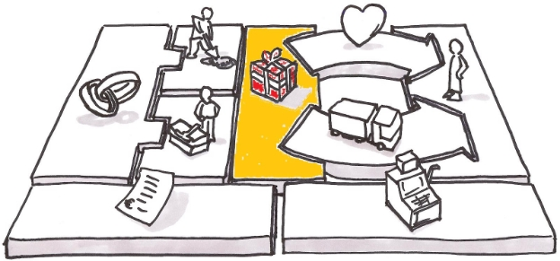
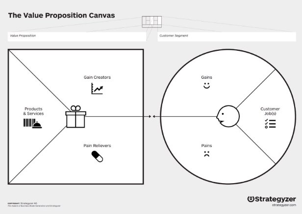
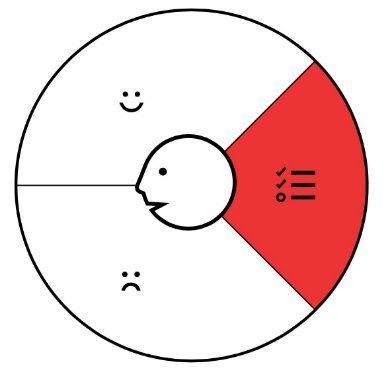
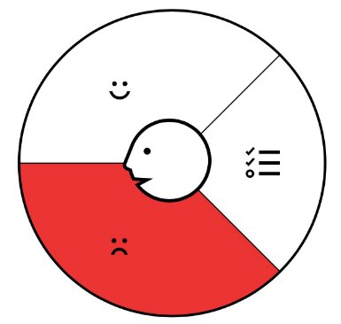
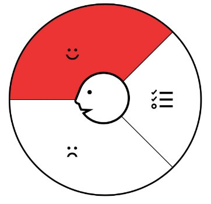
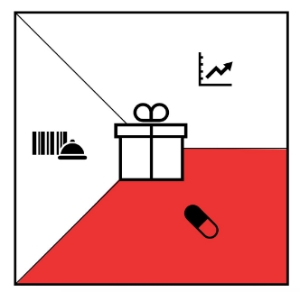
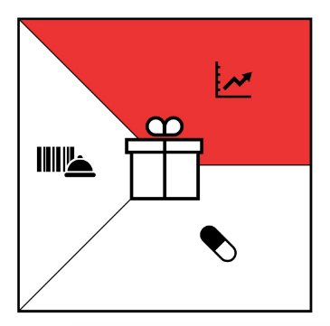
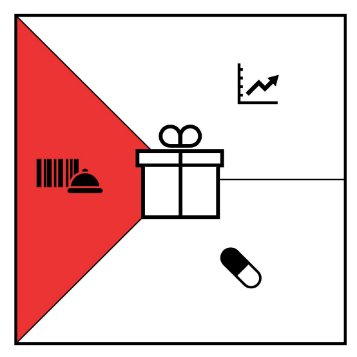

Value Propositions

The value proposition is perhaps the most important part of the business model after the customer. This is often referred to as the Customer Value Proposition - as it includes the keyword "customer" to focus on the customer segment while delivering value. As a Product Manager, your focus should always be on the value generated for the customer and how that value is then captured by the business in the form of profit.

For the value proposition to be truly effective, it needs three components:

- It must offer better value than the competition
- It must be measurable in monetary terms, meaning that you the Product Manager should be able to prove that your value proposition is a better value than the other offerings on the market
- It must be sustainable, meaning you must have the ability to execute it in a reasonable amount of time

So, when we talk about value propositions, it means thinking about your business from the customer's viewpoint rather than from an organizational perspective. Your product’s value proposition must demonstrate that you are meeting the needs of one or various customer segments.

The key to a successful value proposition involves a deep understanding of what the customer really wants or needs and not just how the customer does things now. Creating your value proposition does not begin with trying to persuade customers to buy your product or service. It's all about uncovering what your customer needs and providing solutions to meet those needs. So how do we go about developing a value proposition?

Different Types of Value Propositions

Remember that a value proposition must create value for a customer segment. They typically fall into one of these categories:

- **Newness:** solving for an entirely new set of customer needs because there was no prior offering catering to this. Think of cell phones, for example; they created an entirely new industry around mobile devices and telecommunication.
- **Performance:** could be improving the performance of a current or competitor’s product or service. Think of each new iteration of the cell phones. The key factor when new cell phones are introduced includes new functionality as well as an increase in their device performance. With each new iteration of cell phones, we get the newer version of the chip. (Ex. Apple A1 to A14 Bionic Chip - 5nm)
- **Customization:** focusing on creating tailored experiences for a specific customer segment to create value.
- **“Getting the job done”:** helping the customer get their job done by providing a service. UPS, Uber Freight, and Postmates solve a delivery service problem for businesses and restaurants alike.
- **Design:** a product could simply stand out in the market due to its superior design. Think Apple.
- **Brand/Status:** the value of the brand could signify a higher status for a customer segment. Simple examples here could be Rolex watches or Louis Vuitton handbags.
- **Price:** a common way to satisfy mass market needs is by providing the same value for a lower price. However, bringing the cost of the product down can impact the entire business model. A perfect example here is Southwest. In order to enable low-cost travel for a different customer segment by reducing prices, they had to invest in an entirely new business model, which ultimately limited their offering.
- **Cost Reduction:** creating value by reducing costs for customers. A great example here is Salesforce.com. They provide a cloud-based Customer Relationship Management (CRM) to reduce the investment costs of having to build and manage their own software.
- **Risk Reduction:** creating value by reducing investment risk for customers. A perfect example can be KIA’s 10 years/100,000-mile warranty. This allows customers to have a significantly lower risk of owning and maintaining an automotive.
- **Accessibility:** giving customers who previously lacked access to a product can also be an effective value proposition. Mutual funds are a great example of this, as they allowed the masses access to a professionally managed portfolio for the fraction of the price.
- **Convenience/Usability:** simply making a product easier to use can create an immense amount of value. A great example here is iPod and iTunes. With these, Apple offered an amazing amount of convenience that created and set the tone for digital music.

Key Questions

While focusing on this section, remember to always ask the following questions:

- **Value:** What value do we deliver to the customer?
- **Problems:** Which one of our customer’s problems are we helping to solve?
- **Needs:** Which customer needs are we satisfying?
- **Offering:** What bundles of products and services are we offering to each Customer Segment?

Value Proposition Canvas

Revisiting the Value Proposition

Recall the value proposition from our lessons on the Business Model Canvas.

To recap, the value proposition is a short statement that explains how our product meets customer needs and provides competitive advantage. It answers the question, “Why would someone purchase our product?”

The Value Proposition Canvas takes this one step further and draws a direct connection between the user and the value proposition. How are we actually meeting user needs with our product?

The Value Proposition Canvas

The Value Proposition Canvas is a valuable tool for finding product-market fit. Remember that product market fit is quantified as 40% of your target market being really disappointed if your product disappeared. That definition tells us whether or not we have product market fit, but what it doesn’t tell us is what we could change to improve it. By using the Value Proposition Canvas to directly connect consumer pains and gains to the functions and features of your solution, you can see where the disconnect is and where you can provide additional value.

The Value Proposition Canvas was developed by Alexander Osterwalder, who, as you might remember, also developed the Business Model Canvas. The Value Proposition Canvas is actually a part of the BMC-- it’s a closer look at how the value proposition box and the customer box interact. We focus on a particular customer segment (represented by a persona) and the value proposition for that segment, since it can differ between different segments.

The Value Proposition Canvas contains two smaller canvases: the product canvas and the customer canvas. Each of those is broken into three sections.

**The Customer Canvas (Customer Segments)**

Who is the customer? What are they trying to achieve that our product/service could help them with? What motivates and inspires them? What do they want to achieve? What things cause them frustration? What are their pain points?

- Jobs
- Gains
- Pains

**The Product Canvas (Value Proposition)**

How can we address these customer needs? What functionality can we provide to help them achieve these gains and diminish their frustrations? What will we need to provide this functionality? What will the product/service that provides these look like?

- Gain Creators
- Pain Relievers
- Product/Services

In the next few lessons, we’ll take a more in-depth look at  each of these categories.

Customer Jobs

The first section of the Customer Canvas is “Jobs”. What tasks is the user trying to accomplish? Think about this in terms of the problem you’re trying to solve.

Because of the title, “jobs”, people often forget the other tasks that people have to do that are less obvious, but no less important. What are their emotional goals? What things do they need to accomplish for themselves and to fit in with society?

For example, many companies send a sticker with their product. This accomplishes two things. First of all, it’s free marketing for the company, but second, it provides value to the customer. Having certain brands allows people to fit in socially. So although someone might be looking for a computer, they also have a need to fit in, and if you know that, you can provide additional value.

Remember on our personas how we defined goals, motivations and frustrations? Pull from these areas to help you fill out this area and the others in the Customer Canvas.

As [Clayton Christensen](https://www.youtube.com/watch?v=sfGtw2C95Ms) puts in, “What job are you hiring this product to do?” Tips

- Don’t give the person’s job title- think in terms of tasks they have to do
- What “hidden” jobs are they trying to accomplish? Things like professional development and job security are associated with work, but won’t be found on a job description.
- What are their emotional needs?
- What does society pressure them to do? What do they do to fit in?
- What is their ideal state? How are they trying to get there?
- What things do they do to make themselves feel happy or accomplished?
- What things do they do to avoid stress or negative experiences?

To better understand these concepts over the next few lessons, we’ll use two example users: **Theo**, a 21-year-old university student and coffee fanatic.

Theo is in his third year studying engineering at his university. He relies on his coffee to keep him going and awake since he gets very little sleep. He usually walks to get coffee from a local store. However, as a university student, he’s also busy, so sometimes he has to skip his coffee in the mornings, which gives him a headache. He hates the taste of the coffee they have in the university food court. Theo tries to purchase sustainably whenever he can, and looks for products that are FSC certified. Theo is looking for a convenient but sustainable coffee product.

**Alyssa**, a 38-year-old designer and team leader.

Alyssa is the team lead for a design team at a small graphics company that creates personalized banners. Alyssa is responsible for daily standups and weekly design consultations. Often, work for one client is worked on by multiple members of the team. Alyssa delegates the work and does a final check before the work goes to the client. Often, there are miscommunications, and the work needs to be sent back. Alyssa is looking for a better form of task management and collaboration for herself and her team.

Pains

Pains are the things that frustrate your user. They are the unfortunate side effects that are associated with whatever job or goal the user is trying to accomplish. Pains are vital because remember-- our main goal as product managers is to solve a problem. If we can’t come up with pains, it might be a sign that we don’t have a real problem, or the problem isn’t as significant as we thought.

Note that the pains should be relevant to the problem that you’re trying to solve. For example, if you’re selling software to a manager at a corporation, a tight budget or executive pressure are relevant pains, but the lack of vending machines in the breakroom wouldn’t be.

There are lots of ways to come up with pains for a user, but this list from the[ Imagineer.co blog ](https://blog.imagineer.co/en-us/what-is-the-value-proposition-canvas-and-what-is-it-for)is a great starting point.

- How do your customers define that something is very expensive, takes a lot of time, or that it requires a lot of effort?
- What makes your clients feel bad? What are their frustrations or headaches?
- How do your customers value existing value propositions? What features are missing? Are there performance issues? What bothers them or what do they say works badly?
- What social consequences do your customers fear? Do they fear a loss of status, power, trust, etc?
- What are the common mistakes your customers make? Are they using a solution incorrectly?
- What are their sources of happiness?
- This one may seem counterintuitive, but knowing what makes them happy may help you to identify features or systems that are preventing them from reaching that happiness.

Let’s take a look at the pains of our two example users. **Theo**, a 21-year-old university student and coffee fanatic.

- Headaches due to lack of caffeine
- Falling asleep in class
- Coffee that leaves a bad taste in his mouth
- Having to budget an additional 20 minutes in the morning to go get coffee
- Expensive coffee at cafe
- Not being allowed to have a coffee maker in his dorm

**Alyssa**, a 38-year-old designer and team leader.

- Boss constantly asking for updates
- Angry comments from clients when the work is inconsistent
- Embarrassment when there are mistakes in the work she’s showing to clients
- Disorganized team meetings
- Having to constantly remind team members of deadlines
- Wasting time resolving questions/miscommunication between team members
- Bulky email threads with design edits and questions

Gains

The third section of the Customer Canvas is the Gains category. This is the flip side of the Pains category and describes things that add value to your customer’s experience. What things is your customer seeking? What are their goals and aspirations? What things satisfy and delight them? Like jobs, we have to think outside the basic tasks and consider the social and emotional aspects. Self-fulfillment and confidence in your work are both gains.

Again, we’ll use this great resource from the[ Imagineer.co blog](https://blog.imagineer.co/en-us/what-is-the-value-proposition-canvas-and-what-is-it-for) to kickstart our brainstorming process.

- What savings will make your customers happy? Consider the savings in terms of time, money, and effort.
- What level of quality do your customers expect?
- What are your customers most looking for? Are they looking for design, warranty, or a specific feature?
- What do your clients dream of, what do they aspire to achieve, or what would be a great relief for them?
- What would increase the likelihood of your customers adopting your value proposition? Do they want lower costs, to invest less, reduce risk, or improve quality?

Now let’s apply what we learned about gains to our two example users. **Theo**, a 21-year-old university student and coffee fanatic.

- Feels good about supporting the environment
- Convenient- fast and portable
- Consistent taste and texture
- Great taste
- Awake and focused in class

**Alyssa**, a 38-year-old designer and team leader.

- Quick learning curve
- All team members are connected
- Satisfaction at checking off tasks
- Ease of mind knowing things are accounted for
- Show boss her and the team’s progress

Pain Relievers

Pain Relievers are the Product Canvas’s answer to the Customer Canvas’s pains. How does the product alleviate those pains? What functions or features does it use to address them? A successful product directly matches pain relievers to pains so that the value provided to the customer is clear.

**Let’s go back to our example users from previous lessons to see how this works. Theo**, a 21-year-old university student and coffee fanatic.

- **Pain:** No coffee maker in dorm >> **Pain Reliever:** Hot water activated (made in microwave)
- **Pain:** Extra time in morning to get coffee >> **Pain Reliever:** Instant coffee (takes 5 minutes)
- **Pain:** Cafe coffee is expensive >> **Pain Reliever:** Packets are ¼ cost of a cup of coffee
- **Pain:** Bad tasting coffee >> **Pain Reliever:** High quality coffee, frequently quality tested

**Alyssa**, a 38-year-old designer and team leader.

- **Pain:** Clients are angry when there are mistakes >> **Pain Reliever:** Previews of work for team review
- **Pains:** Boss constantly asking for updates, reminding team members of deadlines >> **Pain Reliever:** Dashboard with status updates
- **Pain:** Bulky email threads >> **Pain Reliever:** Task-connected messaging
- **Pain:** Disorganized team meetings >> **Pain Reliever:** Auto-Agenda, creates agenda based on priority and deadlines of outstanding items

Gain Creators

**Gain Creators** are the functionality that provide gains. For example, a gain for a person using mobile banking might be “convenience”. A gain creator might be fingerprint-authentication, interactive notifications, or one-click payments. Note that gain creators are not the product. They are features of it or functionality that can be provided. This helps us make sure that we are staying on the user-focused path as we develop a solution. To be included in the product, a feature either needs to be creating gain for the user or relieving pain.

Let’s take a look at our two users to see how we can create their gains.

**Theo**, a 21-year-old university student and coffee fanatic.

- **Gain:** Supporting the Environment >> **Gain Creator:** Compostable packages, Rainforest Alliance certified
- **Gains:** Convenience and Great Taste >> **Gain Creator**: Individual Packaging (keeps grounds fresher)
- **Gains:** Staying awake and Convenience >> **Gain Creator:** 120 mg Caffeine/serving (With slightly more caffeine per serving, you only need to make one cup).

**Alyssa**, a 38-year-old designer and team leader.

- **Gain:** Team Collaboration >> **Gain Creator:** Integration with Figma
- **Gains:** Sense of Accomplishment and Team Accountability >> **Gain Creator:** Interactive checklists
- **Gains:** Sense of Accomplishment and Practical Updates >> **Gain Creator:** Progress notifications (Automatically sent on a weekly basis in an email)

Products and Services

**Products and Services** are the third and final category in the Product Canvas. In this category, you will list the products, services, or features that you are providing in response to the Pain Relievers and the Gain Creators you’ve identified for your user. For example, car companies talk about airbags, leather seats, and extended warranties that relieve user's pains regarding safety. These may be combined in a new model of car or added as additional features on existing models. The new model or additional features would be listed in the products and services section.

What would this look like for the two examples we’ve been working on in this module? **Theo**, a 21-year-old university student and coffee fanatic.

- Individually packaged instant coffee
- Monthly subscription service with discount
- Discount for students
- Free returns if you’re dissatisfied
- Environmental impact statement on packaging
- Compost bin (for purchase or free after 5 orders)

**Alyssa**, a 38-year-old designer and team leader.

- Pay per user pricing
- Basic and Premium tiers
- Free integrations with other popular softwares at premium pricing
- Desktop and mobile applications
- Client interface

Bringing it all together

Now that we’ve covered the last piece of the Product Canvas and the Value Proposition Canvas, let’s look at a completed example of a Value Proposition Canvas for Theo.

